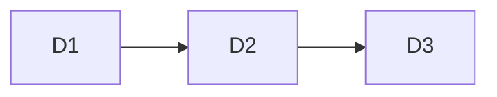

# Delivery Increments

## Metadata

| Field | Value |
|---|---|
| Initiative ID | {{initiative_id}} |
| Execution mode | {{execution_mode}} |
| Created at | {{date}} |
| Created by | delivery-lead |
| Status | Draft |

## Increment Summary

| Increment ID | Name | Story Count | Must / Should / Could | Key Dependencies |
|---|---|---|---|---|
| D1 | Core increment | N | N / N / N | |

## D1: Increment Name

| Field | Value |
|---|---|
| Scope | F-XXX.X, F-XXX.X |
| Entry criteria | |
| Exit criteria | |
| Dependencies | |
| Estimated team effort | Small / Medium / Large |
| Quality gate requirements | |

## Cross-Increment Dependency Graph

---
*This artifact is only applicable in `Enterprise+Modular` execution mode.*
