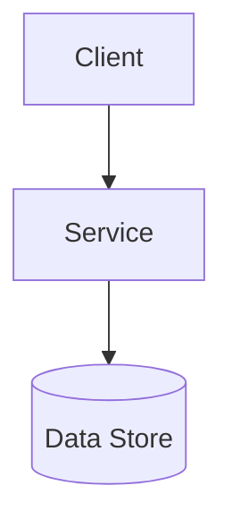
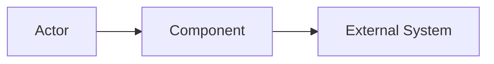

# Draft Architecture

## Metadata

| Field | Value |
|---|---|
| Initiative ID | {{initiative_id}} |
| Created at | {{date}} |
| Created by | architect |
| Status | Draft |

## Executive Summary

2-4 sentences describing the architectural shape of the initiative, the main boundaries, and why this shape fits the business need.

## Component Overview

| Component | Type | Responsibility | Technology |
|---|---|---|---|
| Component name | New / Existing | | Confirmed / Assumed / Unknown |

## Deployment Topology

## Data Flow

## Integration Points

| External System | Protocol | Auth | Sync/Async | Contract Status |
|---|---|---|---|---|
| | REST / gRPC / Event / File | | Sync / Async | Confirmed / Assumed / Unknown |

## Technology Constraints

| Area | Technology | Status | Notes |
|---|---|---|---|
| API | | Confirmed / Assumed / Unknown | |

## Security Architecture

Summarize authentication, authorization, PII handling, audit, and trust boundaries.

## Key Architecture Risks

| Risk | Type | Impact | Mitigation |
|---|---|---|---|
| | Performance / Integration / Data / Security | Low / Medium / High | |

## Open Architecture Questions

| Question | Impact | Owner | Default Assumption |
|---|---|---|---|
| | | | |

---
*This is a draft input to architecture review, not the final architecture authority.*
