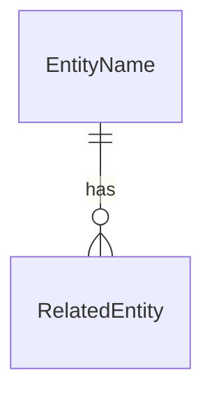

# Entity Model

## Metadata

| Field | Value |
|---|---|
| Initiative ID | |
| Created at | |
| Created by | product-owner |
| Status | Draft |

## Entity Catalog

| ENT-NNN | Name | Description | Owner | PII | BRS Source |
|---|---|---|---|---|---|
| ENT-001 | Entity Name | One-sentence business description | ACT-001 / SYS-001 | Yes / No | FR-001, FR-002 |

One row per domain entity. Do not leave placeholder text in any cell.

---

### ENT-001: Entity Name

**Description:** What this entity represents in the business domain.  
**Owner:** ACT-001 or SYS-001  
**PII:** Yes / No - list which fields if applicable.

**Key attributes:**

| Attribute | Description | Data Type | Length/Precision | Validation Rules |
|---|---|---|---|---|
| attribute_name | Business meaning of the attribute | string / integer / decimal / date | 255 / 10,2 / n/a | Not Null; BR-001; Format: Email |

**Status / lifecycle:** valid statuses and transitions, or `stateless`

**Relationships:**

| Relationship | With | Cardinality | Optional | BR-NNN Rule |
|---|---|---|---|---|
| belongs to | ENT-002 | 1:N / M:N / 1:1 | Yes / No | BR-002 |

---

## ER Diagram

## Feature Coverage

| ENT-NNN | FR-NNN Source(s) | Notes |
|---|---|---|
| ENT-001 | FR-001, FR-002 | |

---
*Set Status: Accepted only by workflow or human approval when applicable. Never self-accept.*
