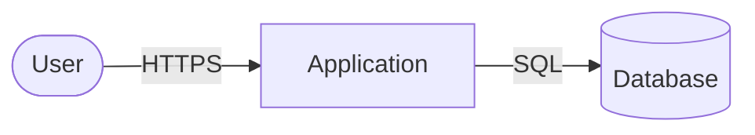

# Threat Model

## Metadata

| **Field** | **Value** |
|---|---|
| **Status** | **In progress** |
| Initiative ID | {{initiative_id}} |
| Methodology | STRIDE + DREAD |
| Created at | {{date}} |
| Created by | security-reviewer |

## Trust Boundaries

## Threat Catalog

| THR-NNN | Boundary | STRIDE | Threat Description | DREAD | Risk | Existing Mitigation | Required Mitigation | Owner | Status |
|---|---|---|---|---|---|---|---|---|---|
| THR-001 | | | | | | | | | |

## Mitigation Priority

| Priority | THR-NNN | Required Mitigation | Owner | By when |
|---|---|---|---|---|
| 1 | THR-001 | | | before handoff |

## Accepted Threats

| THR-NNN | Justification | Owner | Review date |
|---|---|---|---|

---
*Status: In progress - set to Accepted by the security gate owner. Never self-accept.*
