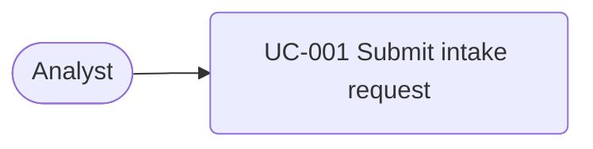

# Use Cases

```mermaid
graph LR
  Analyst([Analyst])
  UC001(UC-001 Submit intake request)
  Analyst --> UC001
```

| UC-NNN | Title | Primary Actor(s) | FR Sources |
|---|---|---|---|
| UC-001 | Submit intake request | Analyst | FR-001 |
