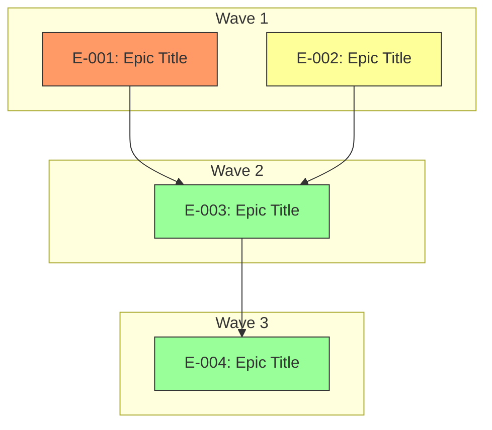

# Elaboration Plan

## Metadata

| Field | Value |
|---|---|
| Initiative ID | {{initiative_id}} |
| Created at | {{date}} |
| Created by | delivery-lead |
| Status | Draft |

---

## Elaboration Strategy Summary

| Metric | Value |
|---|---|
| Total epics | N |
| Elaboration waves | N |
| Parallelizable epics | N |
| Critical path epics | N |
| Highest risk epic | E-NNN |

---

## Prioritisation Criteria

| Factor | Weight | Rationale |
|---|---|---|
| Business priority (Must > Should > Could) | High | {{rationale}} |
| Architecture risk (from architecture-risks) | High | {{rationale}} |
| Cross-cutting concerns (from architecture-impact-map) | Medium | {{rationale}} |
| Dependency count (blocking others) | Medium | {{rationale}} |
| Standalone capability (can deliver independently) | Low | {{rationale}} |

---

## Elaboration Order

### Wave 1 — {{Wave Title}}

| Epic | Title | Rationale | Risk Level | Dependencies | Parallel? |
|---|---|---|---|---|---|
| E-NNN | {{title}} | {{why this epic goes first}} | Low / Medium / High | None / E-NNN | Yes / No |

### Wave 2 — {{Wave Title}}

| Epic | Title | Rationale | Risk Level | Dependencies | Parallel? |
|---|---|---|---|---|---|
| E-NNN | {{title}} | {{why this wave}} | Low / Medium / High | E-NNN | Yes / No |

---

## Epic Dependency Analysis

| Epic | Depends On | Depended On By | Cross-Cutting Concerns | Architecture Risk |
|---|---|---|---|---|
| E-NNN | None / E-NNN | E-NNN | {{concerns from impact map}} | RISK-NNN / None |

---

## Parallel Elaboration Opportunities

| Group | Epics | Rationale | Constraint |
|---|---|---|---|
| {{group name}} | E-NNN, E-NNN | {{why they can be elaborated in parallel}} | {{any shared dependency or constraint}} |

---

## Elaboration Dependency Diagram

---

## Risks and Mitigations

| Risk | Impact | Mitigation |
|---|---|---|
| {{risk affecting elaboration order}} | {{what happens if order is wrong}} | {{how to mitigate}} |

---

## Recommendations

{{2-3 sentences summarising the recommended elaboration sequence and why.}}

---
*This is a human-gated artifact. The delivery lead must review and approve the elaboration order before epic and story elaboration proceeds. Adjust wave assignments and parallel groupings based on team capacity and constraints. Set Status: Accepted only after human review. Never self-accept.*
