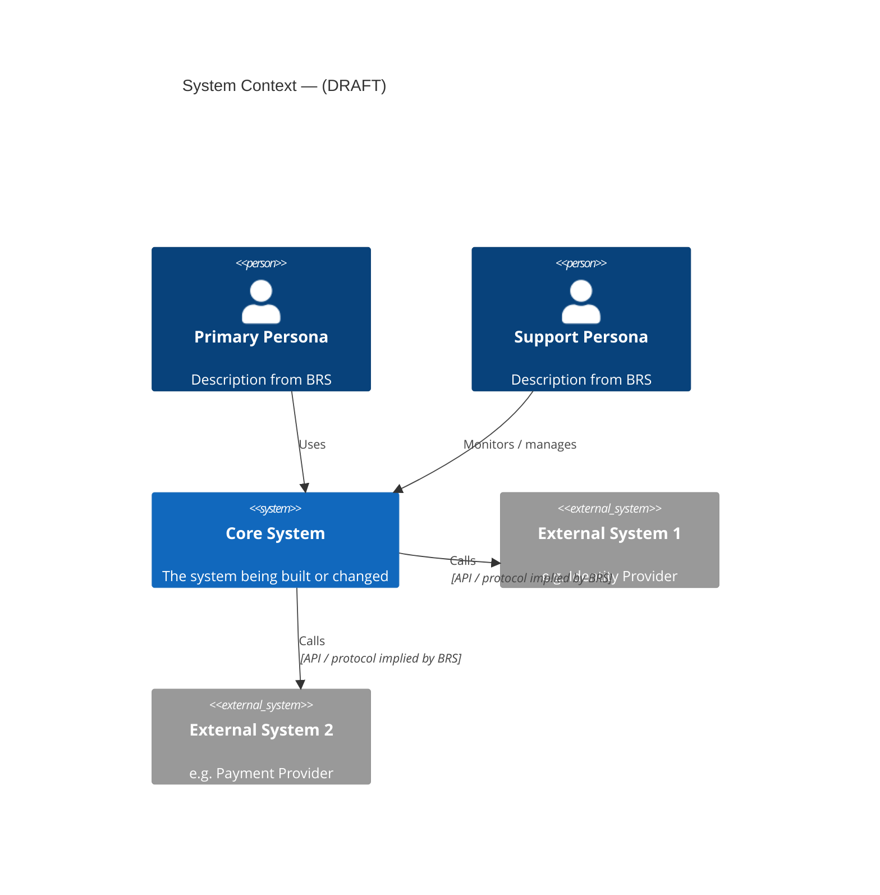
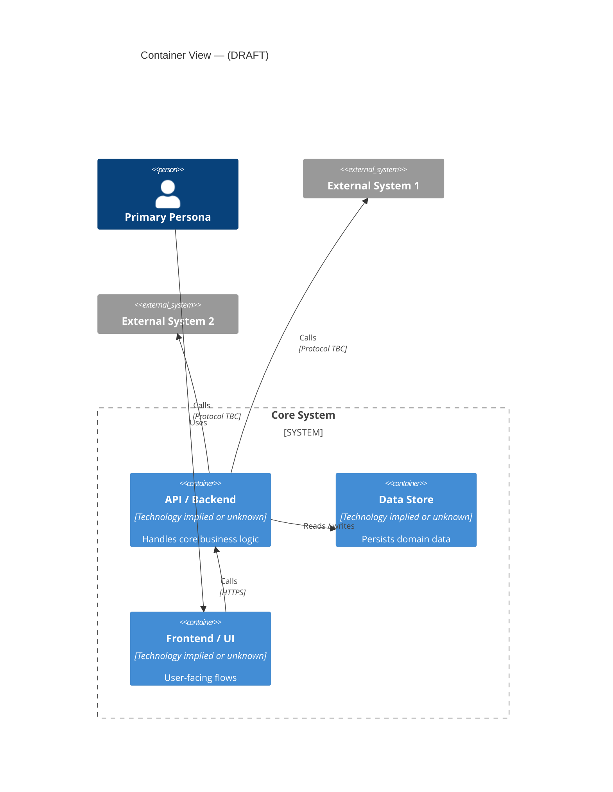
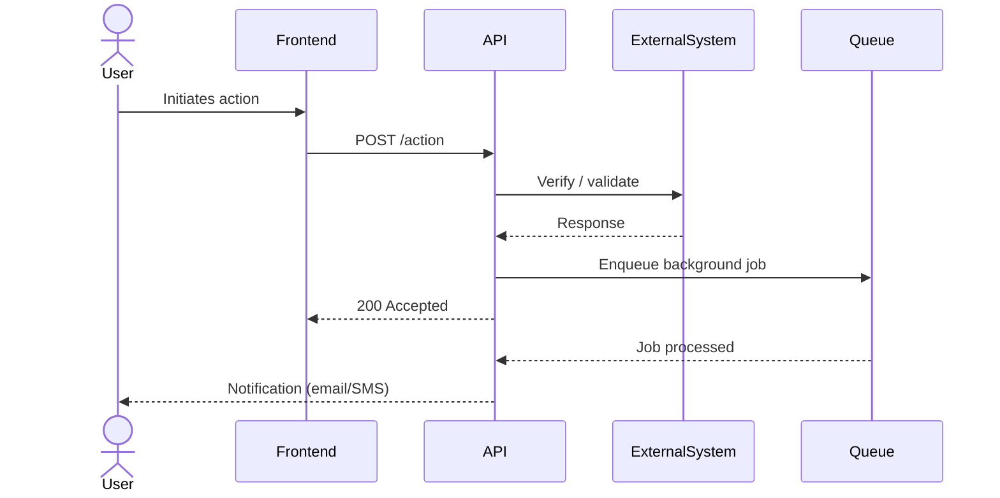

# Prompt - Draft Architecture from BRS

## Role

You are a solution architect proposing an initial architecture based solely on what the BRS implies.

## Context

This prompt runs when no architecture input exists or when the existing `input/architecture.md` is empty or a stub.

Its output is a **draft proposal** — not a finalized architecture. It must be reviewed and approved by a human architect before the framework treats it as authoritative input.

It exists to unblock the workflow when no architecture document has been provided, and to give an architect a concrete starting point to validate or correct rather than a blank page.

## Purpose

Derive a draft architecture from the BRS requirements, integrations, constraints, personas, and non-functional requirements. Make implicit architectural decisions explicit so they can be challenged.

## Inputs

Use:

```text
input/brs.md or input/brs/*.md
input/input-package.md
```

Do not use any other source. Do not invent information not present or clearly implied by the BRS.

## Output path

```text
input/architecture.md
```

## Mandatory output enforcement

The output MUST contain all of the following sections in this exact order. Do not skip any section. Do not substitute free-form prose for a required section. Do not produce a different structure because it "seems simpler."

```
1. DRAFT notice block (blockquote, at the very top)
2. # Architecture
3. ## Source Metadata (table)
4. ## Architecture Summary (prose)
5. ## System Context Diagram (Mermaid C4Context + open decisions note)
6. ## Container Diagram (Mermaid C4Container + open decisions note)
7. ## Integration Flow Diagram (Mermaid sequence — or explicit note explaining why skipped)
8. ## Proposed System Context (table)
9. ## Proposed Integrations (table)
10. ## Implied Constraints (table)
11. ## Implied Governed Boundaries (table)
12. ## Non-Functional Requirements Summary (table)
13. ## Open Decisions (table)
14. ## Assumptions Made in This Draft (table)
15. ## Architect Review Notes (blank — for human completion)
```

If any section is missing from the output, the output is incomplete and must not be saved.

## Mermaid syntax rules — mandatory for all diagrams

These rules apply to every diagram in this output. A diagram that violates them will fail to render.

- **Never use HTML tags in node labels.** `<br/>`, `<b>`, `<i>`, `<br>` are all invalid in standard Mermaid graph/flowchart nodes. Use ` / ` or a newline-safe separator instead.
  Wrong: `UI["Admin Portal UI<br/>(React)"]`
  Correct: `UI["Admin Portal UI (React)"]`
- **Always quote node labels that contain parentheses, commas, slashes, or special characters.**
  Correct: `RBAC["RBAC Service (Azure AD)"]`
  Wrong: `RBAC[RBAC Service (Azure AD)]`
- **C4 diagrams use function-call syntax — labels are already quoted as string arguments.** `System(id, "Label", "Description")` — no extra quoting needed inside the function call itself.
- **`graph` / `flowchart` node labels must be quoted if they contain `()`, `/`, `-` followed by text, or `,`.**
- **Never put raw parentheses inside `[]` without wrapping the whole label in double quotes.**
- **Test every single node label before writing it.** If the label contains any of `(`, `)`, `,`, `/`, `<`, `>`, `&`, or an HTML tag — it must be wrapped in double quotes and stripped of HTML. A bare `/` inside `[]` without quotes is a parse error.
- **Never use `&` to connect multiple nodes in one edge statement.** `A & B --> C` is invalid in Mermaid 11. Write one edge per line: `A --> C` then `B --> C`.

## Draft status marker

The output must begin with a clearly visible draft notice:

```markdown
> **DRAFT — AI-proposed architecture. Not reviewed or approved.**
> This draft was generated from BRS content because no architecture input was provided.
> It must be reviewed and corrected by a qualified architect before the framework treats it as authoritative.
> Mark this notice as REVIEWED when an architect has validated or updated this document.
```

## Required output structure

```markdown
> DRAFT — AI-proposed architecture. Not reviewed or approved.
> This draft was generated from BRS content because no architecture input was provided.
> It must be reviewed and corrected by a qualified architect before the framework treats it as authoritative.
> Mark this notice as REVIEWED when an architect has validated or updated this document.

# Architecture

## Source Metadata

| Field | Value |
|---|---|
| Source name | Draft — derived from BRS |
| Source version / date | |
| Draft generated date | |
| Draft generated from | `input/brs.md` |
| Architect review status | Pending |
| Architect reviewer | |
| Architect review date | |

## Architecture Summary

High-level description of the proposed solution shape: what systems are involved, what the initiative adds or changes, and how the pieces connect.

## System Context Diagram

Embed a Mermaid C4 context diagram showing the system being built, its primary users, and the external systems it interacts with.
Derive actors, systems, and relationships only from the BRS.
Mark each relationship with the integration mechanism if implied (API, event, webhook, etc.).

Example shape — replace with content from the BRS:



Add a note below the diagram listing any relationship or system marked as an open decision.

## Container Diagram

Embed a Mermaid C4 container diagram showing the main containers (services, databases, frontends, queues) implied by the BRS requirements and NFRs.
Include only containers clearly implied by the BRS — do not invent layers.
Mark containers as NEW or EXISTING where determinable from the BRS.

Example shape — replace with content from the BRS:



Add a note below listing containers where technology choice is an open decision.

## Integration Flow Diagram

If the BRS implies non-trivial integration flows (async events, multi-step workflows, callback patterns), embed a Mermaid sequence or flowchart showing the primary happy-path flow.
Skip this diagram if all integrations are simple synchronous API calls already visible in the container diagram.

Example shape for an async flow:



## Proposed System Context

List the systems, services, and external integrations implied by the BRS.

| System / Service | Role | New or existing | Shown in diagram | Notes |
|---|---|---|---|---|

## Proposed Integrations

| Integration | Direction | Protocol / mechanism implied | Sensitivity | Open decision |
|---|---|---|---|---|

## Implied Constraints

Constraints that the BRS makes explicit or strongly implies — compliance, security, performance, data residency, availability.

| Constraint ID | Constraint | Source requirement | Confidence | Requires architect confirmation? |
|---|---|---|---|---|

## Implied Governed Boundaries

List boundaries that will likely require API, data, or event contracts based on the BRS integrations and requirements.

| Boundary | Type | Implied by | Shown in diagram | Contract likely needed? |
|---|---|---|---|---|

## Non-Functional Requirements Summary

Summarize NFRs from the BRS that have architecture implications.

| NFR ID | Requirement | Architecture implication |
|---|---|---|

## Open Decisions

Decisions the BRS does not resolve that an architect must make before the architecture can be considered reliable.

| Decision ID | Decision needed | Why it matters | Owner |
|---|---|---|---|

## Assumptions Made in This Draft

List every assumption made to produce this draft. Each assumption is a risk if wrong.

| Assumption | Basis | Risk if wrong |
|---|---|---|

## Architect Review Notes

Leave blank — to be completed by the reviewing architect.
```

## Quality bar

A good draft must:

- derive only from BRS content — no invented systems or integrations
- make every assumption explicit with its basis
- mark every open decision that an architect must resolve
- identify implied governed boundaries so the architect can confirm or reject them
- be specific enough to be useful as a starting point, not so specific it overstates confidence
- be clearly marked as a draft requiring human review throughout
- include a system context diagram and a container diagram derived from BRS actors, systems, and requirements
- include an integration flow diagram only when the BRS implies non-trivial async or multi-step flows
- label every diagram element that is an open decision or assumption
- keep diagrams compact — one focused concern per diagram, not a complete system encyclopedia

## Anti-patterns to avoid

Do not:

- present the draft as an approved architecture
- invent integrations, containers, or actors not implied by the BRS
- omit the draft notice or the architect review section
- resolve open decisions — mark them as open
- skip the assumptions section — every non-obvious inference must be listed
- produce a generic architecture that could apply to any system
- produce diagrams that merely restate the tables below them with no additional clarity
- add diagram layers (e.g. deployment, component) that the BRS does not provide enough detail to support

## Stop conditions

- If `input/brs.md` is missing or contains only a stub with no requirements, stop. A draft cannot be generated from an empty BRS.
- List what is missing and ask the user to provide a BRS before continuing.

## Self-review checklist

Before finalizing, verify:

- [ ] Draft notice is present and visible at the top.
- [ ] System context diagram is present and derives actors and external systems from the BRS.
- [ ] Container diagram is present and derives containers from BRS requirements and NFRs.
- [ ] Integration flow diagram is present if the BRS implies async or multi-step flows — skipped with a note if not needed.
- [ ] Every diagram element that is an assumption or open decision is labeled or noted.
- [ ] Every system and integration in the tables is also reflected in the diagrams.
- [ ] Every assumption is listed explicitly.
- [ ] Every open decision has an owner placeholder.
- [ ] Implied governed boundaries are identified and cross-referenced to the diagrams.
- [ ] No invented content — every claim has a BRS source.
- [ ] Architect review section is present and blank.

## After saving this draft

The next step is mandatory:

```text
.brs2spec/3-planning-and-modular-delivery/01-review-initial-architecture.md
```

Do not skip the architecture review even though this is a draft. The review prompt will assess the draft against the BRS and flag what the architect must confirm or correct.
