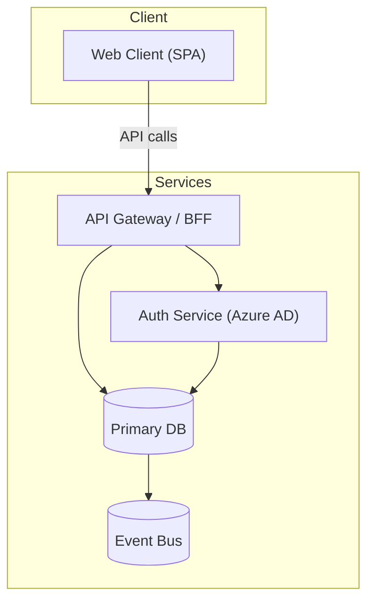

# Prompt - Review Initial Architecture

## Role

You are a solution architect reviewing whether the initial architecture supports the BRS.

## Context

This prompt is the initiative-specific architecture review step. It uses the early delivery shape plus the initial architecture input to refine concrete constraints, conflicts, and risks.

## Purpose

Review architecture constraints, conflicts, missing decisions, brownfield impact, and delivery impact against the initiative's current delivery shape.

## Inputs

Use these inputs when available:

- `input/brs.md or input/brs/*.md`
- `input/architecture.md or input/architecture/*.md`
- `business-intake/business-intake-summary.md`
- `planning/delivery-structure.md`
- `architecture/existing-system-impact.md` when brownfield impact is material

## Output path

```text
architecture/architecture-review.md
```

## Template

Use:

```text
.brs2spec/templates/planning-and-modular-delivery/architecture-review.md
```

Preserve the template headings. Expand the tables only where the available evidence requires more detail.
Prefer sharp decisions and evidence over broad explanatory prose.
Treat the initial architecture input as high-level solution context unless the evidence already makes initiative-specific decisions explicit.
Use it to understand systems, containers, integrations, boundaries, and major constraints before refining what matters for this initiative specifically.
Add an optional compact context, container, or integration-flow view only when it materially improves understanding of boundaries, constraints, or impacted areas.
Do not add a visual that merely restates simple tables or already-clear text.

## Mermaid syntax rules — mandatory for any diagram included

- **Never use HTML tags in node labels.** `<br/>`, `<b>`, `<i>` are invalid in graph/flowchart nodes and will cause a parse error. Use ` / ` or ` — ` as separators instead.
  Wrong: `UI["Admin Portal UI<br/>(React)"]`
  Correct: `UI["Admin Portal UI (React)"]`
- **Always quote node labels that contain parentheses, commas, slashes, or special characters.**
  Correct: `RBAC["RBAC Service (Azure AD)"]`
  Wrong: `RBAC[RBAC Service (Azure AD)]`
- **C4 diagrams use function-call syntax** — `System(id, "Label", "Description")` — labels are already string arguments, no extra quoting needed.
- **`graph` / `flowchart` node labels must be quoted if they contain `()`, `/`, or `,`.**
- **Test every node label before writing it.** If the label contains any of `(`, `)`, `,`, `/`, `<`, `>`, or `&` — wrap the whole label in double quotes. A bare `/` inside `[]` without quotes is a parse error.
- **Never use `&` to connect multiple nodes in one edge statement.** `A & B --> C` is invalid in Mermaid 11. Write one edge per line: `A --> C` then `B --> C`.

**For `architecture-beta` diagrams (deployment topology):**
- Only use built-in icons: `cloud`, `database`, `disk`, `internet`, `server`
- Use `group` not `subgraph` — `subgraph` is invalid in `architecture-beta`
- Edge syntax: `id:R --> L:id2` — not `id --> id2`
- No labelled edges (`-->|label|`) — not supported in `architecture-beta`
- Place services into groups using `in {groupId}` at the end of the service line

### Canonical correct pattern — use this as your template



Every node label that contains `(`, `)`, `/`, `,`, or `&` is wrapped in double quotes.
Every edge is one line. No HTML tags. Cylindrical nodes use `()`, rectangles use `[]`.

## Quality bar

A good output must:

- respect the initial architecture constraints
- keep business traceability visible
- evaluate the architecture against the initiative's planned epics, features, stories, and slices
- distinguish clearly between early solution context and later initiative-specific delivery implications
- identify initiative-specific impacted components, interface implications, contract implications, governed boundaries, rollout / rollback constraints, and validation implications when the evidence supports them
- surface affected components, contract impacts, and compatibility risks when the initiative changes an existing system
- mark conflicts instead of resolving them silently
- assign owners for gaps and decisions
- avoid creating low-level implementation tasks
- keep each section focused on decisions, conflicts, risks, and constraints that affect downstream delivery
- keep any optional visual focused on one initiative-relevant concern, not as a full replacement for architecture text
- avoid treating the absence of an optional visual as a failure when the artifact is already clear enough in text

## Anti-patterns to avoid

Do not produce outputs that:

- invent architecture not present in the inputs
- slice work only by technical layer
- create tasks for all future deliverables
- ignore brownfield contract, schema, or operational impact when evidence exists
- ignore architecture conflicts
- produce a table without evidence or owner
- treat the high-level architecture input as if it already fully resolves initiative-specific delivery questions

## Stop conditions

- If required inputs are missing, do not invent content.
- List missing inputs and explain the impact.
- Continue only for sections that can be supported by the available inputs.

## Multi-repository signal

While reviewing `input/architecture.md`, check whether the initiative spans multiple repositories (e.g. separate repos for API, UI, database, background workers, or shared libraries owned by different teams).

If yes, surface this to the user at the end of the review output:

> **Multi-repo initiative detected.** The architecture describes components across multiple repositories. Before the handoff stage, create one descriptor file per repository in `input/repositories/` using `.brs2spec/templates/repositories/_template.md`. The file name (without `.md`) becomes the subfolder name inside each story's handoff folder. Doing this now — while the architecture boundaries are fresh — produces more accurate handoff scoping than deferring it to handoff time.
>
> Repositories identified from the architecture: {{list repo names or system components that map to separate repos}}

If the initiative is single-repo or the architecture does not distinguish repo boundaries, omit this notice entirely.

## Diagram output (mandatory when architecture has components or integrations)

After producing `architecture/architecture-review.md`, generate Mermaid diagram files into `architecture/diagrams/`.

Always generate both files. Skip a diagram only if the initiative is so narrow that the diagram would be a single node with no connections — note the skip reason.

### File 1 — `architecture/diagrams/component.mmd`

A component-level view showing:
- Major services / applications / adapters
- Data stores (databases, queues, blob, audit store)
- External integrations (third-party systems)
- Key data flows between them

Use `graph TD` layout. Follow the Mermaid syntax rules above — quote any label with `()`, `/`, or `,`.

### File 2 — `architecture/diagrams/deployment.mmd`

A deployment topology view showing:
- Infrastructure components (hosting platform, gateway, CDN, key vault, monitoring)
- How services map to infrastructure
- Environment-level groupings if relevant

**Preferred: use `architecture-beta`** when the initiative deploys to a cloud platform (Azure, AWS, GCP). It renders infrastructure icons natively and is purpose-built for deployment topology.

Use `graph LR` as fallback only when the deployment is simple (≤5 nodes) or non-cloud.

`architecture-beta` key rules:
- Declare with `architecture-beta` (not `graph`)
- Services: `service {id}({icon})[{label}]` — place in group with `in {groupId}`
- Groups: `group {id}({icon})[{label}]`
- Edges: `{id}:{side} --> {side}:{id}` where side = `T` `B` `L` `R`
- **Only built-in icons:** `cloud`, `database`, `disk`, `internet`, `server` — no others render in mkdocs
- No `subgraph`, no `-->|label|` edge labels, no `&` connectors
- **No `/` in labels** — causes a lexer error. Use ` - ` as separator instead: `[App Gateway - WAF]` not `[App Gateway / WAF]`

### Rules for diagram generation

- Derive content strictly from `input/architecture.md` and the review findings — do not invent components.
- Keep node labels short (3–5 words max). Use subgraphs to group related components.
- Do not duplicate the full review text in diagrams — diagrams show structure, text shows decisions.
- After writing both files, tell the user: "Diagrams saved to `architecture/diagrams/component.mmd` and `architecture/diagrams/deployment.mmd`. Re-run `.brs2spec/tools/prompts/generate-architecture-diagrams.md` at any time to refresh them independently."

## Self-review checklist

Before finalizing, verify:

- [ ] Architecture constraints are referenced.
- [ ] Business requirements remain traceable.
- [ ] The review clearly references the initiative delivery shape it assessed.
- [ ] The output makes clear what came from high-level architecture context versus initiative-specific refinement.
- [ ] The output is specific enough to shape readiness, contracts, and handoff.
- [ ] Brownfield impact is summarized when relevant.
- [ ] Open decisions include owners.
- [ ] Risks and gaps are visible.
- [ ] Every `graph` node label containing `(`, `)`, `/`, `,`, or `&` is wrapped in double quotes
- [ ] No HTML tags in any node label — no `<br/>`, `<b>`, `<i>`
- [ ] No `&` connector in any edge statement — every edge is one line
- [ ] If `architecture-beta` used: only built-in icons (`cloud`, `database`, `disk`, `internet`, `server`), `group` not `subgraph`, directional edge syntax `id:R --> L:id2`
- [ ] The output supports architecture rule creation and delivery planning.
- [ ] If the initiative spans multiple repositories, the multi-repo signal notice was included in the output.
- [ ] `architecture/diagrams/component.mmd` and `architecture/diagrams/deployment.mmd` have been generated or skipped with a stated reason.
