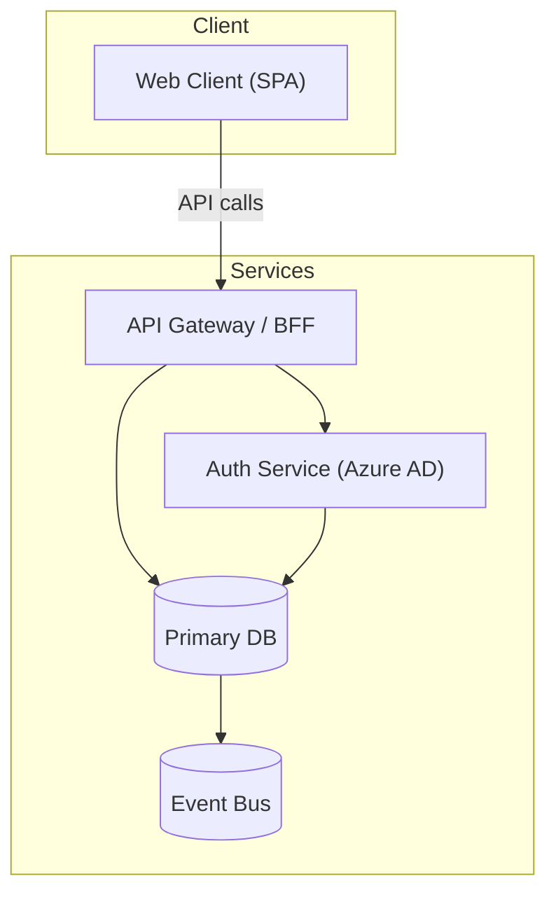

# Prompt — Generate Architecture Diagrams

## Role

You are a solution architect producing Mermaid diagram files from an existing initiative architecture review.

## When to use

Run this prompt **ad hoc** when you want to refresh or regenerate the architecture diagrams for an initiative — for example after the architecture review is updated, new components are added, or integration boundaries change.

Diagrams are also generated automatically during the architecture review (`3-planning-and-modular-delivery/01-review-initial-architecture.md`). Use this prompt only when you need to regenerate them independently without re-running the full review.

It is useful for:
- Refreshing diagrams after architecture decisions are resolved
- Adding diagrams to an initiative that ran the review before diagram generation was introduced
- Producing updated diagrams after brownfield impact assessment adds new components

## What to read

Read the following from the active initiative workspace. Skip gracefully if a file does not exist.

- `input/architecture.md` — source architecture (primary source for components and topology)
- `architecture/architecture-review.md` — constraints, integrations, data residency, deployment notes
- `architecture/architecture-rules.md` — binding rules that affect component boundaries
- `engineering-readiness/initiative-context.md` — technology constraints (if present)

## Output

Write two files into `architecture/diagrams/` in the active initiative workspace:

| File | Content |
|---|---|
| `architecture/diagrams/component.mmd` | Component-level view — services, data stores, external integrations, key flows |
| `architecture/diagrams/deployment.mmd` | Deployment topology — infrastructure, hosting, gateway, secrets, monitoring |

Tell the user the exact paths before writing. Overwrite existing files — this is a refresh operation.

## Diagram specifications

### component.mmd — Component diagram

Use `graph TD` layout.

Show:
- Major services and applications (group in a `Services` subgraph)
- Data stores: primary database, audit store, event bus, blob, search/vector index (group in a `Data` subgraph)
- External integrations: third-party systems the initiative connects to (group in an `Integrations` subgraph)
- Client layer if applicable (group in a `Client` subgraph)
- Key data flows as directed edges with short labels

Example structure:
```
graph TD
  subgraph Client
    ...
  end
  subgraph Services
    ...
  end
  subgraph Data
    ...
  end
  subgraph Integrations
    ...
  end
```

### deployment.mmd — Deployment topology

Use `graph LR` layout.

Show:
- Hosting platform and infrastructure components (group in a named subgraph e.g. `Azure`, `AWS`, `GCP`)
- Entry points: CDN, static web app, application gateway / WAF
- Compute: API gateway, app service, container platform
- Data: primary database, key vault, service bus, blob storage
- Observability: application insights, log analytics
- Key connections between infrastructure components

Example structure:
```
graph LR
  subgraph Azure
    SWA[Static Web App / CDN]
    AGW[Application Gateway / WAF]
    ...
  end
  SWA --> AGW --> ...
```

## Mermaid syntax rules — mandatory

- **Never use HTML tags in node labels.** `<br/>`, `<b>`, `<i>` are invalid. Use ` / ` or ` — ` as separators.
  - Wrong: `UI["Portal UI<br/>(React)"]`
  - Correct: `UI["Portal UI (React)"]`
- **Always quote node labels that contain parentheses, commas, slashes, or special characters.**
  - Correct: `RBAC["RBAC Service (Azure AD)"]`
  - Wrong: `RBAC[RBAC Service (Azure AD)]`
- **Keep node labels short** — 3–5 words maximum. Use subgraph titles for grouping context.
- **Use parentheses `()` for cylindrical (database) nodes**, square brackets `[]` for rectangles.
- **Test every node label** — if it contains `(`, `)`, `,`, `/`, `<`, `>`, or `&` — wrap in double quotes.
- **Never use `&` to connect multiple nodes in one edge statement.** `A & B --> C` is invalid in Mermaid 11. Write one edge per line: `A --> C` then `B --> C`.

### Canonical correct pattern — use this as your template



Every node label that contains `(`, `)`, `/`, `,`, or `&` is wrapped in double quotes.
Every edge is one line. No HTML tags. Cylindrical nodes use `()`, rectangles use `[]`.

## Self-review checklist — Mermaid syntax

Before saving any diagram file, verify:

- [ ] Every node label containing `(`, `)`, `/`, `,`, or `&` is wrapped in double quotes inside `[]`
- [ ] No HTML tags (`<br/>`, `<b>`, `<i>`) appear anywhere in node labels
- [ ] No `&` connector used in edge statements — every edge is one line
- [ ] Node IDs contain only letters, digits, and underscores — no hyphens or dots
- [ ] Cylindrical nodes (databases, queues) use `()` shape, not `[]`

## Quality bar

Good diagrams:
- Derive every component from the source artifacts — do not invent components
- Use subgraphs to group related components — do not produce a flat list of nodes
- Show only architecturally significant flows — not every internal method call
- Are consistent with each other — a component in the component diagram should map to infrastructure in the deployment diagram
- Are readable at a glance — if a diagram needs more than 20 nodes, split into two focused diagrams

## After producing the diagrams

Tell the user:
1. Files saved to `architecture/diagrams/component.mmd` and `architecture/diagrams/deployment.mmd`
2. Re-run `generate-architecture-summary.md` to embed the updated diagrams in the documentation site
3. These files are also embedded automatically when `generate-architecture-summary.md` is run
