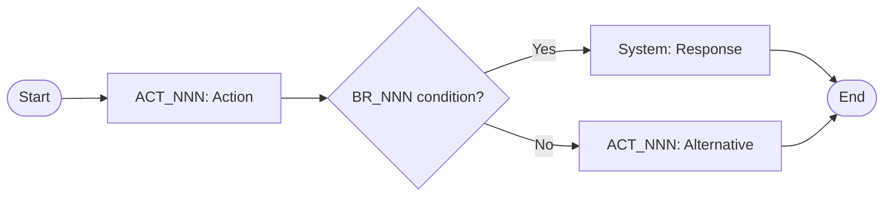

# Process Flows

## Metadata

| Field | Value |
|---|---|
| Initiative ID | {{initiative_id}} |
| Created at | {{date}} |
| Created by event | {{event_id}} |
| Status | Draft |

## Process Flow Catalog

| PF-NNN | Name | Primary Actor | Trigger | Outcome | BRS Source |
|---|---|---|---|---|---|
| PF-001 | | | | | |

---

## PF-001: {{Flow Name}}

**Primary actor:** ACT-NNN  
**Secondary actors:** ACT-NNN, SYS-NNN  
**Trigger:** {{what initiates this flow}}  
**Pre-conditions:** {{system state required before start}}

### Steps

| Step | Actor | Action | System Response |
|---|---|---|---|
| 1 | ACT-NNN | | |

### Decision Points

| Step | Condition | Branch |
|---|---|---|
| | BR-NNN — {{condition}} | Yes → Step N / No → Step N |

### Alternative Paths

**PF-001-A: {{Alternative name}}**  
Branches from step N when {{condition}}.

### Post-conditions

- {{Observable system state after flow completes}}

### Flow Diagram

---
*Set Status: Accepted after review. Do not self-accept.*
