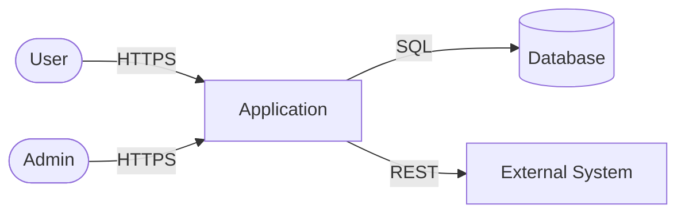

# Threat Model

## Metadata

| **Field** | **Value** |
|---|---|
| **Status** | **In progress** |
| Initiative ID | {{initiative_id}} |
| Methodology | STRIDE + DREAD |
| Created at | {{date}} |
| Created by event | {{event_id}} |

## Trust Boundaries

## Threat Catalog

| THR-NNN | Boundary | STRIDE | Threat Description | DREAD | Risk | Existing Mitigation | Required Mitigation | Owner | Status |
|---|---|---|---|---|---|---|---|---|---|
| THR-001 | User ↔ App | S | | /15 | Critical / High / Medium / Low | | | | Open / Mitigated / Accepted |

**STRIDE:** S=Spoofing, T=Tampering, R=Repudiation, I=Information Disclosure, D=Denial of Service, E=Elevation of Privilege  
**DREAD:** Damage(1-3) + Reproducibility(1-3) + Exploitability(1-3) + Affected users(1-3) + Discoverability(1-3) = /15  
**Risk:** Critical(11-15), High(7-10), Medium(4-6), Low(1-3)

## Mitigation Priority

| Priority | THR-NNN | Required Mitigation | Owner | By when |
|---|---|---|---|---|
| 1 (Critical) | | | | before handoff |

## Accepted Threats

| THR-NNN | Justification | Owner | Review date |
|---|---|---|---|

---
*Status: In progress — set to Accepted by security gate owner. Never self-accept.*
