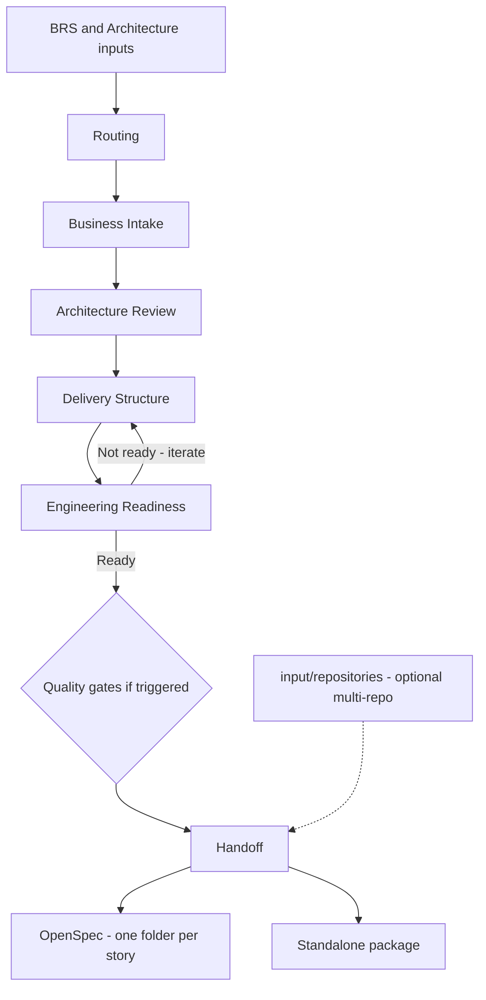
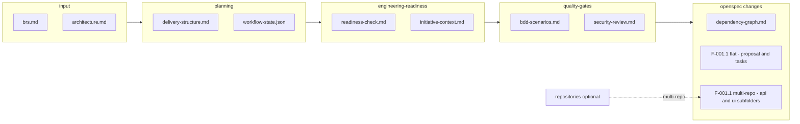

# Enterprise BRS to Delivery Readiness Framework

**From enterprise BRS to AI-safe engineering handoff.**

`brs-to-spec` is the missing upstream layer before OpenSpec, GitHub Copilot, Codex, or any AI-assisted delivery tool. It transforms one or more raw **Business Requirements Specification (BRS)** documents, plus optional architecture source material, into business-approved, architecture-aligned, delivery-ready increments — structured so that an AI coding agent can implement safely, one story at a time.

## What problem does this solve?

Enterprise delivery fails when AI coding agents are pointed at raw BRS documents. A real initiative carries ambiguity, implicit assumptions, architecture constraints, regulatory expectations, and cross-team dependencies that no coding agent can resolve from a Word file. This framework creates the controlled path between business intent and safe engineering execution.

OpenSpec is the default engineering downstream, but it is not mandatory. The framework also supports standalone execution, Microsoft 365 Copilot / Copilot Studio business intake, and GitHub Copilot / VS Code guided delivery workflows.

## Start here

Run the workflow runner at the start of every session:

```text
.brs2spec/brs-to-spec-run-workflow.md
```

It detects where you are, executes the next stage, and continues automatically until a genuine human decision is required. No menus, no permission requests.

## Example output

See `initiatives/I001-customer-onboarding/` for a complete worked example. Key files:

- `planning/workflow-state.json` — machine-readable stage tracker
- `planning/delivery-structure.md` — epics, features, user stories with traceability
- `openspec/changes/dependency-graph.md` — wave-ordered story execution plan
- `openspec/changes/F-001.1-onboarding-submission/` — one self-contained story folder (proposal, design, tasks, specs)

## Recommended first prompt

Run:

```text
.brs2spec/brs-to-spec-run-workflow.md
```

Use it when you want Copilot or a Codex agent to inspect the current initiative workspace and continue from the correct next step. See `HOW_TO_USE.md` for the full step-by-step walkthrough.

The workflow runner:
- Detects the active initiative workspace
- Reads `planning/workflow-state.json` for a fast-path hint (or auto-initialises it if missing)
- Checks content, not just file existence — stubs and placeholders count as missing
- Identifies stale artifacts (resolved decisions not yet reflected)
- Executes the next required stage fully
- Re-assesses and continues automatically until a genuine stop condition is reached

## Why this framework exists

Do not ask an AI coding agent to implement directly from a large Word BRS.

A real enterprise initiative usually spans ambiguity, implicit assumptions, architecture constraints, regulatory expectations, dependencies, hidden delivery risks, and review obligations across multiple roles. Sometimes the source material is one BRS and one architecture note. Sometimes it is split across several documents. This framework creates a controlled path from business intent to delivery-ready work.

## Core workspace model

The primary operating model is an **initiative workspace**:

```text
initiatives/<initiative-id>-<slug>/
```

Each initiative workspace represents one delivery initiative.

### Default input model

For the common case, keep the inputs simple:

```text
initiatives/<initiative-id>-<slug>/
  input/
    brs.md
    architecture.md
    input-package.md
```

### Expanded input model

Only expand into folders when the same initiative has multiple source documents:

```text
initiatives/<initiative-id>-<slug>/
  input/
    brs/
      main.md
      compliance.md
    architecture/
      main.md
      security-constraints.md
    input-package.md
```

Use `input/input-package.md` to record inventory, completeness, overlap, conflicts, assumptions, and consolidation notes.

## What this framework is

It is an adaptive front door for enterprise delivery.



The framework is designed so generated artifacts are evidence-based, traceable, decision-oriented, and ready for structured review.

An important governance rule is that governed boundaries must be made explicit:

- governed service or API boundary -> usually trigger `API contract`
- governed data ownership or schema boundary -> usually trigger `Data contract`
- governed asynchronous event boundary -> usually trigger `Event contract`

Prompts consistently define:

```text
role
context
purpose
inputs
output path
required structure
quality bar
anti-patterns
stop conditions
self-review checklist
```

Templates and review artifacts consistently capture:

```text
evidence
risk
owner
required-before stage
decision status
traceability
review outcome
acceptance and exit criteria
```

Optional visual views may be embedded inside the owning artifact when they materially improve clarity for review, handoff, or documentation.

Prefer lightweight text-native visuals such as Mermaid, and only add them when they clarify something that would otherwise stay hard to follow in text.

Default visual rule:

- prefer embedded Mermaid in markdown
- reference an existing authoritative diagram when one already exists
- avoid large decorative or tool-specific diagrams unless they are already the system of record

## Initiative-Scoped Outputs

All outputs belong to the active initiative workspace. For example:

```text
initiatives/<initiative-id>-<slug>/
  business-intake/business-intake-summary.md
  architecture/architecture-review.md
  planning/delivery-increments.md
  planning/traceability-matrix.md
  engineering-readiness/readiness-check.md
  quality-gates/*.md
  openspec/changes/... or standalone-delivery/...
  perspectives/agile-planning/gitlab-planning-view.md
```



This keeps artifacts for separate initiatives isolated from each other while still allowing an initiative to grow from a simple single-document input model into a multi-document one when needed.

## Artifact use model

Each important artifact should have an obvious consumer and an obvious downstream use.

| Artifact | Primary consumer | Purpose / decision supported | Downstream use | Do not duplicate |
|---|---|---|---|---|
| `business-intake/business-intake-summary.md` | Product Owner, business analyst, delivery lead | Confirm business scope, goals, gaps, and boundaries | Feeds architecture review, delivery planning, and readiness | Low-level engineering design or implementation tasks |
| `architecture/architecture-review.md` | Architect, tech lead, delivery lead | Confirm constraints, conflicts, and architecture-impact decisions | Feeds architecture rules, delivery structure, readiness, and contracts | Rewritten business scope or copied task breakdown |
| `planning/delivery-structure.md` | Delivery lead, PO, architect, engineering lead | Define planning structure, story shape, slices, governed boundaries, and traceability expectations | Feeds traceability, readiness, handoff, and planning projection | Full acceptance text, repeated architecture rationale, or detailed implementation steps |
| `engineering-readiness/readiness-check.md` | Delivery lead, architect, QA, governance reviewers | Decide whether work is ready and which gates are mandatory | Triggers conditional quality gates and constrains handoff | Detailed handoff content or code-review findings |
| `quality-gates/*.md` | QA, security, architect, SRE, engineering reviewers | Record gate-specific decisions and evidence | Feeds handoff approval, implementation constraints, merge, or release | Full restatement of business intake or planning artifacts |
| `standalone-delivery/delivery-spec.md` or `openspec/changes/.../design.md` | Engineers, tech lead, reviewers | Define the active deliverable and its implementation boundaries | Feeds implementation tasks and validation | Duplicated acceptance sources or backlog projection |
| `openspec/changes/.../tasks.md` or `standalone-delivery/.../tasks.md` | Engineers, coding agents, reviewers | Provide the approved engineering implementation contract | Feeds one-task-at-a-time implementation and implementation review | Broad business restatements or a second planning hierarchy |
| `perspectives/agile-planning/gitlab-planning-view.md` | Delivery team, PO, scrum master / PM | Project approved planning artifacts into Agile-tool language | Feeds GitLab / Jira / Azure DevOps planning and coordination | Source-of-truth requirements, architecture constraints, or implementation task truth |

Some of these artifacts may also include an optional visual view when it materially improves understanding:

- `business-intake/business-intake-summary.md` -> business flow or actor/system view
- `architecture/architecture-review.md` -> system context, container, or integration flow
- `planning/delivery-structure.md` -> slice/dependency or capability-to-module orientation view
- `openspec/changes/.../design.md` or `standalone-delivery/.../delivery-spec.md` -> focused interaction or sequence flow for the active deliverable

These visuals support documentation and implementation together, but they are not mandatory by default.

## What this framework is not

It is not:

- a replacement for OpenSpec
- a coding-agent framework
- a replacement for Product Owners, architects, QA, security, or SRE
- a mandatory process for every small change
- a way to generate implementation directly from raw BRS sources without normalization

## Core principle

Use the smallest workflow that gives enough control.

## Entry modes

Use an entry mode first to choose the right starting pattern.

Entry modes do not replace delivery modes or execution modes.

They help the user decide how to enter the framework before routing the initiative in the normal way.

| Entry mode | Use when | Minimum starting artifacts | Likely next prompt | Risk if wrong mode is chosen |
|---|---|---|---|---|
| BRS-first | A new or formal initiative starts from one or more BRS documents | `input/brs.md`, optional `input/architecture.md`, `input/input-package.md` | `.brs2spec/0-input-preparation/03-normalize-input-package.md` then `.brs2spec/1-routing/01-select-delivery-and-execution-mode.md` | Important business ambiguity may stay hidden if the inputs are not normalized first |
| Existing-system enhancement | The initiative changes an existing solution, integration, contract, or operational flow | normalized inputs plus existing architecture context and affected-area notes where available | `.brs2spec/2-business-intake/01-create-business-intake-summary.md`, optional `architecture/existing-system-impact.md`, and architecture review | Regression, compatibility, rollback, and governed-boundary impact may be missed |
| Small change / bug fix | Scope is narrow, the affected area is known, and the change may qualify for Fast Path | concise BRS or problem statement, architecture context if relevant, `input/input-package.md` | `.brs2spec/1-routing/01-select-delivery-and-execution-mode.md` | Teams may over-process a small change or, worse, skip readiness on a risky fix |
| Large modular initiative | The initiative spans multiple capabilities, teams, or increments | normalized inputs, architecture context, delivery-shaping context | `.brs2spec/1-routing/01-select-delivery-and-execution-mode.md` followed by modular planning prompts | Under-sizing the initiative can cause poor slicing, weak traceability, and context saturation |

## Delivery modes

| Delivery mode | Use when | Typical output |
|---|---|---|
| Fast Path | The change is already clear and engineering-ready | OpenSpec directly or small standalone package |
| Standard Path | Some clarification is needed | Business intake + readiness + handoff |
| Enterprise Path | Formal BRS, architecture impact, compliance, multiple stakeholders | Intake + architecture + traceability + gates |
| Enterprise + Modular Delivery | Large, multi-team, multi-quarter work or AI context saturation risk | Modules + increments + active-deliverable handoff |

## Small-change paths

Small changes should use the lightest safe path.

They should not be forced through unnecessary weight, but they must still preserve:

```text
traceability
architecture awareness
readiness discipline
triggered quality gates
handoff quality
```

Use:

```text
docs/20-small-change-paths.md
```

## Execution modes

| Execution mode | Use when | Output |
|---|---|---|
| OpenSpec | OpenSpec is available and should be the engineering source of truth | `openspec/changes/dependency-graph.md` + one `F-XXX.X-<slug>/` folder per user story inside the initiative workspace |
| Standalone | OpenSpec is not used | `standalone-delivery/<deliverable-name>/` inside the initiative workspace |
| Business Copilot | Business users work in Microsoft 365 / SharePoint / Word / Teams | SharePoint/Word review outputs plus initiative-scoped framework artifacts |

## Official normalized inputs

Within an initiative workspace, the canonical inputs are:

```text
input/brs.md or input/brs/*.md
input/architecture.md or input/architecture/*.md
input/input-package.md
```

At the beginning of an initiative, `input/architecture.md` or `input/architecture/*.md` is often high-level solution architecture context, for example:

```text
system landscape
software systems
containers
major integrations
major platform boundaries
high-level constraints
```

Use that early architecture input to frame the world the initiative lives in.

Do not assume it already answers every initiative-specific delivery question.

## Conditional quality gates

Quality gates are not optional.

They are not always required, but when triggered by the readiness check, they become mandatory before the relevant implementation, merge, or handoff step.

## Brownfield / existing-system mode

When the initiative changes an existing solution, use the framework's brownfield handling to make these visible early:

This is the recommended pattern for an `existing-system enhancement`.

```text
affected components or modules
compatibility and regression risk
API or contract impact
data migration or schema sensitivity
existing behavior that must remain stable
deployment or rollback sensitivity
operational dependencies
```

When the impact is material, create:

```text
architecture/existing-system-impact.md
```

using:

```text
.brs2spec/templates/planning-and-modular-delivery/existing-system-impact.md
```

## Architecture handling rule

Treat the initial architecture input as:

```text
high-level solution architecture context early
initiative-specific delivery constraint later
```

That means:

- use the initial architecture input early to understand systems, containers, integrations, and major boundaries
- use delivery shaping to make the initiative concrete
- then refine architecture implications against that initiative shape in `architecture/architecture-review.md` and `architecture/architecture-rules.md`

The later architecture stage should explicitly refine initiative-specific decisions such as:

- impacted components
- interface and contract impact
- governed boundaries
- rollout / rollback constraints
- validation implications
- delivery-shaping rules

Do not imply that architecture is optional when it exists.

Do not over-claim that the initial architecture input already resolves all initiative-specific delivery questions.

## Planning view

The framework can generate an Agile / GitLab planning view as a read-only projection.

It also serves as the framework's single team-facing Delivery Planning View.

It does not create a second source of truth. The source of truth remains:

```text
business-intake/business-intake-summary.md
planning/delivery-structure.md
planning/delivery-increments.md when the initiative uses Modular Delivery
planning/traceability-matrix.md
engineering-readiness/readiness-check.md
quality-gates/*.md
openspec/changes/... or standalone-delivery/...
```

Downstream helper outputs are not source of truth:

```text
perspectives/agile-planning/gitlab-planning-view.md
.brs2spec/8-copilot-implementation execution summaries
.brs2spec/9-reviewers review findings
```

The planning view maps those artifacts into the language used by delivery teams:

```text
Epic
Feature / Issue
User Story
Task / Checklist
Milestone
Labels
```

Epic / Feature / User Story structure should be defined during delivery planning, not invented only in the planning projection.

The GitLab planning view should project that structure for Agile tooling.

The same projection can include:

```text
Engineering Notes
Enablement Needs
GitLab mapping
```

User stories in that view provide business intent and traceability.

OpenSpec or standalone tasks remain the engineering implementation contract.

Those tasks should be derived from the planned user stories plus architecture constraints, readiness decisions, and quality gates — without becoming a new workflow or a parallel technical-planning track.

Generated output:

```text
perspectives/agile-planning/gitlab-planning-view.md
```

If scope, requirements, architecture constraints, quality gates, or implementation tasks change, update the source artifacts first and regenerate the planning view.

## Planning artifact density rule

The largest planning artifacts should stay readable as initiatives grow.

Use this rule:

```text
delivery-structure.md = planning structure and traceability logic
gitlab-planning-view.md = team-facing projection for coordination
```

In `planning/delivery-structure.md`:

- keep epic / feature / user story structure detailed enough for handoff and traceability
- keep story-traceability rules, governed boundaries, and slice logic explicit
- keep capability lists, candidate modules, and candidate slices summary-level unless more detail changes delivery decisions
- reference acceptance and architecture sources instead of repeating them

In `perspectives/agile-planning/gitlab-planning-view.md`:

- show only the planning projection needed for team coordination
- keep Engineering Notes and Enablement Needs concise and evidence-based
- reference source artifacts instead of copying their content
- do not turn the planning view into a second backlog or engineering contract

## Copilot guidance

The repository includes guidance for GitHub Copilot and VS Code so assistants understand that this is a BRS-to-delivery-readiness framework, not an application codebase.

Relevant support files include:

```text
.github/instructions/brs-to-spec.instructions.md   ← behavioral rules, scoped to initiatives/**
.github/prompts/brs2spec/                          ← Copilot Chat slash command stubs
.brs2spec/agent-instructions.md                    ← behavioral rules for Claude Code / Cursor / Codex
.brs2spec/module.md                                ← full index of all prompts with descriptions
docs/15-github-copilot-workflow.md
docs/16-prompt-execution-environments.md
docs/17-copilot-usage.md
.vscode/settings.json
```

The framework behavioral rules define a critical operating rule: work inside one initiative workspace at a time, and treat all workflow paths as relative to that workspace.

For implementation and review, the framework also includes:

```text
.brs2spec/8-copilot-implementation/
.brs2spec/9-reviewers/
.brs2spec/templates/quality-gates/ready-for-copilot-checklist.md
```

Quality gate artifacts and reviewer prompts are intentionally separate:

- quality gates are governance artifacts created before implementation, merge, or release when triggered
- reviewer prompts are downstream helpers used after implementation to review actual code and tests against the approved source artifacts

## Template quality rule

Every important review artifact should answer:

```text
What decision was made?
What evidence supports it?
What risk remains?
Who owns the action?
By when / before which stage is it required?
Which requirement or architecture constraint is affected?
```

## Artifact quality review rule

Before moving to the next workflow step, ask whether the artifact is good enough for use, not just present.

Use:

```text
docs/21-artifact-quality-review.md
```

The lightweight review test is:

```text
What decision does this artifact support?
What evidence is actually present?
What next step depends on it?
What would go wrong if we used it as-is?
```

If the answer is weak, revise the artifact before proceeding.

## Recommended use

Create an initiative workspace:

```bash
python .brs2spec/tools/scripts/new_initiative.py onboarding-request --initiative-id I001 --mode enterprise --execution-mode openspec
```

Add another BRS source only if the initiative really has more than one source document:

```bash
python .brs2spec/tools/scripts/add_brs.py initiatives/I001-onboarding-request compliance
```

Add another architecture source only if needed:

```bash
python .brs2spec/tools/scripts/add_architecture.py initiatives/I001-onboarding-request security-constraints
```

Then run the prompts against that initiative workspace, treating every input and output path as relative to:

```text
initiatives/I001-onboarding-request/
```

If the right starting pattern is unclear, review:

```text
docs/18-entry-modes.md
```

If the change is narrow and likely qualifies for a lighter path, also review:

```text
docs/20-small-change-paths.md
```

At each point, the framework should help you answer:

```text
What stage am I in?
What is already complete?
What is missing?
What comes next?
What risk exists if I skip ahead?
```


