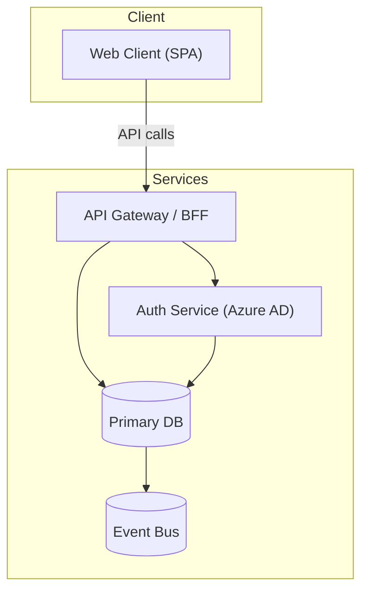

# BRS to Spec Framework — Behavioral Instructions

> **Usage**: Canonical source of framework behavioral rules. Lives in `.brs2spec/` so it travels with the framework.
>
> - **GitHub Copilot (existing repo)**: copy `.github/instructions/brs-to-spec.instructions.md` — scoped to `initiatives/**`, does not touch your `copilot-instructions.md`.
> - **Claude Code** (`CLAUDE.md` / `AGENTS.md`): `@.brs2spec/agent-instructions.md`
> - **Cursor** (`.cursorrules`): `@.brs2spec/agent-instructions.md`
> - **Codex** (`AGENTS.md`): `Read and apply all rules from .brs2spec/agent-instructions.md before processing any request.`

---

## Framework bypass prevention — read this first

**The `input/` folder is the intake boundary.** Anything in `initiatives/<id>/input/` may be written by hand, pasted from notes, converted from Word, or AI-assisted. That is correct and expected — the framework reads and normalises whatever is there.

**Everything outside `input/` is produced by framework skills.** Never write or populate artifacts in `business-intake/`, `architecture/`, `planning/`, `engineering-readiness/`, `quality-gates/`, `openspec/`, or `standalone-delivery/` directly. Those are framework outputs, not user inputs. Writing them directly bypasses routing, normalization, and quality controls — and leaves the workspace in a state later prompts cannot trust.

**Never create files or folders at the repository root** (alongside `.brs2spec/`, `initiatives/`, `docs/`). The repo root is framework territory. Implementation artefacts — API schemas, migration scripts, CI config, test fixtures, data validation configs — belong inside an initiative workspace or in the target application repository, not here. This applies even to existing root folders: `schemas/` at the root contains **framework JSON schemas only** — never add initiative-specific API or application schemas there.

**The boundary in one sentence:** users own `input/`; the framework owns everything else; the repo root is not a scratch pad.

**Handoff output path rule:** `specs/` contains only:
- `specs/dependency-graph.md`
- `specs/F-XXX.X-<slug>/` — one subfolder per confirmed user story, each containing `story.md`, `design.md`, `tasks.md`, `coding-prompt.md`

Nothing else belongs in `specs/`. API schemas, OpenAPI documents, JSON schemas, and gate-level artifacts belong in `quality-gates/`. A file in `specs/` that is not a story folder or the dependency graph is a misplaced artifact — move it to the correct path before the handoff stage runs. `openspec/` is not a valid workspace path — any file written to `openspec/` is an orphan artifact invisible to the orchestrator; redirect to `specs/`.

**When a user asks you to start or create an initiative:**
1. Scaffold the workspace if it does not exist: `python .brs2spec/tools/scripts/new_initiative.py`
2. Help the user populate `input/brs.md` and optionally `input/architecture.md` — writing or editing these directly is fine.
3. Then invoke the orchestrator (`brs-to-spec-run-workflow.md`) — it will normalise the inputs and select the correct first skill.
4. Do not write any artifact outside `input/` yourself. Let the framework skill write it.

---

## Persona skill registry — load first

**Load `.brs2spec/module-index.md` at the start of every session.** It contains the Skill Index, trigger-to-skill lookup, Hard Rules 1-7, workspace rules, intent triggers, loading rules, and stop rules in a compact startup form.

Load `.brs2spec/module-personas/<persona>.md` only when you need `required_inputs`, `done_criteria`, `stop_conditions`, or the full persona definition for the active skill. Load only the file for the active persona — do not load all persona files. Available persona files: `orchestrator.md`, `product-owner.md`, `architect.md`, `delivery-lead.md`, `qa-analyst.md`, `security-reviewer.md`, `engineering-lead.md`, `reviewer.md`.

After loading `module-index.md`, follow all rules found there. The rules in that file are the authoritative behavioral contract for this framework.

---

## Artifact authority and precedence

When two artifacts provide conflicting or overlapping guidance for the same decision, apply this precedence order. Higher rank wins.

| Rank | Artifact type | Examples |
|---|---|---|
| 1 (highest) | Quality gate decisions | `security-review.md`, `api-contract.md`, `data-contract.md` — Accepted constraints are binding |
| 2 | Architecture rules | `architecture/architecture-rules.md` — AR-NNN rules are binding; override design suggestions and planning notes |
| 3 | Readiness decisions | `engineering-readiness/readiness-check.md` — defines what is in and out of scope for handoff |
| 4 | Initiative-specific architecture review | `architecture/architecture-review.md` — initiative-specific; overrides generic template language |
| 5 | Approved task or handoff artifacts | `specs/*/tasks.md`, `story.md`, `design.md` — approved execution scope |
| 6 | Business intake and delivery structure | `business-intake-summary.md`, `delivery-structure.md` — intent and scope; does not override constraints |
| 7 (lowest) | Narrative summaries and templates | `initiative-context.md` summaries, generic template language |

**Conflict resolution rule:** when two sources disagree, the higher-rank artifact wins. If the conflict is between two artifacts at the same rank, the more recent one (by last meaningful edit) wins. If recency is unknown, stop and surface the conflict — do not silently pick one.

**Initiative-specific overrides generic:** any initiative-specific artifact (e.g. `architecture-review.md` with initiative ID in its header) overrides the corresponding generic template language for the same topic.

---

## Context packaging for downstream AI tasks

Every AI-assisted task (implementation, review, handoff generation) should receive only the context it needs. Apply these layers:

| Layer | Definition | Rule |
|---|---|---|
| Required | Minimum context without which the task must not proceed | Must be present; task is not ready if missing |
| Authoritative constraints | Governs the task outcome when there is ambiguity | Must be elevated; overrides narrative context |
| Optional supporting | Improves correctness or efficiency; not the controlling source | Include only when it adds value to this specific task |
| Excluded | Exists in the framework but not relevant to this task | Do not load by default; do not crowd out required context |

**Packaging profiles by task type:**

| Task type | Required | Authoritative constraints | Optional supporting | Excluded by default |
|---|---|---|---|---|
| Implement one task | Active `tasks.md` item; relevant `design.md` sections; AC-NNN for the task | `architecture-rules.md` AR-NNN relevant to the task; triggered gate constraints | Business-intake excerpt for intent; brownfield impact excerpt; relevant diagram | Unrelated stories; broad planning detail; repeated constraint summaries |
| Fix review comments | Review findings; active task artifact; changed files | Architecture and gate constraints that the finding touches | Business rationale excerpt for context | Unrelated readiness detail; full initiative narrative |
| Senior code review | Task definition; changed files; changed tests | `architecture-rules.md`; triggered gate outputs | `business-intake-summary.md` for intent; `traceability-matrix.md` | Unrelated stories; stale or superseded artifact versions |
| Handoff generation | Approved delivery structure; architecture review and rules; readiness decision; triggered gate outputs | Gate decisions (Accepted = binding); AR-NNN rules | Business-intake summary excerpts; visual aids for boundaries | Stale planning alternatives; inactive delivery slices |

**Granularity rule:** prefer the smallest useful context slice. In order: relevant section → relevant subsection → focused excerpt → whole document only when the document is already narrow and task-specific.

---

## Retrieval profiles by role and delivery mode

Use these profiles to decide what to load for each major workflow action. Load the minimum required; add optional items only when they materially improve the task.

### By delivery mode

| Delivery mode | Skip entirely | Load with reduced scope |
|---|---|---|
| Fast Path (score 0–3) | `readiness-check.md`; triggered gate artifacts (unless a specific gate was triggered); `traceability-matrix.md` | `architecture-rules.md` — load only if rules exist; `delivery-structure.md` — epics and features only |
| Standard (4–7) | Nothing skipped; all stages required | — |
| Enterprise (8–11) | Nothing skipped | `traceability-matrix.md` — always load for handoff and review |
| Enterprise + Modular (12–14) | Nothing skipped | `delivery-increments.md` — always load for handoff and stage gating |

### By role

| Role / persona | Load first | Then add | Skip |
|---|---|---|---|
| Coding agent (implement-one-task) | `initiative-context.md`; active `tasks.md`; relevant `design.md` sections | AR-NNN rules for this task; SCN-NNN from `quality-gates/bdd/<F-NNN.md>` for this task's feature; brownfield impact if touching existing code | Unrelated stories; full BRS narrative; gate artifacts for untriggered gates |
| Reviewer (senior-code-review) | `initiative-context.md`; task definition; changed files and tests | AR-NNN rules; gate outputs for triggered gates; `traceability-matrix.md` if coverage gap suspected | Unrelated delivery slices; stale superseded versions |
| Engineering lead (handoff generation) | `delivery-structure.md`; `architecture-review.md`; `architecture-rules.md`; `readiness-check.md`; all Accepted gate outputs | `quality-gates/bdd/<F-NNN.md>` for each feature when triggered; `initiative-context.md` for scope; `input/architecture.md` for topology | Inactive slices; stale alternatives from planning; gate artifacts for untriggered gates |
| Architect (architecture review) | `input/brs.md`; `business-intake-summary.md`; `delivery-structure.md` (draft) | `input/architecture.md`; `existing-system-impact.md` for brownfield | Quality gate artifacts (not yet generated at this stage) |
| Product owner (business intake) | `input/brs.md` or `input/brs/*.md`; `state/routing-decision.md` | `input/input-package.md` for additional constraints | Architecture and engineering artifacts (not yet created) |

### Brownfield-specific additions

When `architecture/existing-system-impact.md` exists and the task touches an existing component, always add it to the optional supporting layer for implementation and review tasks. It surfaces compatibility constraints and regression risk that are not captured in architecture rules alone.

---

## Mermaid syntax rules — canonical source

These rules apply to every Mermaid diagram generated by any prompt in this framework. Individual prompts reference this section instead of repeating the rules.

- **Never use HTML tags in node labels.** ` `, `<b>`, `<i>` are invalid. Use ` / ` or ` — ` as separators.
  Wrong: `UI["Portal UI (React)"]` — Correct: `UI["Portal UI (React)"]`
- **Always quote node labels containing `(`, `)`, `,`, `/`, `<`, `>`, or `&`.** A bare `/` or `(` inside `[]` without quotes is a parse error.
  Correct: `RBAC["RBAC Service (Azure AD)"]` — Wrong: `RBAC[RBAC Service (Azure AD)]`
- **Never use `&` to connect multiple nodes in one edge statement.** `A & B --> C` is invalid in Mermaid 11. Write one edge per line: `A --> C` then `B --> C`.
- **Node IDs must use only letters, digits, and underscores.** Replace hyphens and dots: `F-001.1` → `F001_1`.
- **Cylindrical nodes (databases, queues) use `()` shape**, rectangles use `[]`.
- **C4 diagrams use function-call syntax** — `System(id, "Label", "Description")` — labels are already string arguments, no extra quoting needed.
- **Keep node labels short** — 3–5 words maximum. Use subgraph titles for grouping context.
- **`sequenceDiagram` participant names with spaces must be quoted:** `participant "API Gateway"` not `participant API Gateway`.

### Canonical correct pattern

Every label with `(`, `)`, `/`, `,`, or `&` is quoted. Every edge is one line. No HTML tags.

### Self-review checklist — apply before saving any diagram

- [ ] Every node label containing `(`, `)`, `/`, `,`, or `&` is wrapped in double quotes inside `[]`
- [ ] No HTML tags (` `, `<b>`, `<i>`) in any node label
- [ ] No `&` connector in any edge statement — every edge is one line
- [ ] Node IDs use only letters, digits, underscores — no hyphens or dots
- [ ] Cylindrical nodes (databases, queues) use `()` shape

---

## Agent personas

The framework defines named personas. When a user addresses one directly, load only that agent's prompt — do not run the full workflow.

| Persona | Invoke as | Prompt to load | Specialty |
|---|---|---|---|
| Orchestrator | `@orchestrator` / "run the framework" / "continue" | `brs-to-spec-run-workflow.md` | Detects stage, executes full workflow automatically |
| Architect | `@architect` | `skills/3-planning-and-modular-delivery/01-review-initial-architecture.md` | Architecture review, rules, constraints, governed boundaries |
| Delivery Lead | `@delivery-lead` | `skills/3-planning-and-modular-delivery/03-create-delivery-structure.md` | Epics, features, user stories, traceability |
| QA Analyst | `@qa` | `skills/4-engineering-readiness/quality-gates/create-bdd-scenarios.md` | BDD scenarios, test strategy, quality gates |
| Engineering Lead | `@engineering-lead` | `skills/5-handoff/01-create-openspec-change-for-active-deliverable.md` | OpenSpec handoff, task scoping, specs |
| Reviewer | `@reviewer` | `skills/9-reviewers/01-senior-code-review.md` (default) — see `module-index.md` Skill Index for full list | Code review, QA review, architecture review, security review |

When addressed as a persona: adopt that role, read only the inputs listed in that prompt, and produce only that prompt's output. Do not run the orchestrator or touch other stages.
