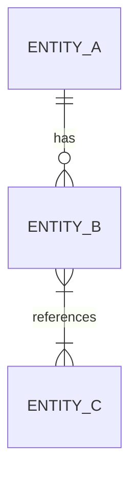

# Entity Model

> **Consumer:** Architects, engineers, data engineers, QA
> **Purpose:** Domain entity catalog — the data model that this initiative introduces or modifies
> **Generated from:** `input/brs.md`, `quality-gates/data-contract.md`, `architecture/architecture-review.md`

## Metadata

| Field | Value |
|---|---|
| Initiative |  |
| Version |  |
| Last updated |  |
| Status | Draft / Reviewed / Accepted |

## ER diagram

<!-- Mermaid erDiagram. Entities only — no attributes in the diagram. -->
<!-- Include all entities this initiative creates or materially changes. -->
<!-- Show relationships with cardinality (||, |{, }|, }{ etc.). -->

## Entity catalog

<!-- One subsection per entity. Repeat the block below. -->
<!-- Derive attribute details from: data-contract.md schema tables; BRS data requirements; architecture-review.md data decisions. -->

---

### {{EntityName}}

**Description:** {{one sentence — what this entity represents in the domain}}
**Introduced by:** {{F-NNN.N}} / Existing (modified by {{F-NNN.N}})
**Storage:** {{table name, collection name, or message schema name}}

| Attribute | Type | Constraints | Description |
|---|---|---|---|
| id | UUID | PK, NOT NULL | Surrogate primary key |
| created_at | TIMESTAMP | NOT NULL | Record creation timestamp (UTC) |
| updated_at | TIMESTAMP | NOT NULL | Last update timestamp (UTC) |

**Relationships:**

| Related entity | Cardinality | FK column | Notes |
|---|---|---|---|
| {{OtherEntity}} | One-to-many | {{fk_column}} | |

**Business rules that constrain this entity:**

| Rule ID | Rule | Enforcement |
|---|---|---|
| BR-NNN | | Application / DB constraint / Both |

---

### {{EntityName}}

<!-- Copy block above -->
