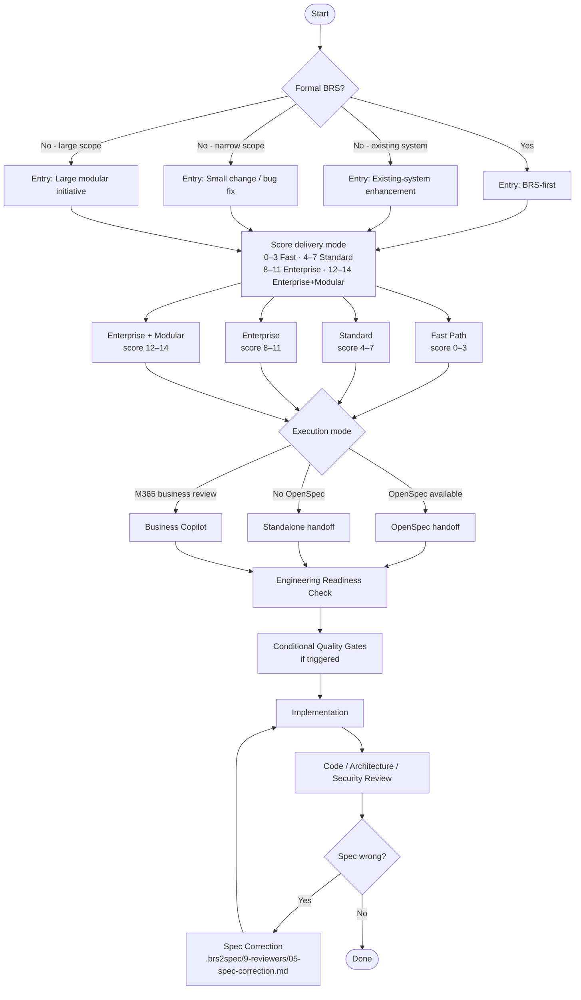

# Decision Tree

Use this document to find your entry point and delivery mode before opening any prompt.

For automated routing, run `.brs2spec/00-start.md` — it asks five questions and scores the decision for you.

---

## Step 1 — What kind of situation are you entering?

```
Do you have a formal BRS document?
│
├── Yes → Entry mode: BRS-first
│         First prompt: .brs2spec/0-input-preparation/01-convert-brs-word-to-markdown.md
│
├── No, but you are changing an existing system
│         → Entry mode: Existing-system enhancement
│         First prompt: .brs2spec/2-business-intake/01-create-business-intake-summary.md
│
├── No, scope is narrow (single story or bug fix)
│         → Entry mode: Small change / bug fix
│         First prompt: .brs2spec/1-routing/01-select-delivery-and-execution-mode.md
│
└── No, scope spans multiple capabilities or teams
          → Entry mode: Large modular initiative
          First prompt: .brs2spec/0-input-preparation/03-normalize-input-package.md
```

---

## Step 2 — How much workflow control do you need?

Score each criterion. Sum the scores to find your delivery mode.

| Criterion | 0 | 1 | 2 | Your score |
|---|---|---|---|---|
| Requirement ambiguity | Clear and complete | Some gaps | Significant gaps or conflicts | |
| Architecture impact | None | Touches existing components | New boundaries or services | |
| Compliance / audit relevance | None | Informally relevant | Formally required | |
| Business criticality | Low | Medium | High or customer-facing | |
| Number of teams | One | Two | Three or more | |
| Delivery size | Single story | 2–5 stories | 6+ stories or multi-quarter | |
| Brownfield regression risk | None | Low | Significant existing behavior affected | |
| **Total** | | | | |

| Total score | Delivery mode |
|---|---|
| 0–3 | **Fast Path** — minimal artifacts, engineering-ready scope |
| 4–7 | **Standard** — some clarification needed, one team |
| 8–11 | **Enterprise** — formal BRS, architecture impact, compliance |
| 12–14 | **Enterprise + Modular Delivery** — multi-team, multi-quarter |

Override is always allowed with explicit justification in the routing decision.

---

## Step 3 — Which downstream engineering format will you use?

| Situation | Execution mode |
|---|---|
| OpenSpec is available in your project | OpenSpec |
| No OpenSpec | Standalone |
| Business stakeholders review and approve in M365 | Business Copilot |

---

## Full flow by delivery mode



---

## Minimum artifact set by delivery mode

| Artifact | Fast Path | Standard | Enterprise | Enterprise + Modular |
|---|---|---|---|---|
| `input/input-package.md` | Required | Required | Required | Required |
| `routing/routing-decision.md` | Required | Required | Required | Required |
| `business-intake/business-intake-summary.md` | Optional | Required | Required | Required |
| `architecture/architecture-review.md` | Skip | Optional | Required | Required |
| `architecture/architecture-rules.md` | Skip | Optional | Required | Required |
| `planning/delivery-structure.md` | Skip | Required | Required | Required |
| `planning/delivery-increments.md` | Skip | Skip | Skip | Required |
| `planning/traceability-matrix.md` | Skip | Optional | Required | Required |
| `engineering-readiness/readiness-check.md` | Required if risk exists | Required | Required | Required |
| `engineering-readiness/initiative-context.md` | Required if risk exists | Required | Required | Required |
| Quality gates | Triggered only | Triggered only | Triggered only | Triggered only |
| Handoff artifact | Required | Required | Required | Required |

---

## Common mistakes

| Mistake | Consequence | Fix |
|---|---|---|
| Skipping readiness on Fast Path because "it's small" | Missing triggered gate, contract drift | Always run readiness when regression, security, or contract risk exists |
| Choosing Enterprise + Modular by default | Over-processing, context bloat | Score the criteria — reach 12+ before choosing this path |
| Running all prompts sequentially | Unnecessary artifacts, slower delivery | Use routing to exclude prompts not needed for the selected mode |
| Treating quality gates as optional | Governed boundary without contract | Gates are conditional, not optional — if triggered they are required |
| Implementing without `initiative-context.md` | Cross-session constraint drift | Generate context after readiness; load it before every implementation session |
