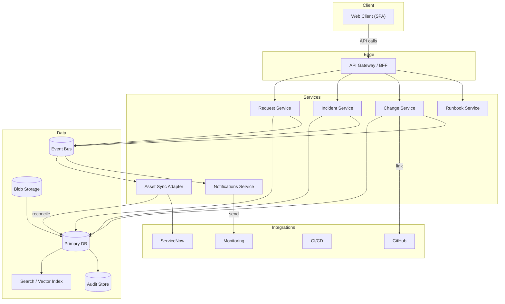

# Architecture Summary — I004 IT Portal

> Generated from initiative workspace. Last updated: 2026-06-11.
> Authoritative sources are `architecture/architecture-review.md` and `architecture/architecture-rules.md`.
> This document is a readable summary — not a replacement for the governed architecture artifacts.

## Diagrams

### Component diagram

### Deployment topology

## Review outcome

| Field | Value |
|---|---|
| Review decision | Approved with conditions |
| Reviewed by | TBD — architect and Product Owner to sign off |
| Date | 2026-06-11 |
| Key finding | Architecture is sound for MVP but three open decisions (D-001, D-002, D-003) must be resolved before connector implementation and handoff can proceed |

## Technology context

| Area | Detail |
|---|---|
| Platform / runtime | Azure-hosted web application; environments: dev / qa / stg / prod mapped to Azure subscriptions |
| Identity | Azure AD for SSO (SAML/OIDC); group-to-role mapping for RBAC |
| Secrets management | Azure Key Vault; portal accesses secrets via managed identity |
| Primary integration | ServiceNow — tickets (two-way, post-MVP) and CMDB (read-only sync, MVP) |
| CI/CD integration | One provider for MVP — GitHub Actions or Azure DevOps (D-001 pending) |
| Monitoring | App Insights / Prometheus; Log Analytics per environment |
| Storage — audit | Append-only / WORM store (technology to be confirmed — D-003 pending) |
| AI assistant | Hosted LLM (Azure OpenAI) with RAG over portal docs and CMDB metadata; dev/qa scope only for MVP |

## Binding architecture rules

These rules apply to all implementation work on this initiative and are enforced at code review and gate acceptance.

| Rule ID | Rule | Enforcement | Applies to |
|---|---|---|---|
| AR-001 | Least-privilege RBAC enforced at all API endpoints and UI views | Automated tests + policy checks; verified with sample role mappings | All API and UI layers |
| AR-002 | ServiceNow is authoritative for CMDB records — portal is read-only for MVP | Connector contract enforces read-only; no portal-owned CMDB records until D-002 resolved | CMDB connector |
| AR-010 | All external-facing APIs use HTTPS with token-based auth (OIDC/SAML) | Integration tests and CI policy; TLS required in infra templates | All external APIs |
| AR-011 | Integration adapter presents a single internal contract per external system | Contract tests and adapter unit tests; documented in handoff | ServiceNow, CI/CD, monitoring adapters |
| AR-012 | External integrations must declare data sensitivity and PII levels in contract metadata | Data-contract gate required before handoff | All external integration contracts |
| AR-020 | Audit events stored in append-only store with configurable retention and export | Storage choice validated in `engineering-readiness`; infra templates must support WORM | Audit service |
| AR-021 | Non-production environments use masked or synthetic data by default | CI pipelines must include data-masking step | dev / qa / stg environments |
| AR-030 | Secrets in Azure Key Vault accessed via managed identities only | Key Vault usage validated in infra templates; no secrets in code or config files | All services |
| AR-031 | AI assistant-triggered actions require explicit approval and audit trail | BDD scenarios and security review must include audit verification | AI assistant feature |
| AR-040 | Environments defined for dev/qa/stg/prod with subscription and resource-group mapping documented | `engineering-readiness` entry required; IaC templates reference mappings | Infrastructure / deployment |
| AR-041 | Design for 99.9% availability in primary region using redundancy and autoscaling | Infra templates must show AZs and autoscaling policies | Web and API layers |

## Key constraints

- **Audit trail** — must be append-only, exportable, and retention-configurable. Storage technology and retention period must be defined (D-003) before handoff.
- **Azure AD SSO** — mandatory. Group-to-role mapping approach must be validated in PoC before confirmed delivery structure.
- **Non-prod test data** — masked or synthetic by default. CI pipelines must include data-masking step.
- **High availability** — 99.9% uptime for primary region; multi-AZ redundancy and autoscaling required in infrastructure design.
- **Secrets** — Azure Key Vault with managed identity access. No secrets in code, environment variables or configuration files.
- **ServiceNow as CMDB source of truth** — portal does not own CMDB records in MVP. Subject to D-002 resolution.

## Governed boundaries

| Boundary | What it protects | Consequence of crossing |
|---|---|---|
| CMDB write-back | ServiceNow data integrity | Data duplication, reconciliation failures, ServiceNow contract violation |
| Secret storage | Key Vault centralisation | Secret leakage, rotation failures, security review failure |
| Non-prod data masking | PII and compliance | Data-contract gate failure, compliance breach |
| AI assistant action scope | Unauthorised actions via assistant | Security review failure, audit trail gaps |
| Append-only audit store | Audit immutability | Compliance breach, FR-10 gate failure |

## Architecture decisions made

| Decision | Answer | Impact on implementation |
|---|---|---|
| Delivery mode | Standard | All stages required; no Fast Path skip |
| Execution mode | Standalone | Handoff will be a standalone delivery package, not OpenSpec |
| RBAC approach | Azure AD groups mapped to portal roles | Auth layer must implement group claim extraction and role mapping |

## Open architecture decisions

| ID | Decision | Owner | Impact if unresolved |
|---|---|---|---|
| D-001 | Which CI/CD provider for MVP? | Product Owner / Platform | Webhook format and adapter implementation cannot start |
| D-002 | Portal ownership of asset types vs ServiceNow authoritative | Product Owner / Platform | Connector design and data contracts blocked; AR-002 enforcement conditions unknown |
| D-003 | Audit retention policy and storage technology | Security / Compliance | Infra design for audit store blocked; AR-020 cannot be validated; handoff blocked |
| D-004 | Azure AD group-to-role vs custom claims mapping | Platform / Identity | Auth PoC cannot be signed off |

## What implementation must not do

- Store secrets in code, configuration files, environment variables, or any location other than Azure Key Vault.
- Allow the portal to create, update or delete CMDB records in ServiceNow in MVP (read-only only).
- Use production data in dev, qa or stg environments without explicit masking.
- Allow AI assistant to trigger any action without an explicit approval step and audit record.
- Create infrastructure resources outside the defined dev/qa/stg/prod subscription and resource-group structure.
- Expose PII fields to roles that do not have explicit access permissions.
