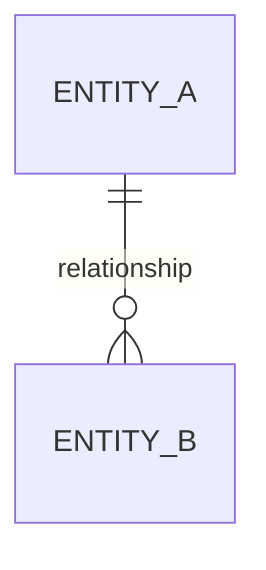

# Prompt — Create Entity Model

## Purpose

Create or update `business-analysis/entity-model.md` based on:

- `business-analysis/requirements.md`

This prompt is based on the AI Unified Process `/entity-model` prompt and adapted for initiative-local artifact production.

## Instructions

Create or update the entity model at `business-analysis/entity-model.md`.

The document must contain:

- an ER diagram
- one attribute table per entity

## DO NOT

- Add attributes or columns to the Mermaid diagram
- Write prose-only descriptions instead of attribute tables
- Create a generic "Relationships" table as a substitute for the ER diagram
- Skip attribute tables
- Introduce database implementation details such as index names or physical storage choices

## Inputs

Required:

- `business-analysis/requirements.md`

Optional:

- `business-analysis/business-rules.md`
- `business-analysis/gaps-and-questions.md`
- architecture feedback already captured in architecture artifacts

## Document Structure

```markdown
# Entity Model

## Entity Relationship Diagram


### ENTITY_NAME
One sentence describing the entity.

| Attribute | Description | Data Type | Length/Precision | Validation Rules |
|---|---|---|---|---|
```

## Required format for each entity

Every entity must have:

1. A `### ENTITY_NAME` heading
2. One sentence description
3. An attribute table with exactly 5 columns

## Mermaid diagram rules

- Show entity names and relationships only
- Do not list attributes in the diagram
- Use valid Mermaid `erDiagram` syntax
- Show cardinality in the relationships

## Validation rules guidance

Use concrete validation phrases such as:

- `Primary Key`
- `Not Null`
- `Not Null, Unique`
- `Optional`
- `Not Null, Min: X, Max: Y`
- `Not Null, Values: A, B, C`
- `Not Null, Format: Email`

## Workflow

1. Read `business-analysis/requirements.md`.
2. Identify the business entities implied by the requirements.
3. Add relationship lines to the ER diagram.
4. For each entity, create one description and one attribute table.
5. Add multi-column constraints after the relevant table when necessary.
6. Validate that every entity in the diagram has a matching attribute-table section.

## Output expectations

This is a business/domain entity model.

It should be strong enough to support later:

- architecture review
- data contract creation
- security review
- handoff design

It does not need to become a physical schema definition at this stage.

## Error handling

- If no meaningful persistent or business entities exist, produce the artifact with an explanation instead of inventing a data model.
- If requirements are too vague to determine entities cleanly, record the ambiguity and reflect it in `gaps-and-questions.md`.
