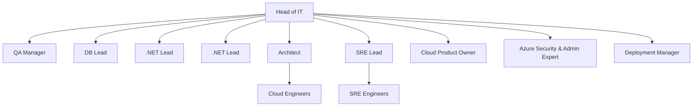
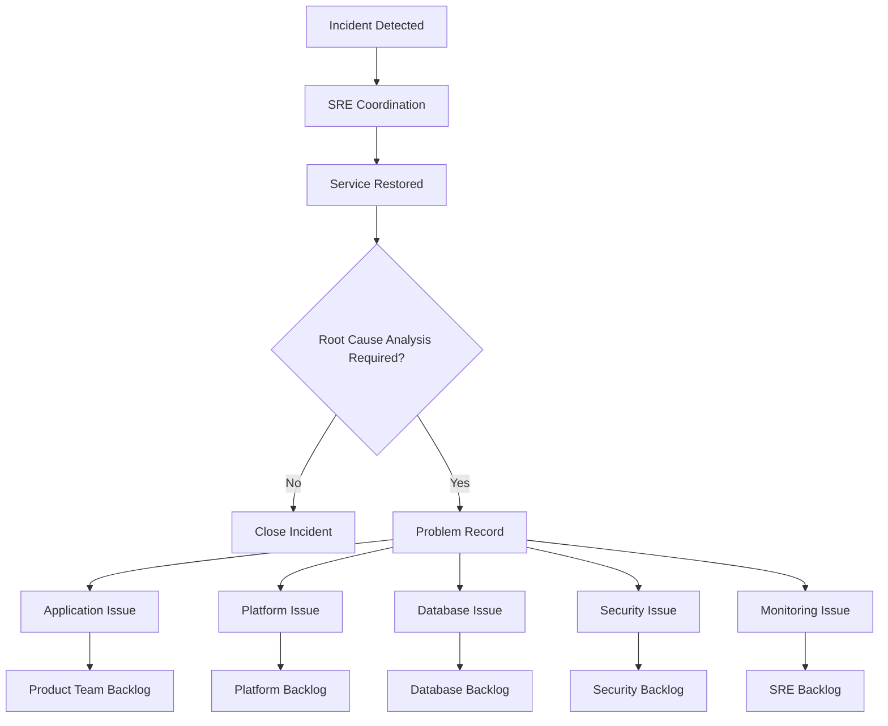

# IT Operating Model and Accountability Framework

## Purpose

This document defines the IT operating model, organizational responsibilities, governance structure, and incident management process.

The objective is to establish clear accountability while maintaining a scalable operating model for product delivery, platform engineering, operations, security, and governance.

---

# 1. Operating Model Overview

The organization is built around four complementary dimensions:

1. Product Delivery Teams
2. Capability Chapters
3. Platform & Operations
4. Governance & Planning

Each dimension has distinct responsibilities and ownership.

---

# 2. Reporting Structure

## Leadership Structure



---

# 3. Product Delivery

The organization includes four cross-functional Product Teams.

Each team consists of:

* Business Product Owner
* Scrum Master
* QA Engineers
* .NET Engineers
* Database Engineers

Product Teams are accountable for:

* Business feature delivery
* Application maintenance
* Technical debt reduction
* Findings remediation
* L3 support
* Production ownership of their applications

Guiding principle:

> You build it, you own it.

---

# 4. Capability Chapters

Capability Chapters ensure consistency, standards, knowledge sharing, and professional growth across Product Teams.

| Chapter                      | Chapter Lead          |
| ---------------------------- | --------------------- |
| Quality Engineering          | QA Manager            |
| Software Engineering         | .NET Leads            |
| Database Engineering         | DB Lead               |
| Platform Engineering         | Architect             |
| Site Reliability Engineering | SRE Lead              |
| Security & Compliance        | Azure Security Expert |

## Chapter Lead Responsibilities

Chapter Leads are accountable for:

* Standards and best practices
* Technical governance
* Capability development
* Coaching and mentoring
* Knowledge sharing
* Recruitment support
* Continuous improvement

Chapter Leads are not accountable for product prioritization or sprint delivery.

---

# 5. Functional Ownership

## Platform Engineering

**Owner:** Architect

Responsibilities:

* Cloud architecture
* Azure platform evolution
* Engineering standards
* Infrastructure as Code
* Shared platform services
* Performance efficiency

Supporting role:

* Cloud Engineers

---

## Platform Planning & Governance

**Owner:** Cloud Product Owner

Responsibilities:

* Platform backlog management
* Quarterly planning
* Sprint planning
* Stakeholder demand intake
* KPC tracking
* Audit action follow-up
* Cost optimization coordination

---

## Operations & Reliability

**Owner:** SRE Lead

Responsibilities:

* Reliability
* Monitoring and observability
* Incident management
* Problem management
* Availability management
* Operational excellence
* Automation and runbooks

Supporting role:

* SRE Engineers

---

## Security & Compliance

**Owner:** Azure Security & Admin Expert

Responsibilities:

* Security controls
* Compliance controls
* Vulnerability management
* Azure governance
* Security reviews
* Audit support

---

## Release Management

**Owner:** Deployment Manager

Responsibilities:

* Release planning
* Release coordination
* Environment governance
* Change management
* Deployment standards
* Rollback governance

---

# 6. Well-Architected Framework Ownership

| Pillar                 | Primary Owner         |
| ---------------------- | --------------------- |
| Reliability            | SRE Lead              |
| Operational Excellence | SRE Lead              |
| Security               | Azure Security Expert |
| Cost Optimization      | Cloud Product Owner   |
| Performance Efficiency | Architect             |
| Sustainability         | Architect             |

The Architect acts as the overall coordinator of the Well-Architected Framework.

---

# 7. Governance Forums

## Architecture & Engineering Board

**Chair:** Architect

Participants:

* Architect
* .NET Leads
* DB Lead
* QA Manager

Purpose:

* Architecture decisions
* Technical debt strategy
* Engineering standards
* Technology roadmap

Frequency:

Monthly

---

## Platform Governance Board

**Chair:** Cloud Product Owner

Participants:

* Cloud Product Owner
* Architect
* SRE Lead
* Security Expert

Purpose:

* Platform roadmap
* KPC review
* Audit follow-up
* Cost optimization
* Governance actions

Frequency:

Monthly

---

## Operations Review Board

**Chair:** SRE Lead

Participants:

* SRE Lead
* Deployment Manager
* QA Manager

Purpose:

* Incident review
* Post-mortems
* Reliability improvements
* Operational excellence initiatives
* Release quality

Frequency:

Bi-weekly

---

## Quarterly Technology Planning

**Chair:** Head of IT

Participants:

All Leads and Managers

Purpose:

* Quarterly priorities
* Capacity allocation
* Platform initiatives
* Findings remediation planning
* Strategic alignment

Frequency:

Quarterly

---

# 8. Incident and Problem Management

## Principles

The SRE team owns incident coordination and service restoration.

The team responsible for the root cause owns the corrective action.

SRE is not the default implementation team.

---

## Incident Lifecycle



---

## Accountability

### SRE Team

Responsible for:

* Incident detection
* Incident coordination
* Communication
* Service restoration
* RCA coordination
* Problem tracking

### Product Teams

Responsible for:

* Application defects
* Technical debt
* Findings remediation
* Application-related root causes

### Cloud Engineers

Responsible for:

* Azure platform issues
* Infrastructure issues
* Platform improvements

### Security Expert

Responsible for:

* Security findings
* Security incidents
* Compliance remediation

### Deployment Manager

Responsible for:

* Release-related incidents
* Change governance
* Deployment coordination

---

# 9. Success Criteria

The operating model is successful when:

* Product Teams own their applications end-to-end.
* Technical debt and findings are continuously addressed.
* Platform Engineering enables delivery without becoming a bottleneck.
* SRE owns reliability and operational excellence.
* Security and compliance are continuously managed.
* Governance actions are visible, tracked, and completed.
* Ownership is clear across all domains.
* Accountability is aligned with capability ownership.

```
```
