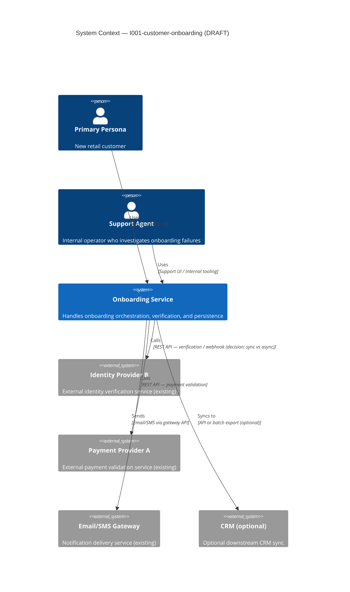
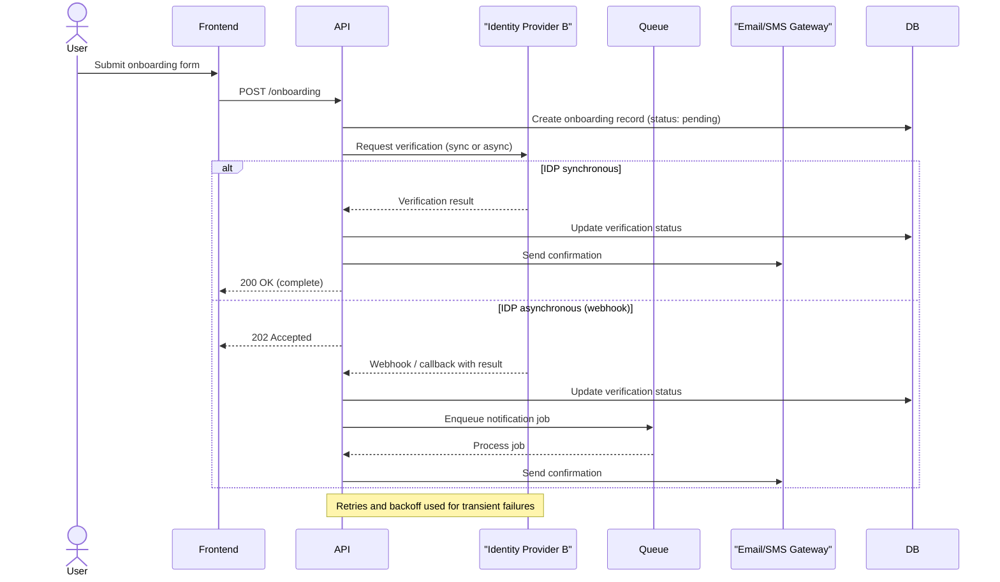

> **Reviewed — Architect-validated**
> This architecture was reviewed and decisions were recorded from the initiative input package (`input/input-package.md`).
> Architect reviewer: Provided via input-package entries
> Architect review date: 2026-06-09

# Architecture

## Source Metadata

| Field | Value |
|---|---|
| Source name | Derived from BRS |
| Source version / date | 1.0 |
| Generated date | 2026-06-09 |
| Generated from | `input/brs.md` |
| Architect review status | Reviewed |
| Architect reviewer | Provided via input/input-package.md |
| Architect review date | 2026-06-09 |

## Architecture Summary

This draft proposes a focused architecture for the Customer Onboarding initiative derived solely from the BRS. The solution is a new digital onboarding flow for retail customers consisting of a user-facing frontend, an API/backend that orchestrates onboarding steps, a persistent data store for profiles/consents/audit logs, and integrations with Identity Provider B, Payment Provider A, and Email/SMS gateways. Support tooling is provided via an internal support UI and optional CRM sync. The architecture emphasizes availability, observability, and secure handling of PII as required by the BRS.

## System Context Diagram



Open decisions in diagram: whether Identity Provider B is used synchronously (direct API call) or asynchronously (webhook/callback) for verification; whether CRM sync is required in-scope or optional post-launch.

## Container Diagram

```mermaid
C4Container
  title Container View — I001-customer-onboarding (DRAFT)

  Person(user, "Primary Persona")

  System_Boundary(sys, "Onboarding Service") {
    Container(frontend, "Frontend (Web/Mobile)", "Technology TBC", "User-facing onboarding UI")
    Container(api, "API / Orchestration Service", "Technology TBC", "Handles orchestration, validation, integration calls, and business logic")
    Container(db, "Data Store", "Relational or document DB (TBC)", "Persists customer profiles, verification records, consents, audit logs")
    Container(queue, "Background Job Queue", "Message broker (TBC)", "Processes async retries, notifications, and long-running tasks")
    Container(support_ui, "Support UI", "Internal web app (TBC)", "Support agents view status and retry steps")
  }

  System_Ext(idp, "Identity Provider B")
  System_Ext(ppay, "Payment Provider A")
  System_Ext(email, "Email/SMS Gateway")

  Rel(user, frontend, "Uses")
  Rel(frontend, api, "Calls", "HTTPS")
  Rel(api, db, "Reads / writes")
  Rel(api, idp, "Calls", "REST API / webhook (TBC)")
  Rel(api, ppay, "Calls", "REST API")
  Rel(api, queue, "Enqueues")
  Rel(queue, api, "Processes jobs")
  Rel(api, email, "Sends")
  Rel(support, support_ui, "Uses")
  Rel(support_ui, api, "Calls")
```

Open decisions: concrete technology choices for frontend, API framework, database and queue; whether identity verification uses synchronous calls or async callbacks; choice of data store type (relational vs document) based on downstream querying and consistency needs.

## Integration Flow Diagram

The BRS implies a multi-step verification flow where the onboarding service calls Identity Provider B and reacts to verification results. The diagram below captures the primary happy-path and background notification flow (including optional queueing for retries and notifications).



If Identity Provider B is strictly synchronous, the async branch may be removed; this is an architect decision.

## Proposed System Context

| System / Service | Role | New or existing | Shown in diagram | Notes |
|---|---|---|---|---|
| Onboarding Service (core) | Orchestrates onboarding flows | New | Yes | Implements FR-001..FR-005 and NFRs for availability and observability |
| Frontend (Web/Mobile) | User-facing onboarding UI | New | Yes | Hosted web or mobile clients |
| Identity Provider B | Identity verification | Existing | Yes | External dependency; SLA and async behavior to confirm |
| Payment Provider A | Payment validation | Existing | Yes | Payment validation for certain flows |
| Email/SMS Gateway | Notification delivery | Existing | Yes | Transactional messages for onboarding progress |
| Support UI | Internal tooling for support agents | New | Yes | May be a thin internal app calling the API |
| CRM (optional) | Downstream customer system | Existing/Optional | No | Optional post-launch integration for sync/export |

## Proposed Integrations

| Integration | Direction | Protocol / mechanism implied | Sensitivity | Open decision |
|---|---|---|---|---|
| Onboarding ↔ Identity Provider B | Outbound calls / callback | REST API, possible webhook/callback | PII / verification data | Confirm sync vs async, data fields, and webhooks |
| Onboarding ↔ Payment Provider A | Outbound calls | REST API | Payment-related data | Confirm exact endpoints and error semantics |
| Onboarding → Email/SMS Gateway | Outbound | REST API or SMTP gateway | PII in messages | Determine template management and provider SLAs |
| Onboarding → CRM | Outbound | API or batch export | PII | Confirm whether required in-scope or optional post-launch |

## Implied Constraints

| Constraint ID | Constraint | Source requirement | Confidence | Requires architect confirmation? |
|---|---|---|---|---|
| C-001 | PII must be encrypted at rest and in transit | NFR-003 (BRS) | High | No (security must validate controls) |
| C-002 | Use Identity Provider B (no custom biometric) | Constraints section (BRS) | High | No |
| C-003 | Service availability >= 99.9% | Measurable targets (BRS) | Medium | Yes — deployment topology and SLA decisions |
| C-004 | Support regional data residency (GDPR) | Constraints (BRS) | Medium | Yes — hosting and data partitioning decisions |

## Implied Governed Boundaries

| Boundary | Type | Implied by | Shown in diagram | Contract likely needed? |
|---|---|---|---|---|
| Onboarding API surface | API boundary | FR-001..FR-005 | Yes | Yes — API contract for support UI and frontend |
| Identity verification boundary | External system boundary | Integration with IDP | Yes | Yes — data fields, SLA, retry semantics |
| Notification boundary | External system boundary | Email/SMS gateway | Yes | Yes — message templates and data retention policies |

## Non-Functional Requirements Summary

| NFR ID | Requirement | Architecture implication |
|---|---|---|
| NFR-001 | 95th percentile verification latency < 30s | Choose IDP and network topology to meet latency; prefer sync or design transparent async UX |
| NFR-002 | Availability >= 99.9% | Design redundancy, health checks, and deployment topology to meet SLA |
| NFR-003 | PII encryption at rest/in transit | Use encrypted storage, TLS, and secrets management |
| NFR-005 | Observability: emit onboarding events | Instrument services with telemetry, tracing, and metrics pipelines |

## Decisions

| Decision ID | Decision needed | Why it matters | Owner | Status | Resolved date |
|---|---|---|---|---|---|
| D-001 | Synchronous vs asynchronous identity verification | Impacts UX, API semantics, queueing, and retry behavior | Architect / Integration owner | Resolved | 2026-06-09 |
| D-002 | Choice of primary data store (relational vs document) | Affects consistency, queries, and migration path | Architect / Data owner | Resolved | 2026-06-09 |
| D-003 | Deployment topology to meet 99.9% | Affects cost and operational complexity | Architect / Ops | Resolved | 2026-06-09 |
| D-004 | Is CRM sync required in initial scope? | Affects integration effort and data contracts | Product / Business owner | Resolved | 2026-06-09 |
| D-005 | Notification provider and template management | Affects reliability and compliance | Product / Ops | Resolved | 2026-06-09 |

## Assumptions Made in This Draft

| Assumption | Basis | Risk if wrong |
|---|---|---|
| A-001 | Identity Provider B provides a verification API (sync or webhook) | BRS states use of Identity Provider B | If wrong, need alternative verification approach or additional vendor integration |
| A-002 | Payment Provider A supports validation endpoints required by flow | BRS lists Payment Provider A integration | If wrong, payment-related onboarding flows need redesign |
| A-003 | Frontend will be a hosted web or mobile client and can accept 202 Accepted UX for async verification | Typical onboarding UX patterns | If wrong, API UX must be synchronous and blocking |
| A-004 | Observability pipeline available to accept telemetry events | BRS requires telemetry coverage | If missing, implementation must include telemetry infra work |

## Architect Review Notes

The reviewing architect should complete this section. Use the checklist below, record decisions, and update the `Architect review status` field in Source Metadata.

### Review checklist

- [ ] Confirm `D-001` (IDP verification): choose Synchronous / Asynchronous — Decision: _____ — Owner: Architect / Integration — Date: _____
- [ ] Confirm `D-002` (Primary data store): choose Relational / Document — Decision: _____ — Owner: Data / Architect — Date: _____
- [ ] Confirm `D-003` (Deployment topology to meet 99.9%): notes on multi-AZ or equivalent — Decision: _____ — Owner: Ops / Architect — Date: _____
- [ ] Confirm `D-004` (CRM sync in-scope): Yes / No — Decision: _____ — Owner: Product — Date: _____
- [ ] Confirm `D-005` (Notification provider and template management): provider chosen / template ownership — Decision: _____ — Owner: Product / Ops — Date: _____
- [ ] Validate Implied Constraints (C-001..C-004) and mark any additional constraints required for the initiative.
- [ ] Validate Implied Governed Boundaries and list required API/Data contracts with owners and target delivery increments.
- [ ] Add any architect review notes, caveats, and acceptance criteria below.

### Architect review entries
**Reviewer:** See `input/input-package.md` (decisions provided)

**Review date:** 2026-06-09

**Architect notes / validation:**
 
- Decision D-001: Identity Provider B verification mode — **asynchronous** (webhook/callback). Rationale: async verification decouples vendor verification latency from the primary user flow, improves scalability, and enables robust retry/backoff via background processing. Owner: Architect / Integration. Resolved: 2026-06-09.
- Decision D-002: Primary data store — **relational**. Rationale: structured profile and consent records with strong consistency and relational queries preferred for audit and traceability. Owner: Data / Architect. Resolved: 2026-06-09.
- Decision D-003: Deployment topology — **Azure** deployment model (AKS across Availability Zones) to meet 99.9% availability objective. Owner: Ops / Architecture. Resolved: 2026-06-09.
- Decision D-004: CRM sync — **In scope** for initial delivery. Rationale: product confirmed initial sync requirement; include CRM mapping and data contract in the delivery plan. Owner: Product. Resolved: 2026-06-09.
- Decision D-005: Notification provider — **SendGrid** (as listed in input package). Owner: Product / Ops. (Template ownership and operational runbook pending.)

Notes:
- Integration contracts for Identity Provider B and Payment Provider A must still be produced (endpoints, webhook semantics, error/retry behavior and SLAs) and added to `input/contracts/` before handoff.
- GDPR data residency region captured as **Italy** in the input package; Legal must validate residency approach prior to regional rollout.

When architected: `Architect review status` set to `Reviewed`, `Architect reviewer` and `Architect review date` populated, and decisions recorded above.
