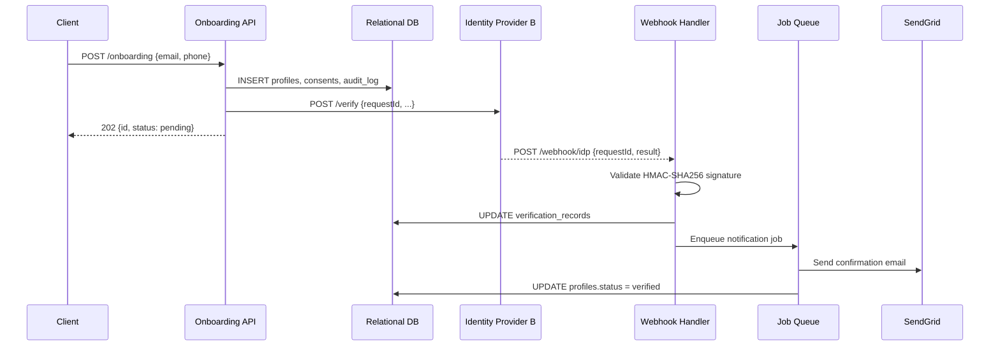

# Design — D1: Guided Onboarding (MVP)

> Self-contained technical context for this increment.
> An engineer implements from this file + `tasks.md` + `specs/` without opening any other artifact.

## System context

This increment adds the onboarding entry point to an existing platform. Three new components are introduced: an Onboarding API (REST, orchestrates the flow), a webhook handler (receives async IDP callbacks), and a background job queue (retries and async processing). These sit in front of a new relational DB schema and integrate outward to Identity Provider B (async), SendGrid (async email), and inward to the existing auth layer (RBAC for future support UI). The frontend is out of scope for D1 — the API is consumed by an existing web/mobile shell.

## API surface

| Method | Path | Purpose | Auth | Request body | Response | Contract artifact |
|---|---|---|---|---|---|---|
| POST | `/onboarding` | Create onboarding record, trigger IDP verification | API key (header `X-API-Key`) | `{ email, phone, consent_marketing }` | `202 { id, status: "pending" }` | `specs/api.md#post-onboarding` |
| GET | `/onboarding/{id}/status` | Return current onboarding state | API key | — | `{ id, status, verification_status, created_at }` | `specs/api.md#get-status` |
| POST | `/webhook/idp` | Receive async IDP verification callback | HMAC-SHA256 signature header | IDP payload (see `specs/api.md#webhook-idp`) | `200 OK` / `400` on invalid sig | `specs/api.md#webhook-idp` |

Full request/response schemas, error codes, and sandbox endpoints: `specs/api.md`.

## Data model changes

| Table | Change | Key columns | PII | Encryption | Contract artifact |
|---|---|---|---|---|---|
| `profiles` | Create | `profile_id (PK)`, `email`, `phone`, `residency_region` | email, phone | Field-level KMS (Azure Key Vault) | `specs/data.md#profiles` |
| `verification_records` | Create | `verification_id (PK)`, `profile_id (FK)`, `idp_request_id`, `status`, `idp_signature` | `idp_payload` — partial | Tokenize raw PII fields in payload | `specs/data.md#verification_records` |
| `consents` | Create | `consent_id (PK)`, `profile_id (FK)`, `consent_type`, `granted` | none | — | `specs/data.md#consents` |
| `audit_logs` | Create | `audit_id (PK)`, `entity`, `entity_id`, `action`, `actor`, `timestamp` | none — no PII in `details` | — | `specs/data.md#audit_logs` |

Full column definitions, indexes, and migration notes: `specs/data.md`.

## Integration points

| Integration | Protocol | Auth method | Async? | Idempotency | Contract artifact |
|---|---|---|---|---|---|
| Identity Provider B | HTTPS REST + webhook callback | HMAC-SHA256 on webhook; API key outbound | Yes — callback via webhook | `idp_request_id` is idempotency key; deduplicate on receipt | `specs/api.md#webhook-idp` |
| SendGrid | HTTPS REST | API key (Key Vault) | Yes — fire and forget | Not required for MVP | `input/contracts/` (when available) |
| Background job queue | Internal | Service-to-service | Yes | Job ID; at-least-once delivery — handlers must be idempotent | — |

## Architecture constraints applied

| Rule ID | Constraint | How applied in D1 |
|---|---|---|
| AR-SEC-001 | Secrets in Azure Key Vault — no hardcoded credentials | IDP API key, SendGrid API key, webhook signing secret all sourced from Key Vault at startup |
| AR-SEC-002 | PII (email, phone) encrypted at rest via KMS | Field-level encryption on `profiles.email` and `profiles.phone` at DB write; hashed copy stored for lookups |
| AR-OBS-001 | Distributed tracing with W3C trace context | Correlation ID injected at API gateway, propagated to IDP client, webhook handler, queue jobs |
| AR-DATA-001 | Italy residency (`eu-south`) | All DB writes go to `eu-south` region; no cross-region replication without Legal approval |

## Security decisions

| Concern | Decision | Accepted risk | Gate reference |
|---|---|---|---|
| Webhook replay attacks | HMAC-SHA256 + timestamp window (5 min) validation | None | `quality-gates/security-review.md` |
| PII in logs/traces | Redact at emission point — structured logger with field-level redaction | None | `quality-gates/security-review.md` |
| IDP payload storage | Tokenize/redact raw PII fields; store only fields needed for audit | Partial IDP payload retained for audit — reviewed and accepted | `quality-gates/data-contract.md` |
| RBAC | Not implemented in D1 (support UI is D2) — onboarding API protected by API key only | Support UI access deferred — accepted for MVP pilot scope | `quality-gates/security-review.md` |

## Observability requirements

These signals are **mandatory** — every component listed must emit them. Do not defer to a later increment.

| Signal | Type | Emitted by | When | Labels |
|---|---|---|---|---|
| `onboarding_start` | Counter | API | On `POST /onboarding` — 202 response | — |
| `onboarding_success` | Counter | API / webhook handler | On IDP callback confirming verification | — |
| `onboarding_failure` | Counter | API / webhook handler | On failure at any stage | `reason`, `stage` |
| `verification_latency_ms` | Histogram (p50/p95/p99) | Webhook handler | Time from IDP request to callback received | — |
| `idp_errors_total` | Counter | IDP client | On IDP API error or timeout | `error_code` |
| `idp_webhook_received` | Counter | Webhook handler | On every webhook receipt | `status` |

Tracing: W3C trace context header propagated through API → IDP client → webhook handler → queue job. Span names: `onboarding.request`, `idp.request`, `idp.webhook`, `email.send`. Sampling: 100% errors, 10% success.

Full SLOs, dashboard queries, alert rules, and runbooks: `specs/observability.md` and `quality-gates/observability-plan.md`.

## Sequence — async IDP verification flow

## Open questions

| # | Question | Owner | Needed before |
|---|---|---|---|
| 1 | Sandbox credentials for IDP B available? | Integration lead | OS-010 (IDP integration task) |
| 2 | SendGrid account and template IDs provisioned? | Ops / Product | OS-020 (notification task) |
| 3 | Key Vault instance provisioned in `eu-south` for pilot? | Platform | OS-001 (first task — secrets needed) |
