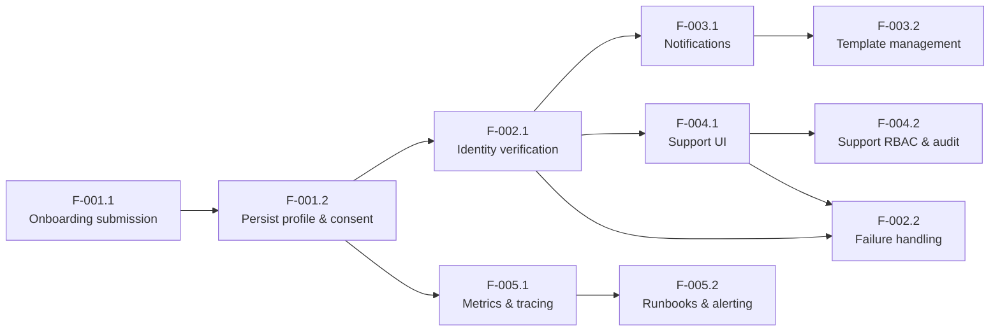

# Dependency Graph — I001: Customer Onboarding

> Engineering lead reference. Read this before assigning work.
> Shows which user stories can start in parallel and which must wait.
> Generated from `planning/delivery-structure.md` and shared schema/API dependencies.

## Execution order

### Wave 1 — start immediately (no dependencies)

| Story | Title | Owner | Folder |
|---|---|---|---|
| F-001.1 | Onboarding submission | Product / Engineering | `F-001.1-onboarding-submission/` |

### Wave 2 — starts when F-001.1 is deployed

| Story | Title | Depends on | Owner | Folder |
|---|---|---|---|---|
| F-001.2 | Persist profile and consent | F-001.1 | Product / Engineering | `F-001.2-persist-profile-and-consent/` |

### Wave 3 — starts when F-001.2 is deployed

| Story | Title | Depends on | Owner | Folder |
|---|---|---|---|---|
| F-002.1 | Identity verification request | F-001.2 | Integration / Security | `F-002.1-identity-verification/` |
| F-005.1 | Metrics and tracing | F-001.2 | Platform / Ops | `F-005.1-metrics-and-tracing/` |

> F-002.1 and F-005.1 can run in parallel — see parallelism notes.

### Wave 4 — starts when F-002.1 is deployed

| Story | Title | Depends on | Owner | Folder |
|---|---|---|---|---|
| F-003.1 | Transactional notifications | F-002.1 | Product / Ops | `F-003.1-transactional-notifications/` |
| F-004.1 | Support UI | F-002.1 | Ops / Support | `F-004.1-support-ui/` |

> F-003.1 and F-004.1 can run in parallel — no shared schema or API changes.

### Wave 5 — starts when F-004.1 is deployed

| Story | Title | Depends on | Owner | Folder |
|---|---|---|---|---|
| F-004.2 | Support RBAC and audit | F-004.1 | Ops / Support | `F-004.2-support-rbac-and-audit/` |
| F-002.2 | Verification failure handling | F-002.1, F-004.1 | Integration / Support | `F-002.2-verification-failure-handling/` |
| F-003.2 | Notification template management | F-003.1 | Product / Ops | `F-003.2-notification-template-management/` |
| F-005.2 | Runbooks and alerting | F-005.1 | Platform / Ops | `F-005.2-runbooks-and-alerting/` |

> F-004.2, F-003.2, F-005.2 can run in parallel.
> F-002.2 requires both F-002.1 (verification data) and F-004.1 (support UI to surface failure details).

## Dependency detail

| Story | Depends on | Reason |
|---|---|---|
| F-001.2 | F-001.1 | Needs `POST /onboarding` endpoint and `profiles` table stub to exist |
| F-002.1 | F-001.2 | Reads `profiles` table; triggers IDP after profile is persisted |
| F-005.1 | F-001.2 | Needs `onboarding_start` signal from the submission endpoint to instrument |
| F-003.1 | F-002.1 | Sends notification on IDP `verified` callback — webhook handler must exist |
| F-004.1 | F-002.1 | Reads `verification_records` table created by F-002.1 |
| F-004.2 | F-004.1 | Adds RBAC and audit to the support endpoints created in F-004.1 |
| F-002.2 | F-002.1 | Needs `failure_reason` in `verification_records` from the verification flow |
| F-002.2 | F-004.1 | Failure details are surfaced through the support UI built in F-004.1 |
| F-003.2 | F-003.1 | Manages templates for the SendGrid integration established in F-003.1 |
| F-005.2 | F-005.1 | Runbooks and alert rules require the telemetry signals from F-005.1 to exist |

## Parallelism notes

**Wave 3 — F-002.1 and F-005.1:**
Both write to `verification_records` indirectly (F-002.1 creates it; F-005.1 instruments it). Coordinate on the span names and signal names before starting — agree on `onboarding.request`, `idp.request` span names and `verification_latency_ms` histogram definition so instrumentation is consistent.

**Wave 4 — F-003.1 and F-004.1:**
No shared schema or API. F-003.1 works on the notification job queue; F-004.1 works on support endpoints and UI. No coordination needed.

**Wave 5 — F-004.2, F-003.2, F-005.2:**
No shared schema or API between these three. F-002.2 is also in wave 5 but shares the support UI with F-004.2 — coordinate on the retry endpoint design before starting both.

## Diagram

