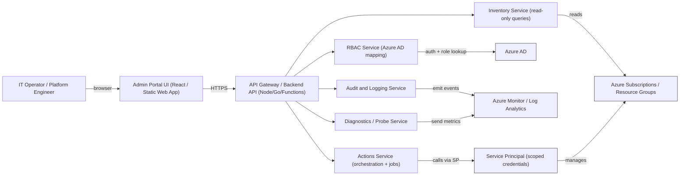

# Admin Portal — Component Diagram

```mermaid
flowchart LR
  %% Users
  U["IT Operator / Platform Engineer"]

  %% UI Layer
  Web["Admin Portal UI (React / Static Web App)"]

  %% API Layer
  API["API Gateway / Backend API (Node/Go/Functions)"]

  %% Services
  Inventory["Inventory Service (read-only queries)"]
  Actions["Actions Service (orchestration + jobs)"]
  RBAC["RBAC Service (Azure AD mapping)"]
  Audit[Audit and Logging Service]
  Probes["Diagnostics / Probe Service"]

  %% Azure Infra
  AD[Azure AD]
  Subscriptions["Azure Subscriptions / Resource Groups"]
  Monitor["Azure Monitor / Log Analytics"]
  SP["Service Principal (scoped credentials)"]

  U -->|browser| Web
  Web -->|HTTPS| API

  API --> Inventory
  API --> Actions
  API --> RBAC
  API --> Audit
  API --> Probes

  Inventory -->|reads| Subscriptions
  Actions -->|calls via SP| SP
  SP -->|manages| Subscriptions
  RBAC -->|auth + role lookup| AD
  Audit -->|emit events| Monitor
  Probes -->|send metrics| Monitor

  classDef infra fill:#eef,stroke:#333,stroke-width:1px;
  class Subscriptions,AD,Monitor,SP infra;
```

Description: high-level components and their relationships for Admin Portal (I003).
