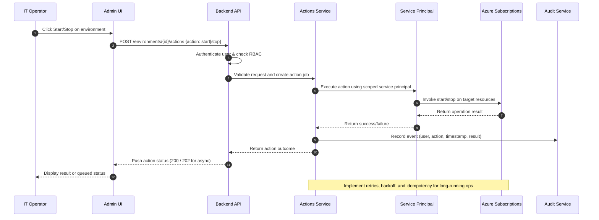

# Admin Portal — Sequence: Start/Stop Environment

```mermaid
sequenceDiagram
  autonumber
  participant User as IT Operator
  participant UI as Admin UI
  participant API as Backend API
  participant Actions as Actions Service
  participant SP as Service Principal
  participant Azure as Azure Subscriptions
  participant Audit as Audit Service

  User->>UI: Click Start/Stop on environment
  UI->>API: POST /environments/{id}/actions {action: start|stop}
  API->>API: Authenticate user & check RBAC
  API->>Actions: Validate request and create action job
  Actions->>SP: Execute action using scoped service principal
  SP->>Azure: Invoke start/stop on target resources
  Azure-->>SP: Return operation result
  SP-->>Actions: Return success/failure
  Actions->>Audit: Record event (user, action, timestamp, result)
  Actions-->>API: Return action outcome
  API-->>UI: Push action status (200 / 202 for async)
  UI-->>User: Display result or queued status

  Note over Actions,Azure: Implement retries, backoff, and idempotency for long-running ops
```

Description: end-to-end happy-path for synchronous start/stop flow in MVP.
