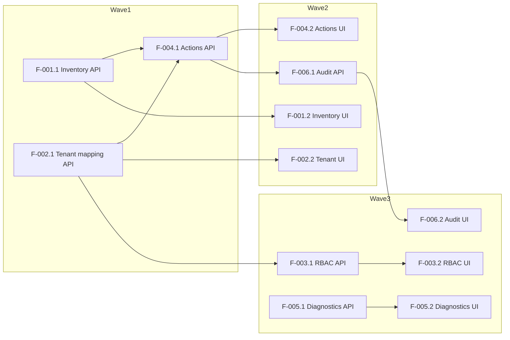

# Dependency Graph — I003 Admin Portal

This document lists all user stories (wave order) and the dependency graph for the OpenSpec handoff.

> Regenerated: 2026-06-10 — `quality-gates/bdd-scenarios.md` accepted; handoff aligned to latest BDD scenarios.

## Story list (canonical)
- F-001.1 — Inventory API (backend)
- F-001.2 — Inventory UI (frontend)
- F-002.1 — Tenant mapping API (backend)
- F-002.2 — Tenant selector UI (frontend)
- F-003.1 — RBAC API (backend)
- F-003.2 — RBAC UI (frontend)
- F-004.1 — Actions API (backend)
- F-004.2 — Actions UI (frontend)
- F-005.1 — Diagnostics API (backend)
- F-005.2 — Diagnostics UI (frontend)
- F-006.1 — Audit store API (backend)
- F-006.2 — Audit UI (frontend)

## Waves (suggested)

- Wave 1 (Sprint 1): F-001.1, F-002.1, F-004.1
- Wave 2 (Sprint 2): F-001.2, F-002.2, F-004.2, F-006.1
- Wave 3 (Sprint 3): F-003.1, F-003.2, F-006.2, F-005.1, F-005.2

## Dependency rationale

- Frontend stories depend on their corresponding backend story (UI → API).
- `F-004.1` (Actions API) depends on `F-002.1` (Tenant mapping API) for scoping and on `F-001.1` for inventory-derived context.
- `F-006.1` (Audit API) should be available by Wave 2 to capture events from actions and RBAC changes.
- RBAC backend `F-003.1` depends on tenant mapping `F-002.1` for scoping and on identity integration work.

## Mermaid diagram

## Parallelism notes

- In Wave 1, `F-001.1` and `F-002.1` can be implemented largely in parallel; `F-004.1` must wait for minimal tenant mapping and inventory context.
- Wave 2 frontends can run in parallel but require integration test slots once their backends are available.

## How to use

- Use this graph to schedule implementation waves. Engineers can pick any story from the earliest unblocked wave.
