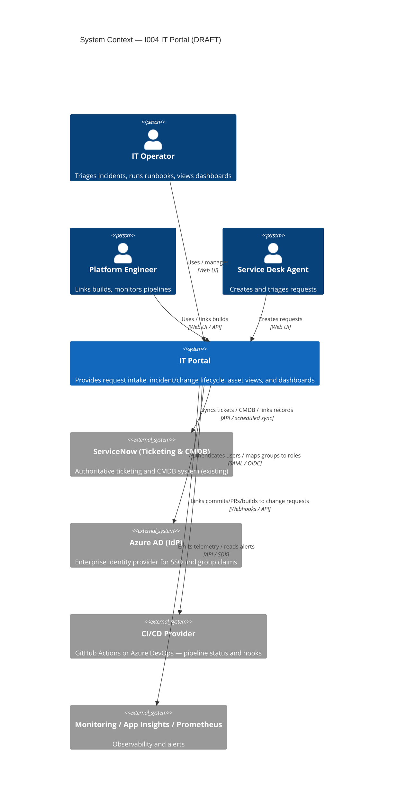
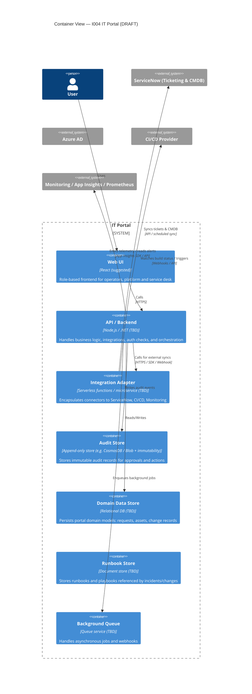
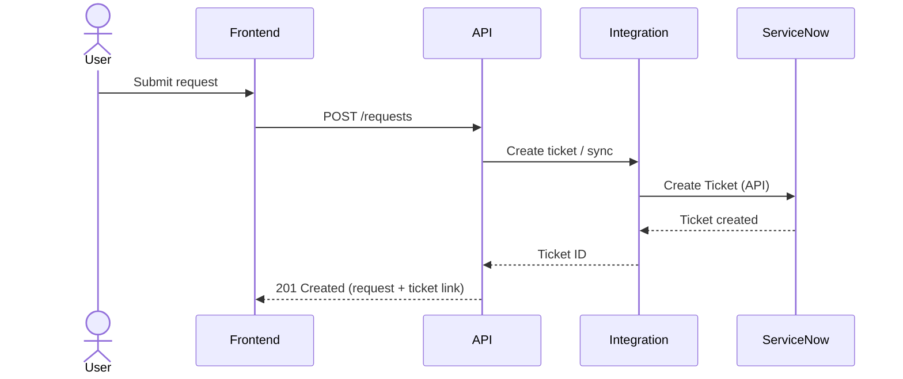

> **DRAFT — AI-proposed architecture. Not reviewed or approved.**
> This draft was generated from BRS content because no architecture input was provided.
> It must be reviewed and corrected by a qualified architect before the framework treats it as authoritative.
> Mark this notice as REVIEWED when an architect has validated or updated this document.

# Architecture

## Source Metadata

| Field | Value |
|---|---|
| Source name | Draft — derived from BRS |
| Source version / date | 2026-06-11 |
| Draft generated date | 2026-06-11 |
| Draft generated from | `input/brs.md` |
| Architect review status | Pending |
| Architect reviewer | |
| Architect review date | |

## Architecture Summary

This draft proposes a standalone IT Portal that integrates with ServiceNow (ticketing & CMDB), Azure AD for SSO and RBAC, one CI/CD provider for linking builds (GitHub Actions or Azure DevOps), and monitoring (App Insights / Prometheus). The portal is a web-based frontend plus API/backend services, an append-only audit store, integrations adapter layer for external systems, and an operations runbook store. Security, auditability and PII minimization are treated as first-class concerns.

## System Context Diagram

Open decisions: D-001 (Confirm primary CI/CD provider), D-002 (CMDB ownership for any portal-owned asset types), D-003 (Exact audit retention period and storage mechanism).

## Container Diagram

Note: Technology choices (frontend framework, backend runtime, DB technology) are open decisions.

## Integration Flow Diagram

This sequence shows the happy path for request intake and ticket creation. Async syncs and reconciliation are handled via the Integration Adapter and background queue.

## Proposed System Context

| System / Service | Role | New or existing | Shown in diagram | Notes |
|---|---|---|---|---|
| IT Portal | Core application providing intake, lifecycle management, dashboards | New | Yes | Integrates with ServiceNow and Azure AD |
| ServiceNow | Ticketing & CMDB | Existing | Yes | Source-of-truth for tickets and CMDB (per BRS assumption) |
| Azure AD | Identity provider | Existing | Yes | Used for SSO and group claims mapping |
| CI/CD Provider | Build and pipeline provider | Existing | Yes | Provider to be confirmed (D-001) |
| Monitoring | Observability & alerts | Existing | Yes | App Insights / Prometheus per BRS |

## Proposed Integrations

| Integration | Direction | Protocol / mechanism implied | Sensitivity | Open decision |
|---|---|---|---|---|
| ServiceNow CMDB / Ticketing | Bi-directional (sync & links) | REST API, scheduled sync, webhooks | High (PII, audit) | D-002 |
| Azure AD | Inbound auth | SAML / OIDC | High (auth) | - |
| CI/CD provider | Inbound status / webhook | Webhooks, API | Medium | D-001 |
| Monitoring | Outbound telemetry / alerts | SDK / API | Medium | - |

## Implied Constraints

| Constraint ID | Constraint | Source requirement | Confidence | Requires architect confirmation? |
|---|---|---|---|---|
| C-001 | Audit trail must be append-only and exportable | FR-10, NFR-5 | High | Yes (storage choice and retention) |
| C-002 | Data masking in non-prod environments | Data & Privacy | High | Yes (masking rules) |
| C-003 | SSO via Azure AD | FR-1 | High | No |

## Implied Governed Boundaries

| Boundary | Type | Implied by | Shown in diagram | Contract likely needed? |
|---|---|---|---|---|
| Portal ↔ ServiceNow | API / Data boundary | Ticketing & CMDB sync | Yes | Yes |
| Portal ↔ CI/CD | Event / webhook boundary | Build linking and triggers | Yes | Yes |
| Portal internal audit store | Data boundary | Audit & compliance | Yes | Possibly |

## Non-Functional Requirements Summary

| NFR ID | Requirement | Architecture implication |
|---|---|---|
| NFR-1 | 99.9% availability | Deploy across availability zones; design for failover |
| NFR-2 | Page load / query performance | Caching, indexed queries, pagination, backend scaling |
| NFR-4 | Data encryption and least privilege | Use Key Vault for secrets; RBAC checks at API layer |

## Open Decisions

| Decision ID | Decision needed | Why it matters | Owner |
|---|---|---|---|
| D-001 | Confirm primary CI/CD provider (GitHub Actions or Azure DevOps) | Affects webhook integration, connectors, and example implementation | Product Owner / Platform |
| D-002 | Confirm whether the portal will own any asset types vs ServiceNow being authoritative | Affects data contracts and sync strategy | Product Owner / Platform |
| D-003 | Audit retention policy and storage choice | Affects cost, compliance and implementation approach | Security / Compliance |

## Assumptions Made in This Draft

| Assumption | Basis | Risk if wrong |
|---|---|---|
| ServiceNow is the primary ticketing and CMDB provider | Stated in BRS and business-intake | High — integration design would change if different |
| Azure AD will be used for SSO and group mapping | Stated in BRS and business-intake | Medium — alternative IdP will require connector changes |
| One CI/CD provider will be chosen for MVP | Delivery-structure and BRS suggest single provider | Medium — multi-provider support increases scope |

## Architect Review Notes

*(Leave blank for architect to complete.)*

