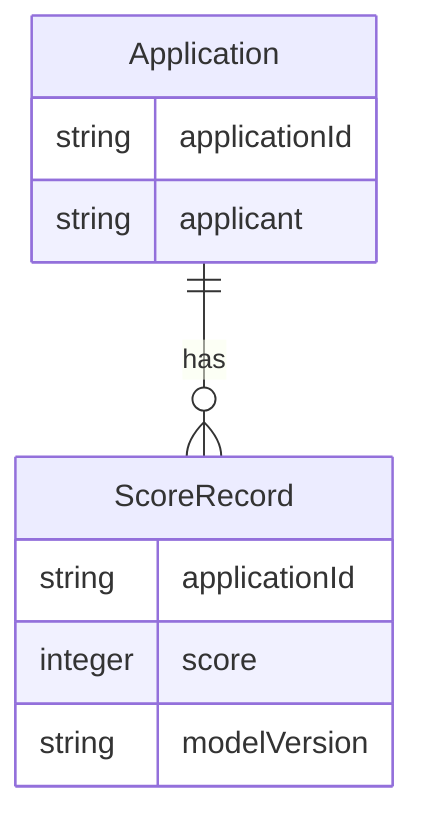

# Implementation Contract

## Data Entities

- Application: { applicationId, applicant, financials, creditReferences }
- ScoreRecord: { applicationId, score, modelVersion, timestamp }



## API Surface

- POST /score - input: { applicationId } -> output: { score, explainability }
- GET /score/{applicationId} - retrieve last score

```yaml
openapi: 3.0.0
info:
	title: Scoring API
	version: 1.0.0
paths:
	/score:
		post:
			summary: Score an application
			requestBody:
				required: true
				content:
					application/json:
						schema:
							type: object
			responses:
				'200':
					description: score returned
```

## Events

- event: application.scored -> { applicationId, score, modelVersion }

## Business Rules

- Rule: if score >= AUTO_APPROVE_THRESHOLD then application_status = APPROVED
- Rule: explainability must be stored with each score for auditability

## Acceptance

- Integration tests for scoring pipeline
- Mocked Experian responses for CI
