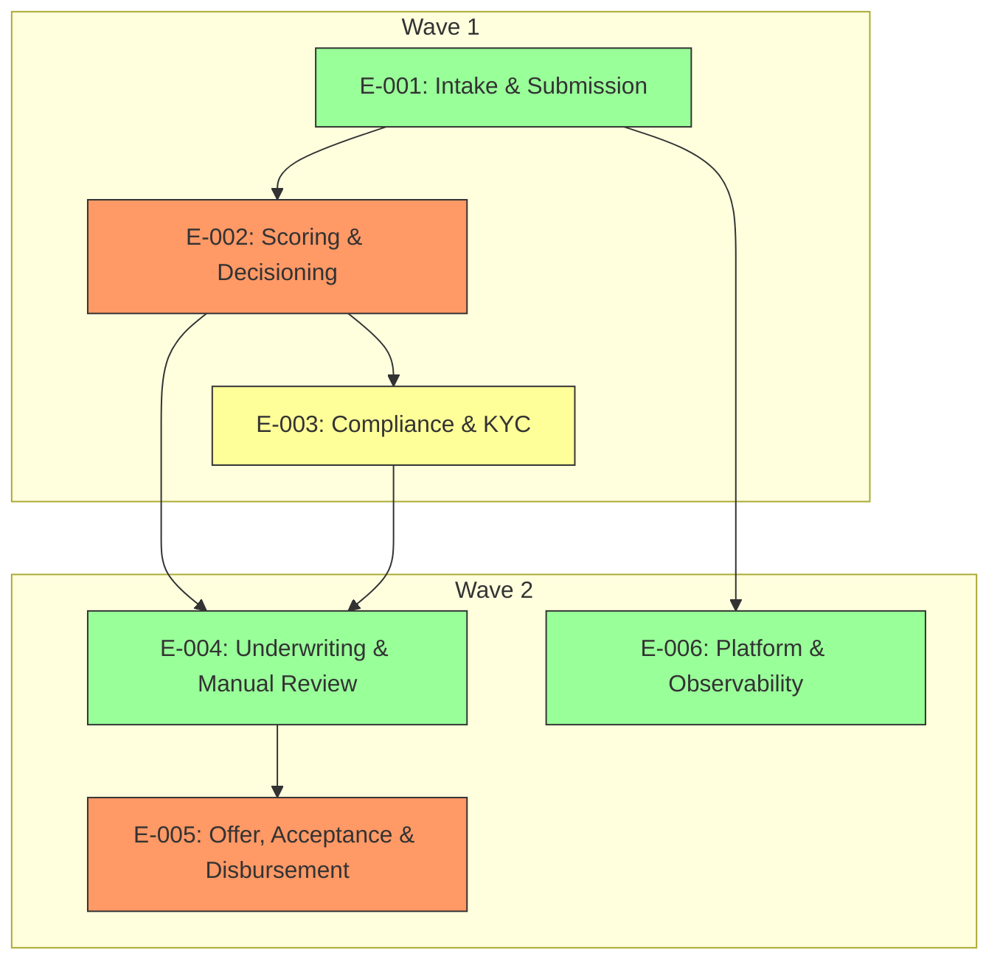

# Elaboration Plan

## Metadata

| Field | Value |
|---|---|
| Initiative ID | I0092-I1 |
| Created at | 2026-06-22 |
| Created by | delivery-lead |
| Status | Draft |

---

## Elaboration Strategy Summary

| Metric | Value |
|---|---|
| Total epics | 6 |
| Elaboration waves | 2 |
| Parallelizable epics | 2 |
| Critical path epics | 2 |
| Highest risk epic | E-002 |

---

## Prioritisation Criteria

| Factor | Weight | Rationale |
|---|---|---|
| Business priority (Must > Should > Could) | High | Focus on delivering mortgage product core flows first |
| Architecture risk (from architecture-risks) | High | E-002 and E-005 contain high-risk integrations and AI scoring |
| Cross-cutting concerns (from architecture-impact-map) | Medium | Security, data residency and observability affect multiple epics |
| Dependency count (blocking others) | Medium | E-001 is a prerequisite for E-002 and E-004 |
| Standalone capability (can deliver independently) | Low | Platform work (E-006) can be delivered in parallel when capacity allows |

---

## Elaboration Order

### Wave 1 — Core Intake, Scoring and Compliance

| Epic | Title | Rationale | Risk Level | Dependencies | Parallel? |
|---|---|---|---|---|---|
| E-001 | Intake & Submission | Foundation for all downstream flows; necessary to capture applicants | Low | None | No |
| E-002 | Scoring & Decisioning | High-risk AI integration and decisioning; must be validated early | High | E-001 | No |
| E-003 | Compliance & KYC | Required to unblock underwriting and legal checks | High | E-002 | No |

### Wave 2 — Underwriting, Offer and Platform

| Epic | Title | Rationale | Risk Level | Dependencies | Parallel? |
|---|---|---|---|---|---|
| E-004 | Underwriting & Manual Review | Dependent on scoring and KYC; best done after core pipelines | Medium | E-002, E-003 | Yes (with E-005 if capacity) |
| E-005 | Offer, Acceptance & Disbursement | External integrations and disbursement require stable underwriting | High | E-004 | Yes (with E-004) |
| E-006 | Platform & Observability | Cross-cutting; can be parallelised in part to improve delivery | Medium | E-001..E-005 | Yes |

---

## Epic Dependency Analysis

| Epic | Depends On | Depended On By | Cross-Cutting Concerns | Architecture Risk |
|---|---|---|---|---|
| E-001 | None | E-002, E-004 | Data ingestion, authentication | Medium |
| E-002 | E-001 | E-003, E-004 | AI scoring, Experian integration, data residency | High |
| E-003 | E-002 | E-004 | AML/KYC, regulatory logging | High |
| E-004 | E-002, E-003 | E-005 | Underwriter UX, audit immutability | Medium |
| E-005 | E-004 | None | DocuSign, core banking disbursement | High |
| E-006 | E-001..E-005 | None | Observability, performance, infra | Medium |

---

## Parallel Elaboration Opportunities

| Group | Epics | Rationale | Constraint |
|---|---|---|---|
| Platform + Observability | E-006 with E-001/E-002 | Platform pieces that enable faster delivery (CI, monitoring) can run in parallel with core work | Requires dedicated platform engineers |
| Offers & Underwriting | E-004 and E-005 | Offer generation and acceptance stories can be elaborated in parallel with underwriting UI work | Needs stable decisioning APIs from E-002 |

---

## Elaboration Dependency Diagram

---

## Risks and Mitigations

| Risk | Impact | Mitigation |
|---|---|---|
| AI model integration scheduling slips | Delays in decisioning and underwriting | Front-load model evaluation and mock integrations; run early spike for Experian and scoring APIs |
| External provider SLA (Experian, DocuSign) | Blocking flow for applicant decisions | Implement retries, fallbacks and circuit breakers; stub integrations for early testing |
| Regulatory logging and audit compliance | Rework if logging insufficient | Define audit schema early; implement immutable audit store (see AR-002) |

---

## Recommendations

Start with Wave 1 focusing on E-001 and E-002 to establish ingestion and scoring; run an early spike for external integrations and AI explainability requirements. Parallelise platform and observability work (E-006) to reduce rework and enable fast feedback loops.

---
*This is a human-gated artifact. The delivery lead must review and approve the elaboration order before epic and story elaboration proceeds. Adjust wave assignments and parallel groupings based on team capacity and constraints. Set Status: Accepted only after human review. Never self-accept.*
