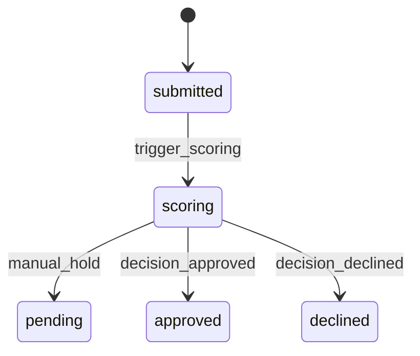
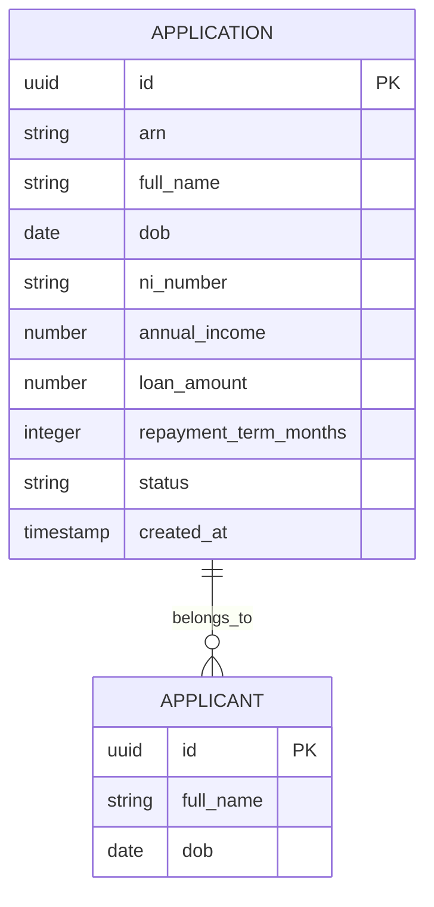

# Implementation Contract — E-001 Intake & Submission

---

## Data Entities

### Application

| Field | Type | Required | Constraints | Source |
|---|---|---|---|---|
| id | uuid | Yes | PK | FR-003 |
| arn | string | Yes | Unique application reference | FR-003 |
| full_name | string | Yes | non-empty | FR-001 |
| dob | date | Yes | valid date | FR-001 |
| ni_number | string | Yes | format per UK NI rules | FR-001 |
| annual_income | decimal | Yes | positive | FR-001 |
| loan_amount | decimal | Yes | between 1000 and 50000 | FR-001 |
| loan_purpose | string | Yes | enumerated values | FR-001 |
| repayment_term_months | integer | Yes | 12..84 | FR-001 |
| status | string | Yes | {submitted, scoring, pending, approved, declined} | FR-005 |
| created_at | timestamp | Yes | ISO 8601 | FR-003 |

**State Machine**



### ER Diagram



---

## API Surface

```yaml
openapi: "3.0.3"
info:
  title: "Intake API"
  version: "1.0.0"
paths:
  /api/intake/submit:
    post:
      summary: "Submit application"
      operationId: "submitApplication"
      requestBody:
        required: true
        content:
          application/json:
            schema:
              type: object
              required:
                - full_name
                - dob
                - ni_number
                - loan_amount
                - repayment_term_months
              properties:
                full_name:
                  type: string
                dob:
                  type: string
                  format: date
                ni_number:
                  type: string
                annual_income:
                  type: number
                loan_amount:
                  type: number
                repayment_term_months:
                  type: integer
      responses:
        "201":
          description: "Created"
          content:
            application/json:
              schema:
                type: object
                properties:
                  arn:
                    type: string
        "400":
          description: "Validation error"

  /api/intake/status:
    get:
      summary: "Lookup application status by ARN and DOB"
      operationId: "lookupStatus"
      parameters:
        - in: query
          name: arn
          required: true
          schema:
            type: string
        - in: query
          name: dob
          required: true
          schema:
            type: string
            format: date
      responses:
        "200":
          description: "Status returned"
          content:
            application/json:
              schema:
                type: object
                properties:
                  arn:
                    type: string
                  status:
                    type: string
                  last_update:
                    type: string
                    format: date-time
        "404":
          description: "Not found"
components:
  securitySchemes:
    none: {}
```

### Consumed APIs (External)

| API | Provider | Timeout | Fallback | Circuit Breaker |
|---|---|---|---|---|
| Scoring API | Internal/Decisioning | 15000ms | enqueue for async retry | enabled |
| Email provider | SMTP / Email service | 5000ms | retry via queue | enabled |

---

## Events

| Event | Type | Producer | Consumers | Trigger |
|---|---|---|---|---|
| application.submitted | domain | Intake API | Scoring pipeline, Audit store, Notification service | On successful submit (201) |

**Payload (application.submitted):**

| Field | Type | Required | Description |
|---|---|---|---|
| arn | string | Yes | Application reference |
| applicant_id | uuid | Yes | Internal id |
| submitted_at | timestamp | Yes | ISO 8601 |

**Delivery:** at-least-once

---

## Business Rules

| Rule | Condition | Effect | Source |
|---|---|---|---|
| BR-001 | loan_amount outside allowed range | reject with 400 and validation error | FR-001 |
| BR-002 | applicant under 18 | reject with 400 | FR-001 |

---

## UI Surface

This section is scoped extract from `architecture/ui-specification.md` for pages owned by this epic.

| Page | Route | Application | Specification Status | Blocking Dependencies | Linked FRs |
|---|---|---|---|---|---|
| Application Form | /applications/new | Applicant Portal | partial | UIQ-001, GAP-UI-001 | FR-001, FR-002, FR-003 |
| Status Lookup | /applications/status | Applicant Portal | partial | UIQ-002 | FR-005 |

### Page: Application Form (/applications/new)

**Specification status:** partial

**Form fields** (extracted from UI spec):

| Field | Type | Required | Validation | Source |
|---|---|---|---|---|
| full_name | text | Yes | non-empty | FR-001 |
| dob | date | Yes | valid date | FR-001 |
| ni_number | text | Yes | NI format (needs-clarification) | FR-001 |
| annual_income | currency | Yes | positive | FR-001 |
| loan_amount | currency | Yes | 1000..50000 | FR-001 |
| repayment_term | number | Yes | 12..84 | FR-001 |

**Data binding:**

| Component | Endpoint | Method | Contract Mode | Notes |
|---|---|---|---|---|
| Form submit | /api/intake/submit | POST | partial | Intake API contract needs finalisation (UIQ-001) |

### Page: Status Lookup (/applications/status)

**Specification status:** partial

**Data binding:**

| Component | Endpoint | Method | Contract Mode | Notes |
|---|---|---|---|---|
| Status lookup | /api/intake/status | GET | unknown | API contract needs clarification (UIQ-002) |

---

## Non-Functional Constraints

| Constraint | Target | Source |
|---|---|---|
| Response time: intake submit ≤2s (p95) | Intake API | NFR-001 |
| Data residency: UK-only | Storage | ARCH-C-001 |

---

## Open Design Questions

| Question | Impact | Must Resolve Before |
|---|---|---|
| UIQ-001: Final Intake API contract (fields, endpoint) | Blocks UI and story readiness | story generation for S-001.1 / S-001.2 |
| UIQ-002: Status API query parameters and response shape | Blocks status page stories | story generation for S-001.4 |

---
*Implementation contract complete for initial elaboration. No placeholder text remains.*
