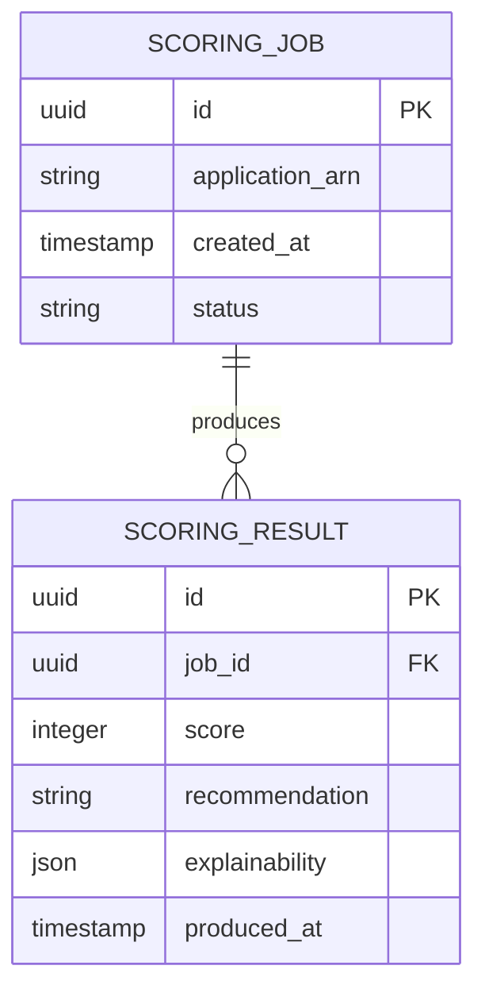

# Implementation Contract — E-002 Decisioning & Scoring

---

## Data Entities

### ScoringJob

| Field | Type | Required | Notes |
|---|---|---|---|
| id | uuid | Yes | Job id |
| application_arn | string | Yes | Source application ARN |
| created_at | timestamp | Yes | ISO 8601 |
| status | string | Yes | queued, running, completed, failed |

### ScoringResult

| Field | Type | Required | Notes |
|---|---|---|---|
| id | uuid | Yes | Result id |
| job_id | uuid | Yes | FK to ScoringJob |
| score | integer | Yes | 0..1000 |
| recommendation | string | Yes | AUTO_APPROVE, REFER_TO_UNDERWRITER, AUTO_DECLINE |
| explainability | json | No | Feature contributions and metadata |
| produced_at | timestamp | Yes | ISO 8601 |



---

## API Surface

```yaml
openapi: "3.0.3"
info:
  title: "Scoring Pipeline API"
  version: "1.0.0"
paths:
  /api/scoring/jobs:
    post:
      summary: "Create scoring job"
      operationId: "createScoringJob"
      requestBody:
        required: true
        content:
          application/json:
            schema:
              type: object
              properties:
                application_arn:
                  type: string
      responses:
        "201":
          description: "Job created"
  /api/scoring/results/{jobId}:
    get:
      summary: "Get scoring result by job"
      parameters:
        - in: path
          name: jobId
          required: true
          schema:
            type: string
      responses:
        "200":
          description: "Scoring result"

```

---

## Events

| Event | Producer | Consumers | Trigger |
|---|---|---|---|
| scoring.job.created | Intake API / Scheduler | Scoring pipeline | On submit or scheduled run |
| scoring.job.completed | Scoring pipeline | Underwriter queue, Audit store, Metrics | On inference complete |

---

## Non-Functional Constraints

| Constraint | Target | Source |
|---|---|---|
| Explainability artifacts retention and tamper-evidence | Explainability service | AR-005 |
| Scoring latency SLA: infer within 60s of submission | Scoring pipeline | FR-006 |

---

## Open Design Questions

| Question | Impact | Must Resolve Before |
|---|---|---|
| Model selection and runtime environment | Affects infra and costs | S-002.1 |

---
*Implementation contract ready for initial elaboration.*
