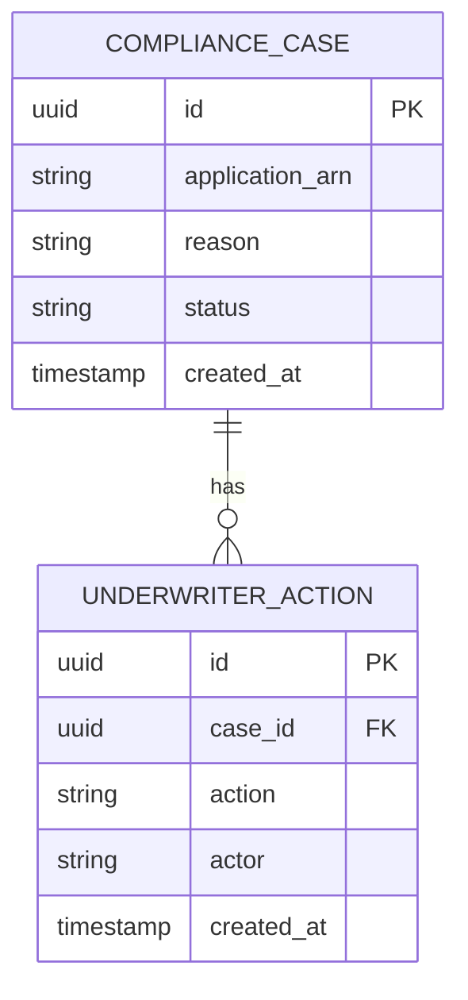

# Implementation Contract — E-003 Compliance & Underwriting

---

## Data Entities

### ComplianceCase

| Field | Type | Required | Notes |
|---|---|---|---|
| id | uuid | Yes | Case id |
| application_arn | string | Yes | Source application ARN |
| reason | string | Yes | e.g. AML_FAIL, KYC_FAIL |
| status | string | Yes | OPEN, RESOLVED |
| created_at | timestamp | Yes | ISO 8601 |

### UnderwriterAction

| Field | Type | Required | Notes |
|---|---|---|---|
| id | uuid | Yes | Action id |
| case_id | uuid | Yes | FK to ComplianceCase |
| action | string | Yes | APPROVE, DECLINE, REQUEST_INFO |
| actor | string | Yes | underwriter id |
| created_at | timestamp | Yes | ISO 8601 |



---

## API Surface

```yaml
openapi: "3.0.3"
info:
  title: "Compliance & Underwriter APIs"
  version: "1.0.0"
paths:
  /api/compliance/cases:
    post:
      summary: "Create compliance case"
      requestBody:
        required: true
        content:
          application/json:
            schema:
              type: object
              properties:
                application_arn:
                  type: string
                reason:
                  type: string
      responses:
        "201": { description: "Created" }
  /api/underwriter/case/{arn}:
    get:
      summary: "Retrieve case and explainability artifacts by ARN"
      parameters:
        - in: path
          name: arn
          required: true
          schema:
            type: string
      responses:
        "200": { description: "Case details" }

```

---

## Events

| Event | Producer | Consumers | Trigger |
|---|---|---|---|
| compliance.case.created | AML/KYC orchestrator | Compliance UI, Audit store | AML/KYC fail |
| underwriter.action.taken | Underwriter UI | Audit store, Notifications | Underwriter decision |

---

## Non-Functional Constraints

| Constraint | Target | Source |
|---|---|---|
| PII handling and retention per ARCH-C-001 | ComplianceCase | ARCH-C-001 |
| Immutable audit trail for actions | Audit store | NFR-005 |

---

## Open Design Questions

| Question | Impact | Must Resolve Before |
|---|---|---|
| HMRC connector authentication model | Affects integration design | S-003.1 |

---
*Implementation contract ready for initial elaboration.*
