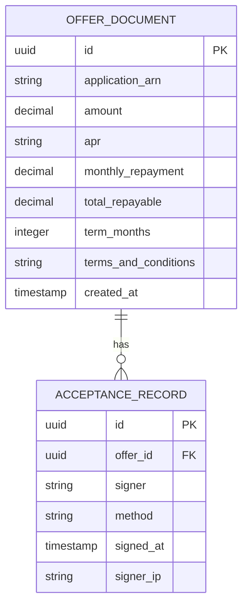

# Implementation Contract — E-004 Offer, Acceptance & Disbursement

---

## Data Entities

### OfferDocument

| Field | Type | Required | Notes |
|---|---|---|---|
| id | uuid | Yes | Offer document id |
| application_arn | string | Yes | Source application ARN |
| amount | decimal | Yes | Approved loan amount |
| apr | string | Yes | Interest rate (APR) |
| monthly_repayment | decimal | Yes | Calculated monthly repayment |
| total_repayable | decimal | Yes | Total repayable amount |
| term_months | integer | Yes | Repayment term in months |
| terms_and_conditions | string | Yes | Rendered terms text or template ref |
| created_at | timestamp | Yes | ISO 8601 |

### AcceptanceRecord

| Field | Type | Required | Notes |
|---|---|---|---|
| id | uuid | Yes | Acceptance id |
| offer_id | uuid | Yes | FK to OfferDocument |
| signer | string | Yes | signatory identifier |
| method | string | Yes | e.g., DocuSign |
| signed_at | timestamp | Yes | ISO 8601 |
| signer_ip | string | No | captured IP address |



---

## API Surface

```yaml
openapi: "3.0.3"
info:
  title: "Offer & Disbursement APIs"
  version: "1.0.0"
paths:
  /api/offers:
    post:
      summary: "Generate an offer for an application"
      requestBody:
        required: true
        content:
          application/json:
            schema:
              type: object
              properties:
                application_arn:
                  type: string
                requested_amount:
                  type: number
      responses:
        "201": { description: "Offer generated" }
  /api/offers/{offer_id}/accept:
    post:
      summary: "Record acceptance callback (DocuSign)"
      parameters:
        - in: path
          name: offer_id
          required: true
          schema:
            type: string
      requestBody:
        required: true
        content:
          application/json:
            schema:
              type: object
              properties:
                signer:
                  type: string
                method:
                  type: string
                signed_at:
                  type: string
      responses:
        "200": { description: "Acceptance recorded" }

``` 

---

## Events

| Event | Producer | Consumers | Trigger |
|---|---|---|---|
| offer.generated | Offer service | Portal, Email, Audit Store | Offer created |
| offer.accepted | DocuSign adapter | Disbursement orchestrator, Audit Store | Acceptance recorded |
| disbursement.instruction.sent | Disbursement orchestrator | T24 adapter, Audit Store | Instruction dispatched |

---

## Non-Functional Constraints

| Constraint | Target | Source |
|---|---|---|
| PII handling and retention per ARCH-C-001 | OfferDocument, AcceptanceRecord | ARCH-C-001 |
| Idempotent disbursement instructions | Disbursement orchestrator | NFR-007 |

---

## Open Design Questions

| Question | Impact | Must Resolve Before |
|---|---|---|
| Acceptance callback security model for DocuSign (webhook auth) | Affects integration design and security | S-004.1 |

---

*Implementation contract ready for initial elaboration.*
