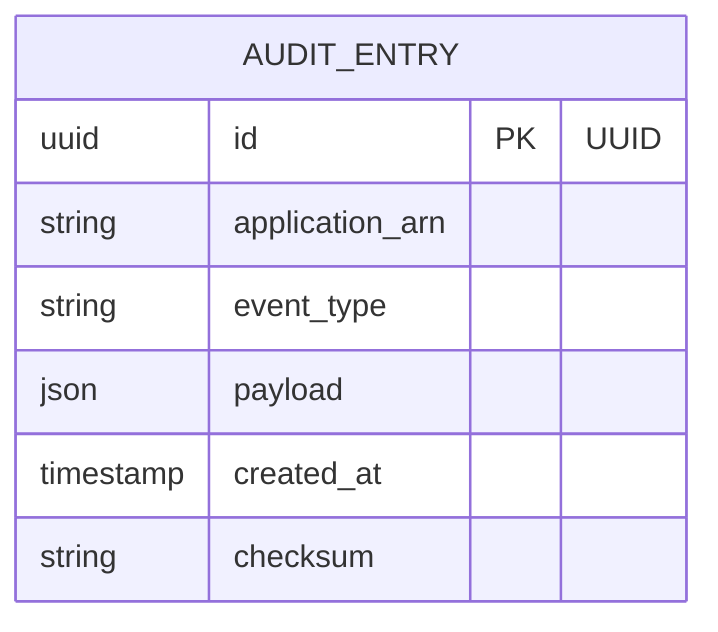

# Implementation Contract — E-005 Platform & Observability

---

## Data Entities

### AuditEntry

| Field | Type | Required | Constraints | Source |
|---|---|---|---|---|
| id | uuid | Yes | PK |
| application_arn | string | Yes | Indexed |
| event_type | string | Yes | e.g. application.submitted, state.transition |
| payload | json | Yes | event payload (snapshot) |
| created_at | timestamp | Yes | ISO 8601 |
| checksum | string | Yes | tamper-evidence hash |

---



## API Surface

```yaml
openapi: "3.0.3"
info:
  title: "Platform Audit API"
  version: "1.0.0"
paths:
  /api/platform/audit:
    post:
      summary: "Append audit event"
      operationId: "appendAudit"
      requestBody:
        required: true
        content:
          application/json:
            schema:
              type: object
              properties:
                application_arn:
                  type: string
                event_type:
                  type: string
                payload:
                  type: object
      responses:
        "201":
          description: "Appended"
        "422":
          description: "Validation error"
```

---

## Events

| Event | Type | Producer | Consumers | Trigger |
|---|---|---|---|---|
| audit.event.appended | audit | Audit API | Analytics, Compliance, Scoring | On audit append |

---

## Non-Functional Constraints

| Constraint | Target | Source |
|---|---|---|
| Data residency: logs stored in UK-only regions | Audit store | ARCH-C-001 |
| Immutable/tamper-evident storage for audit entries | Audit store | NFR-005 |

---

## Open Design Questions

| Question | Impact | Must Resolve Before |
|---|---|---|
| Choice of storage technology (append-only ledger vs object store) | Affects implementation and tamper-evidence design | S-005.1 |

---
*Implementation contract complete for initial elaboration.*
