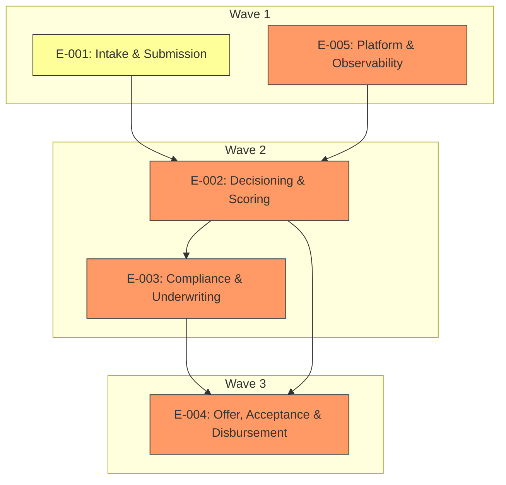

# Elaboration Plan

## Metadata

| Field | Value |
|---|---|
| Initiative ID | I010-GB |
| Created at | 2026-06-28 |
| Created by | delivery-lead |
| Status | Draft |

---

## Elaboration Strategy Summary

| Metric | Value |
|---|---|
| Total epics | 5 |
| Elaboration waves | 3 |
| Parallelizable epics | 2 |
| Critical path epics | 2 |
| Highest risk epic | E-002 |

---

## Prioritisation Criteria

| Factor | Weight | Rationale |
|---|---|---|
| Business priority (Must > Should > Could) | High | Must items (Intake, Scoring, Underwriting, Disbursement) directly enable value and regulatory obligations (from requirements). |
| Architecture risk (from architecture-review) | High | High-risk areas (scoring, disbursement, observability/audit) are scheduled earlier to fail-fast and reduce integration risk. |
| Cross-cutting concerns (from impacted-systems / solution-decisions) | Medium | Audit, integrations and data residency constraints require coordination but can be worked alongside feature work. |
| Dependency count (blocking others) | Medium | Foundation components (Intake, Platform) are prerequisites for downstream epics. |
| Standalone capability (can deliver independently) | Low | Standalone epics are lower priority for early waves unless business-critical. |

---

## Elaboration Order

### Wave 1 — Foundation & Platform

| Epic | Title | Rationale | Risk Level | Dependencies | Parallel? |
|---|---|---|---|---|---|
| E-001 | Intake & Submission | Foundation: provides canonical submission, ARN, status API that all other epics rely on. | Medium | None | Yes |
| E-005 | Platform & Observability | Platform, metrics and audit store enable safe testing and observability for scoring and disbursement. | High | None | Yes |

### Wave 2 — Decisioning & Compliance

| Epic | Title | Rationale | Risk Level | Dependencies | Parallel? |
|---|---|---|---|---|---|
| E-002 | Decisioning & Scoring | High-risk AI work; run early to validate model integration and explainability artifacts. | High | E-001, E-005 | No |
| E-003 | Compliance & Underwriting | Depends on scoring outputs and explainability; implements AML/KYC flows and underwriter casework. | High | E-002 | No |

### Wave 3 — Offer & Disbursement

| Epic | Title | Rationale | Risk Level | Dependencies | Parallel? |
|---|---|---|---|---|---|
| E-004 | Offer, Acceptance & Disbursement | Disbursement depends on completed scoring, AML checks, and offer generation; schedule after decisioning and compliance validated. | High | E-002, E-003 | No |

---

## Epic Dependency Analysis

| Epic | Depends On | Depended On By | Cross-Cutting Concerns | Architecture Risk |
|---|---|---|---|---|
| E-001 | None | E-002, E-004 | PII handling, ARN registry | Medium |
| E-005 | None | E-002, E-003, E-004 | Audit store, observability | High |
| E-002 | E-001, E-005 | E-003, E-004 | Experian adapter, explainability | High |
| E-003 | E-002 | E-004 | AML/KYC connectors, compliance audit | High |
| E-004 | E-002, E-003 | None | T24 adapter, DocuSign | High |

---

## Parallel Elaboration Opportunities

| Group | Epics | Rationale | Constraint |
|---|---|---|---|
| Foundation parallel | E-001, E-005 | Intake and Platform work can proceed in parallel: Intake defines APIs; Platform builds pipelines and audit capabilities. | Ensure interface contracts for Intake are defined early to avoid rework. |

---

## Elaboration Dependency Diagram

---

## Risks and Mitigations

| Risk | Impact | Mitigation |
|---|---|---|
| External contract unavailability (Experian/DocuSign/T24) | Delays integration tests and end-to-end validation | Use sandbox mocks, run contract tests when endpoints become available; prioritize adapter interfaces and contract tests early (Wave 1/2). |
| High-risk model integration (scoring) | Model latency or explainability gaps delay delivery | Run model POC in Wave 2 with telemetry; ensure explainability artifacts are captured to audit store. |

---

## Recommendations

Start with Wave 1 (Intake + Platform) to establish canonical APIs, ARN lifecycle, and observability; run Decisioning & Scoring (Wave 2) next to validate high-risk AI integrations and explainability early, then finalize Offer & Disbursement (Wave 3) after compliance flows are stable.

---
*This is a human-gated artifact. The delivery lead must review and approve the elaboration order before epic and story elaboration proceeds.*
