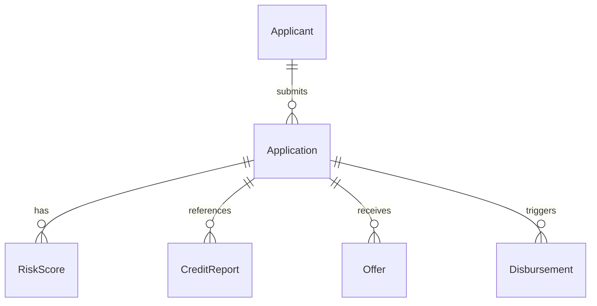

# Entity Model

## Metadata

| Field | Value |
|---|---|
| Initiative ID | I010-NEXT1 |
| Created at | 2026-06-16 |
| Created by | product-owner |
| Status | Draft |

## Entity Catalog

| ENT-NNN | Name | Description | Owner | PII | BRS Source |
|---|---|---|---|---|---|
| ENT-001 | Applicant | Captures applicant personal data and identifiers | APP-001 | Yes (name, DOB, NI) | FR-001, FR-003 |
| ENT-002 | Application | Loan application record, status, ARN, amounts | APP-002 | Yes (ARN links applicant) | FR-001, FR-003, FR-015 |
| ENT-003 | RiskScore | AI scoring result and metadata | SYS-001 | No | FR-006, FR-007 |
| ENT-004 | CreditReport | Experian credit report summary and timestamps | SYS-002 | Yes (credit data) | FR-009 |
| ENT-005 | Offer | Loan offer details and acceptance status | SYS-003 | No | FR-020, FR-021 |
| ENT-006 | Disbursement | Disbursement instruction and confirmation | SYS-004 | No | FR-024, FR-026 |

---

### ENT-001: Applicant

**Description:** Represents a person applying for a loan.
**Owner:** APP-001
**PII:** Yes — `full_name`, `date_of_birth`, `national_insurance_number`, `email`, `phone`

**Key attributes:**

| Attribute | Description | Data Type | Length/Precision | Validation Rules |
|---|---|---|---|---|
| applicant_id | Internal identifier (UUID) | string | 36 | Not Null
| full_name | Full legal name | string | 255 | Not Null
| date_of_birth | DOB | date | n/a | Not Null
| national_insurance_number | NI number | string | 20 | Not Null; pattern
| email | Contact email | string | 255 | Email format

**Status / lifecycle:** active, merged, deleted

**Relationships:**

| Relationship | With | Cardinality | Optional | BR-NNN Rule |
|---|---|---|---|---|
| has applications | ENT-002 (Application) | 1:N | No | FR-001 |

---

### ENT-002: Application

**Description:** Loan application record and current processing state.
**Owner:** APP-002
**PII:** Yes — links to `Applicant`

**Key attributes:**

| Attribute | Description | Data Type | Length/Precision | Validation Rules |
|---|---|---|---|---|
| application_id | Internal ID (UUID) | string | 36 | Not Null
| arn | Application Reference Number | string | 64 | Not Null, unique
| amount_requested | Requested loan amount | decimal | 10,2 | Not Null
| term_months | Requested term | integer | n/a | Not Null
| status | Current workflow state | string | 50 | Not Null

**Relationships:**

| Relationship | With | Cardinality | Optional | BR-NNN Rule |
|---|---|---|---|---|
| belongs to | ENT-001 (Applicant) | N:1 | No | FR-001 |

---

### ENT-003: RiskScore

**Description:** Stores AI model outputs and related metadata for explainability.
**Owner:** SYS-001
**PII:** No

**Key attributes:**

| Attribute | Description | Data Type | Length/Precision | Validation Rules |
|---|---|---|---|---|
| score_id | UUID | string | 36 | Not Null
| application_id | FK to Application | string | 36 | Not Null
| score_value | Integer (0-1000) | integer | n/a | Not Null
| recommendation | AUTO_APPROVE/REFER_TO_UNDERWRITER/AUTO_DECLINE | string | 32 | Not Null
| explainability_data | JSON blob with feature attributions | json | n/a | Not Null

**Relationships:**

| Relationship | With | Cardinality | Optional | BR-NNN Rule |
|---|---|---|---|---|
| computed for | ENT-002 (Application) | N:1 | No | FR-006 |

---

### ENT-004: CreditReport

**Description:** Summarized credit report from Experian.
**Owner:** SYS-002
**PII:** Yes — credit-specific fields

**Key attributes:**

| Attribute | Description | Data Type | Length/Precision | Validation Rules |
|---|---|---|---|---|
| report_id | UUID | string | 36 | Not Null
| application_id | FK to Application | string | 36 | Not Null
| report_summary | Text summary | text | n/a | Not Null
| retrieved_at | Timestamp | datetime | n/a | Not Null

---

### ENT-005: Offer

**Description:** Loan offer generated for approved applications.
**Owner:** SYS-003
**PII:** No

**Key attributes:**

| Attribute | Description | Data Type | Length/Precision | Validation Rules |
|---|---|---|---|---|
| offer_id | UUID | string | 36 | Not Null
| application_id | FK to Application | string | 36 | Not Null
| amount | decimal | 10,2 | Not Null
| apr | decimal | 5,2 | Not Null
| acceptance_status | pending/accepted/withdrawn | string | 20 | Not Null

---

### ENT-006: Disbursement

**Description:** Disbursement instruction and confirmation data.
**Owner:** SYS-004
**PII:** No

**Key attributes:**

| Attribute | Description | Data Type | Length/Precision | Validation Rules |
|---|---|---|---|---|
| disbursement_id | UUID | string | 36 | Not Null
| application_id | FK to Application | string | 36 | Not Null
| amount | decimal | 10,2 | Not Null
| confirmation_status | pending/confirmed/failed | string | 20 | Not Null

---

## ER Diagram

## Feature Coverage

| ENT-NNN | FR-NNN Source(s) | Notes |
|---|---|---|
| ENT-001 | FR-001, FR-003 | |
| ENT-002 | FR-001, FR-003, FR-015 | |

---
*Status: Draft — acceptance by workflow or human gate required.*