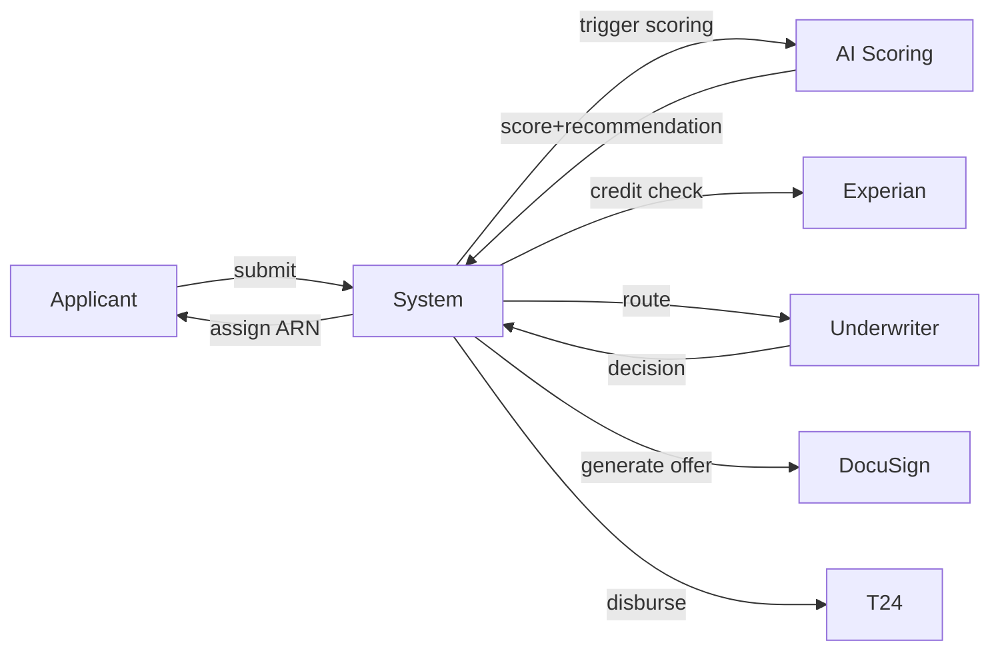

# Use Cases

## Use Case Catalog

| UC ID | Title | Related FRs |
|---|---|---|
| UC-001 | AI Pre-screening and Scoring | FR-006, FR-007 |
| UC-002 | Underwriter Review Flow | FR-015, FR-016, FR-017 |
| UC-003 | Offer Generation and Acceptance | FR-020, FR-021, FR-022 |
| UC-004 | Disbursement to Core Banking | FR-024, FR-025, FR-026 |
| UC-005 | AML/KYC Screening and Routing | FR-012, FR-013, FR-014 |
| UC-006 | Credit Bureau Integration | FR-009 |
| UC-007 | Notifications and Applicant Communications | FR-004, FR-021, FR-027 |
| UC-008 | Administrative Monitoring and Metrics | FR-028, FR-029, NFR-007 |

## UC-001

### Main Success Scenario

1. Applicant submits application with required fields.
2. System assigns ARN and triggers AI scoring.
3. AI returns score and recommendation.
4. If AUTO_APPROVE and ≤£10,000, proceed to offer generation.

## UC-002

### Main Success Scenario

1. System routes application to Underwriter queue for REFER_TO_UNDERWRITER or high-value AUTO_APPROVE.
2. Underwriter reviews application and makes a decision.
3. Decision is recorded immutably.

## UC-003

### Main Success Scenario

1. System generates loan offer.
2. Applicant accepts via e-signature.
3. Acceptance logged and cooling-off applies.

## UC-004

### Main Success Scenario

1. After cooling-off expiry or waiver, system triggers disbursement to T24.
2. System records confirmation and notifies applicant.

## UC-005

### Main Success Scenario

1. System performs AML/KYC screening during intake.
2. If AML/KYC passes, application proceeds; if not, flagged COMPLIANCE_HOLD and routed to Compliance.

## UC-006

### Main Success Scenario

1. System retrieves credit report from Experian and records summary.
2. If Experian is unavailable, application is routed to Underwriter.

## UC-007

### Main Success Scenario

1. Applicant receives email confirmations and portal notifications at key milestones (submission, offer, disbursement).

## UC-008

### Main Success Scenario

1. Admin dashboard aggregates metrics and provides near-real-time monitoring for operations and compliance.
