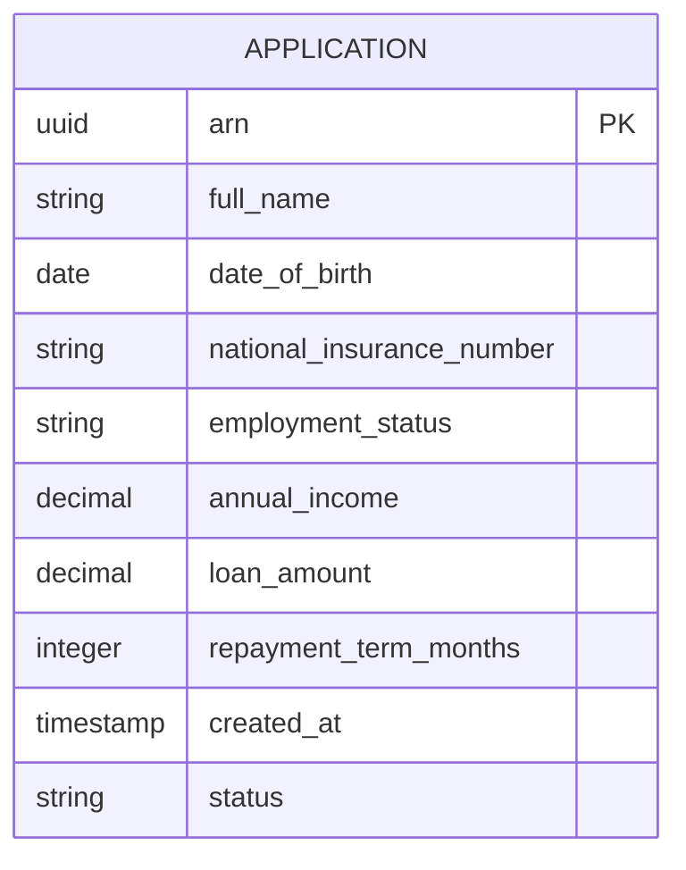
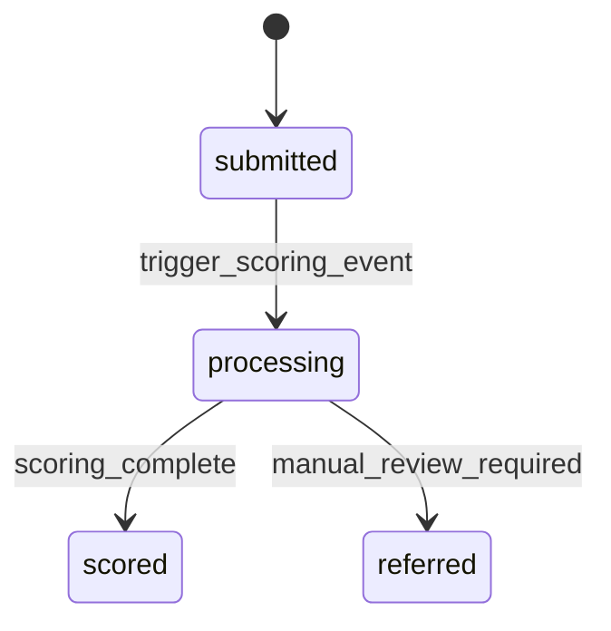

# Implementation Contract — E-001 Intake & Submission

## Data Entities


### ER Diagram



### Application

| Field | Type | Required | Constraints | Source |
|---|---|---|---|---|
| arn | uuid | Yes | Unique application reference | FR-003 |
| full_name | string | Yes | non-empty | FR-001 |
| date_of_birth | date | Yes | ISO 8601 | FR-001 |
| national_insurance_number | string | Yes | UK NI pattern | FR-001 |
| employment_status | string | Yes | enum | FR-001 |
| annual_income | decimal | Yes | >= 0 | FR-001 |
| loan_amount | decimal | Yes | between 1000 and 50000 | FR-001 |
| repayment_term_months | integer | Yes | 12..84 | FR-001 |
| created_at | timestamp | Yes | server-generated | N/A |
| status | string | Yes | submitted / processing / scored / referred | FR-006 |

**State Machine**



| Transition | Trigger | Actor | Side Effects |
|---|---|---|---|
| submitted → processing | submission accepted | intake service | emit event `application.submitted` to scoring topic |
| processing → scored | scoring result | scoring service | write score to `ExplainabilityStore`, emit `application.scored` |
| any → referred | rule or manual override | scoring or underwriter | mark application for underwriter review |

---

## API Surface

```yaml
openapi: "3.0.3"
info:
  title: "Intake API"
  version: "1.0.0"
paths:
  /api/v1/applications:
    post:
      summary: "Submit application"
      operationId: "submitApplication"
      requestBody:
        required: true
        content:
          application/json:
            schema:
              type: object
              required:
                - full_name
                - date_of_birth
                - national_insurance_number
                - employment_status
                - annual_income
                - loan_amount
                - repayment_term_months
              properties:
                full_name:
                  type: string
                date_of_birth:
                  type: string
                  format: date
                national_insurance_number:
                  type: string
                employment_status:
                  type: string
                annual_income:
                  type: number
                loan_amount:
                  type: number
                repayment_term_months:
                  type: integer
      responses:
        "201":
          description: "Accepted"
          content:
            application/json:
              schema:
                type: object
                properties:
                  arn:
                    type: string
                    format: uuid
        "400":
          description: "Validation error"
        "422":
          description: "Business rule violation"

  /api/v1/applications/{arn}:
    get:
      summary: "Get application by ARN"
      parameters:
        - name: arn
          in: path
          required: true
          schema:
            type: string
      responses:
        "200":
          description: "Application data"
        "404":
          description: "Not found"
```

### Consumed APIs (External)

| API | Provider | Timeout | Fallback | Circuit Breaker |
|---|---|---|---|---|
| Experian credit report | Experian | 5s | return partial | enabled |
| E-sign provider | DocuSign | 5s | no-op (out of scope) | enabled |

---

## Events

| Event | Type | Producer | Consumers | Trigger |
|---|---|---|---|---|
| application.submitted | domain | intake-service | scoring-pipeline, observability | submission accepted |
| application.scored | domain | scoring-service | underwriter, explainability-store | scoring completed |

### application.submitted

**Payload:**

| Field | Type | Required | Description |
|---|---|---|---|
| arn | uuid | Yes | Application reference |
| submitted_at | timestamp | Yes | When submission received |
| applicant_hash | string | Yes | PII hashed value for linking |

**Delivery:** at-least-once
**Idempotency key:** arn

---

## Business Rules

| Rule | Condition | Effect | Source |
|---|---|---|---|
| BR-001: Minimum loan amount | loan_amount < 1000 | reject submission | FR-001 |
| BR-002: Age check | applicant age < 18 | reject submission | FR-001 |
| BR-003: ARN uniqueness | duplicate arn | generate new arn / dedupe | FR-003 |

---

## UI Surface

This epic delivers the Application Form and Status Lookup pages from the UI specification. Extracted pages:

| Page | Route | Application | Specification Status | Blocking Dependencies | Linked FRs |
|---|---|---|---|---|---|
| Application Form | /applications | Applicant Portal | partial | G-UI-001 | FR-001, FR-002 |
| Status Lookup | /applications/status | Applicant Portal | partial | Q-001 | FR-005 |

**Contract Mode:** proposed-by-ui-spec for form submission endpoint, pending confirmation of repository mapping (G-UI-001).

---

## Non-Functional Constraints

| Constraint | Target | Source |
|---|---|---|
| Response time < 2s for form render | frontend | NFR-001 |
| Submission processing within 2 minutes for confirmation email | intake service | FR-004 |
| UK-region data residency, AES-256 at rest, TLS1.3 in transit | infra | ARCH-C-001 |

---

## Open Design Questions

| Question | Impact | Must Resolve Before |
|---|---|---|
| UIQ-002: Does Applicant Portal require user accounts or only ARN-based status lookup? | Affects auth model for submission and status lookup | story generation for Application Form |
| UIQ-003: Provide `/scores/{id}` explanation payload schema for underwriter page | Affects Application Detail data binding | story generation for underwriter panels |

---

*End of contract.*
