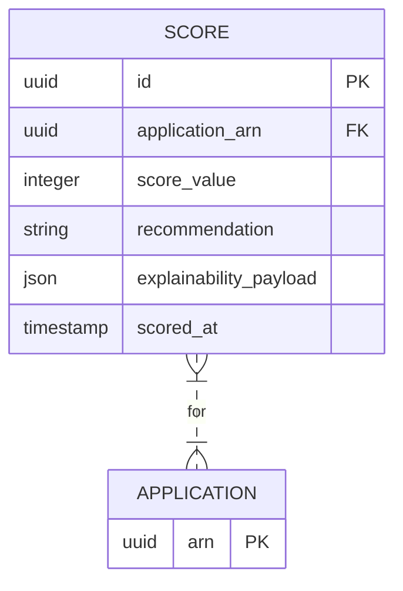

# Implementation Contract — E-002 Scoring & Explainability

## Data Entities

### ER Diagram



### Score

| Field | Type | Required | Constraints | Source |
|---|---|---|---|---|
| id | uuid | Yes | PK | FR-007 |
| application_arn | uuid | Yes | FK to Application.arn | FR-003 / FR-007 |
| score_value | integer | Yes | 0..1000 | FR-007 |
| recommendation | string | Yes | AUTO_APPROVE / REFER_TO_UNDERWRITER / AUTO_DECLINE | FR-007 |
| explainability_payload | json | Yes | persisted explainability traces | C-004 / D-002 |
| scored_at | timestamp | Yes | server-generated | NFR-002 |

---

## API Surface

```yaml
openapi: "3.0.3"
info:
  title: "Scoring API"
  version: "1.0.0"
paths:
  /api/v1/scores/{id}:
    get:
      summary: "Get score and explainability"
      operationId: "getScore"
      parameters:
        - name: id
          in: path
          required: true
          schema:
            type: string
      responses:
        "200":
          description: "Score + explainability payload"
          content:
            application/json:
              schema:
                type: object
                properties:
                  id:
                    type: string
                    format: uuid
                  application_arn:
                    type: string
                  score_value:
                    type: integer
                  recommendation:
                    type: string
                  explainability_payload:
                    type: object
        "404":
          description: "Not found"
```

### Consumed APIs (External)

| API | Provider | Timeout | Fallback | Circuit Breaker |
|---|---|---|---|---|
| Experian CreditExpert | Experian | 30s | refer to underwriter | enabled |

---

## Events

| Event | Type | Producer | Consumers | Trigger |
|---|---|---|---|---|
| application.submitted | domain | intake-service | scoring-service | submission accepted |
| application.scored | domain | scoring-service | underwriter, explainability-store, observability | scoring completed |

### application.scored

**Payload:**

| Field | Type | Required | Description |
|---|---|---|---|
| id | uuid | Yes | Score id |
| application_arn | uuid | Yes | ARN |
| score_value | integer | Yes | Score value |
| recommendation | string | Yes | Recommendation enum |
| explainability_ref | string | Yes | reference to persisted explainability trace |

**Delivery:** at-least-once
**Idempotency key:** id

---

## Business Rules

| Rule | Condition | Effect | Source |
|---|---|---|---|
| BR-010: Auto-approve threshold | score_value >= 800 and loan_amount <= 10000 | AUTO_APPROVE | FR-010 / FR-007 |
| BR-011: Refer-to-underwriter | score_value between 600..799 | REFER_TO_UNDERWRITER | FR-007 |

---

## Non-Functional Constraints

| Constraint | Target | Source |
|---|---|---|
| End-to-end scoring <= 90s | scoring pipeline | NFR-002 |
| Explainability traces retained for 7 years | ExplainabilityStore | AR-NNN / compliance |

---

## Open Design Questions

| Question | Impact | Must Resolve Before |
|---|---|---|
| SDQ-002: Confirmed `/scores/{id}` contract | Affects UI binding and storage schema | story generation for `/scores/{id}` |

---

## Solution Decisions

| Decision ID | Area | Action |
|---|---|---|
| SD-002 | Scoring Service | create-new — Python ML runtime, /scores/{id} API, write explainability traces to ExplainabilityStore |
| D-002 | Explainability schema | create-new — persist explainability traces and link by id |

---

*End of contract.*
