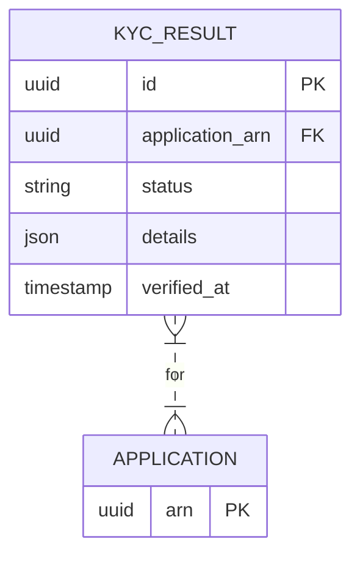

# Implementation Contract — E-003 Compliance & KYC

## Data Entities

### ER Diagram



### KYC_RESULT

| Field | Type | Required | Constraints | Source |
|---|---|---|---|---|
| id | uuid | Yes | PK | FR-013 |
| application_arn | uuid | Yes | FK | FR-013 |
| status | string | Yes | verified / failed / partial | FR-013 |
| details | json | No | provider response | FR-013 |
| verified_at | timestamp | Yes | server | FR-013 |

---

## API Surface
```yaml
openapi: "3.0.3"
info:
    title: "KYC Adapter API"
    version: "1.0.0"
paths:
    /api/v1/kyc/{arn}:
        get:
            summary: "Get KYC verification status for an application"
            parameters:
                - name: arn
                    in: path
                    required: true
                    schema:
                        type: string
            responses:
                "200":
                    description: "KYC result"
                "404":
                    description: "Not found"
```

KYC adapter will expose internal endpoints for the Compliance Worker to request verification; results are persisted to `KYC_RESULT` and emitted as events `application.kyc_verified`.

---

## Events

| Event | Type | Producer | Consumers | Trigger |
|---|---|---|---|---|
| application.kyc_verified | domain | compliance-worker | scoring-service, underwriter | result persisted |

---

## Business Rules

| Rule | Condition | Effect | Source |
|---|---|---|---|
| BR-020: KYC failure routing | KYC status == failed | set COMPLIANCE_HOLD and route to compliance | FR-014 |

---

## Non-Functional Constraints

| Constraint | Target | Source |
|---|---|---|
| KYC API latency <= 60s | KYC adapter | FR-013 |

---

## Open Design Questions

| Question | Impact | Must Resolve Before |
|---|---|---|
| SDQ-003: HMRC contract & SLA confirmation | Integration reliability | Implementation start |

---

*End of contract.*
