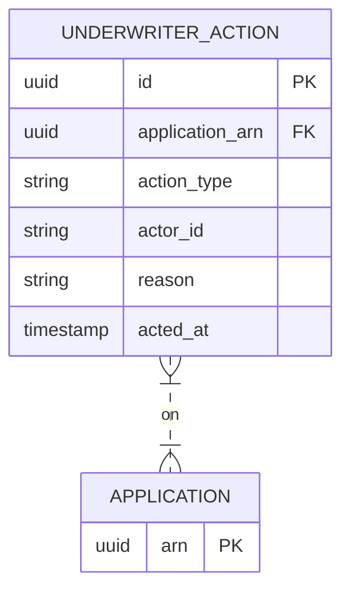

# Implementation Contract — E-004 Underwriter Decisioning

## Data Entities

### ER Diagram



### Underwriter Action

| Field | Type | Required | Constraints | Source |
|---|---|---|---|---|
| id | uuid | Yes | PK | FR-018 |
| application_arn | uuid | Yes | FK | FR-018 |
| action_type | string | Yes | approve / decline / request_info | FR-017 |
| actor_id | string | Yes | underwriter id | FR-018 |
| reason | string | Cond. | required for decline | FR-017 |
| acted_at | timestamp | Yes | server | FR-018 |

---

## API Surface

```yaml
openapi: "3.0.3"
info:
  title: "Underwriter API"
  version: "1.0.0"
paths:
  /api/v1/underwriter/actions:
    post:
      summary: "Record an underwriter action"
      requestBody:
        content:
          application/json:
            schema:
              type: object
      responses:
        "201":
          description: "Action recorded"
```

---

## Events

| Event | Type | Producer | Consumers | Trigger |
|---|---|---|---|---|
| underwriter.action.recorded | domain | underwriter-api | AuditStore, Notifications | action recorded |

---

## Non-Functional Constraints

| Constraint | Target | Source |
|---|---|---|
| Audit entries must be write-once and tamper-evident | AuditStore | FR-028 |

---

*End of contract.*
