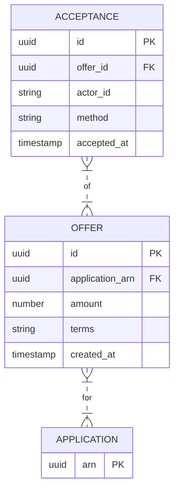

# Implementation Contract — E-005 Offer & Acceptance

## Data Entities

### ER Diagram



## API Surface

```yaml
openapi: "3.0.3"
info:
  title: "Offer API"
  version: "1.0.0"
paths:
  /api/v1/offers:
    post:
      summary: "Create offer for an application"
      requestBody:
        content:
          application/json:
            schema:
              type: object
      responses:
        "201":
          description: "Offer created"
  /api/v1/offers/{offerId}/accept:
    post:
      summary: "Accept an offer"
      parameters:
        - name: offerId
          in: path
          required: true
          schema:
            type: string
      responses:
        "200":
          description: "Offer accepted"
```

## Events

| Event | Type | Producer | Consumers | Trigger |
|---|---|---|---|---|
| offer.created | domain | offer-service | provisioning | offer created |
| offer.accepted | domain | acceptance-service | provisioning, audit | offer accepted |

*End of contract.*
