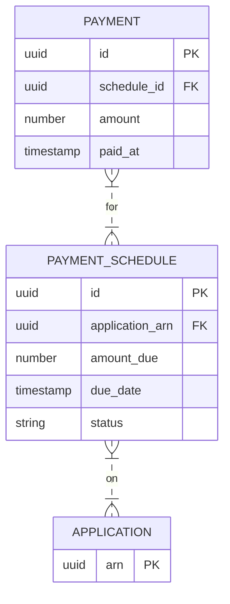

# Implementation Contract — E-006 Disbursement & Payments

## Data Entities

### ER Diagram



## API Surface

```yaml
openapi: "3.0.3"
info:
  title: "Servicing API"
  version: "1.0.0"
paths:
  /api/v1/servicing/schedules/{applicationArn}:
    get:
      summary: "Get payment schedules for an application"
      parameters:
        - name: applicationArn
          in: path
          required: true
          schema:
            type: string
      responses:
        "200":
          description: "Schedules returned"
```

## Events

| Event | Type | Producer | Consumers | Trigger |
|---|---|---|---|---|
| servicing.payment_missed | domain | servicing-worker | notifications, collections | payment missed |

*End of contract.*
