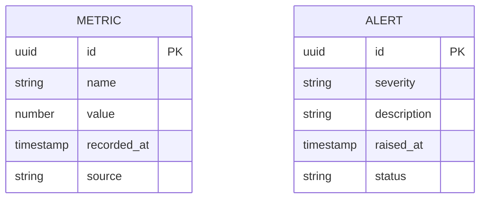

# Implementation Contract — E-007 Operations, Admin & Observability

## Data Entities

### ER Diagram



## API Surface

```yaml
openapi: "3.0.3"
info:
  title: "Operations API"
  version: "1.0.0"
paths:
  /api/v1/metrics:
    post:
      summary: "Ingest a metric"
      requestBody:
        content:
          application/json:
            schema:
              type: object
      responses:
        "202":
          description: "Accepted"
  /api/v1/admin/flags:
    get:
      summary: "List feature flags"
      responses:
        "200":
          description: "List of flags"
```

## Events

| Event | Type | Producer | Consumers | Trigger |
|---|---|---|---|---|
| metric.ingested | domain | services | MetricsStore, Dashboards | metric posted |
| alert.raised | domain | monitoring | IncidentManagement, Notifications | threshold breached |

*End of contract.*
