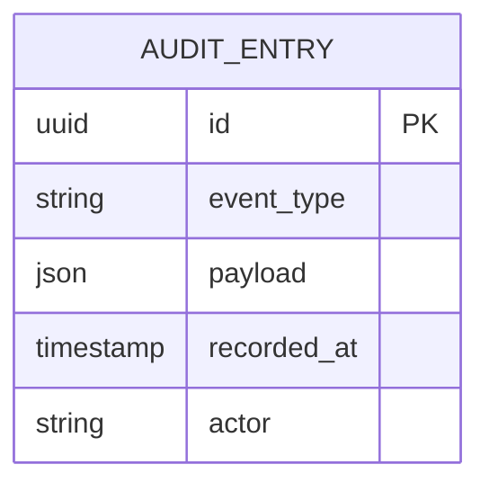

# Implementation Contract — E-008 Platform, Security & Audit

## Data Entities

### ER Diagram



## API Surface

```yaml
openapi: "3.0.3"
info:
  title: "Audit API"
  version: "1.0.0"
paths:
  /api/v1/audit:
    post:
      summary: "Write an audit entry"
      requestBody:
        content:
          application/json:
            schema:
              type: object
      responses:
        "201":
          description: "Audit recorded"
```

## Non-Functional Constraints

| Constraint | Target | Source |
|---|---|---|
| Data residency: UK only | Storage | NFR-004 |
| Encryption: AES-256 at rest | Storage | NFR-004 |
| TLS1.3 for all transport | Network | NFR-004 |

*End of contract.*
