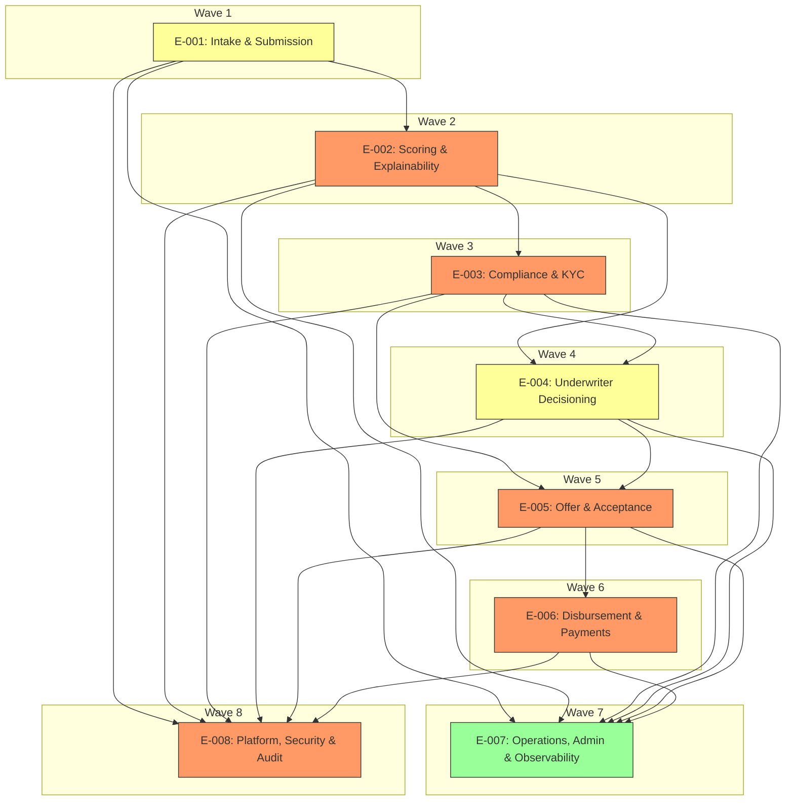

# Elaboration Plan

## Metadata

## Elaboration Strategy Summary

| Metric | Value |
|---|---|
| Total epics | 8 |
| Elaboration waves | 8 |
| Parallelizable epics | 0 |
| Critical path epics | E-001, E-002, E-003, E-005 |
| Highest risk epic | E-002 |

---

## Prioritisation Criteria

| Factor | Weight | Rationale |
|---|---|---|
| Business priority (Must > Should > Could) | High | Must-have epics deliver the minimum viable product and satisfy regulatory constraints |
| Architecture risk (from architecture-review) | High | High-risk epics (scoring, KYC, disbursement) should be scheduled early to surface issues |
| Cross-cutting concerns (from impacted-systems / solution-decisions) | Medium | Platform and shared integrations require coordination but are validated later to avoid blocking early learning |
| Dependency count (blocking others) | Medium | Foundation epics with many dependents (E-001) go earlier to unblock consumers |
| Standalone capability (can deliver independently) | Low | Independent epics can be parallelised when possible |

---

## Elaboration Order

### Wave 1 — Foundation

| Epic | Title | Rationale | Risk Level | Dependencies | Parallel? |
|---|---|---|---|---|---|
| E-001 | Intake & Submission | Provides intake and ARN required by downstream flows | Medium | None | No |

### Wave 2 — Scoring validation

| Epic | Title | Rationale | Risk Level | Dependencies | Parallel? |
|---|---|---|---|---|---|
| E-002 | Scoring & Explainability | Validate AI pipeline, explainability, and Experian integration early | High | E-001 | No |

### Wave 3 — Compliance

| Epic | Title | Rationale | Risk Level | Dependencies | Parallel? |
|---|---|---|---|---|---|
| E-003 | Compliance & KYC | AML/KYC must be proven with HMRC integration and screening | High | E-002 | No |

### Wave 4 — Underwriter tooling

| Epic | Title | Rationale | Risk Level | Dependencies | Parallel? |
|---|---|---|---|---|---|
| E-004 | Underwriter Decisioning | Build underwriter UI and actions after scoring and KYC are available | Medium | E-002, E-003 | No |

### Wave 5 — Offer flows

| Epic | Title | Rationale | Risk Level | Dependencies | Parallel? |
|---|---|---|---|---|---|
| E-005 | Offer & Acceptance | Offer generation depends on compliance and underwriter decisions | High | E-003, E-004 | No |

### Wave 6 — Disbursement

| Epic | Title | Rationale | Risk Level | Dependencies | Parallel? |
|---|---|---|---|---|---|
| E-006 | Disbursement & Payments | Integrate T24 adapter and ensure payment flows are reliable | High | E-005 | No |

### Wave 7 — Operations & observability

| Epic | Title | Rationale | Risk Level | Dependencies | Parallel? |
|---|---|---|---|---|---|
| E-007 | Operations, Admin & Observability | Provide admin metrics and monitoring across flows | Low | E-001..E-006 | No |

### Wave 8 — Platform & security validation

| Epic | Title | Rationale | Risk Level | Dependencies | Parallel? |
|---|---|---|---|---|---|
| E-008 | Platform, Security & Audit | Final validation of platform controls, encryption, and auditability across components | High | E-001..E-006 | No |

---

## Parallel Elaboration Opportunities

| Group | Epics | Rationale | Constraint |
|---|---|---|---|
| None | None | No safe parallel groups exist due to sequential dependencies and cross-cutting platform concerns | Shared integrations and audit requirements prevent safe parallelisation at epic level |
Rationale references: architecture/architecture-review.md (Scoring: High risk; AML/KYC: High; Disbursement: High); planning/delivery-skeleton.md dependencies.

---

## Elaboration Dependency Diagram

---

## Epic Dependency Analysis

| Epic | Depends On | Depends Reason |
|---|---|---|
| E-001 | None | Intake provides foundational APIs and ARN generation |
| E-002 | E-001 | Scoring consumes submission data and ARN mapping |
| E-003 | E-002 | KYC/AML decision relies on scoring events and routing |
| E-004 | E-002, E-003 | Underwriter UI surfaces scoring and compliance status |
| E-005 | E-003, E-004 | Offer generation requires compliance clearance and underwriter decisions |
| E-006 | E-005 | Disbursement needs finalised offer and acceptance |
| E-007 | E-001..E-006 | Ops requires visibility into all flows for metrics/alerts |
| E-008 | E-001..E-006 | Platform/security must integrate with all components for audit/encryption |

---

## Risks and Mitigations

| Risk | Impact | Mitigation |
|---|---|---|
| Integration latency (Experian/HMRC) | Scoring delays, routing to underwriters | Early integration spike; contractual SLA confirmation; circuit breakers per NFR-007 |
| Explainability shortfall | Model rejection by regulators | Use Azure Foundry; implement ExplainabilityStore and trace capture (C-004) |
| Payment contract changes (T24) | Disbursement rework, delays | Define adapter contract, mock T24 in early integration tests, involve IT architecture (DEC-002) |
| Data residency non-compliance | Regulatory breach | Enforce UK-only hosting and encryption (ARCH-C-001) |

---

## Recommendations

Start with Wave 1 (E-001) to deliver intake and ARN capabilities, then execute Wave 2 (E-002) to validate scoring and explainability. Prioritise early integration spikes with Experian and HMRC in Wave 2–3 to de-risk latency. Treat Platform & Security (E-008) as cross-cutting integration work performed alongside waves but formally validated in Wave 8.

Contact: Delivery Lead
