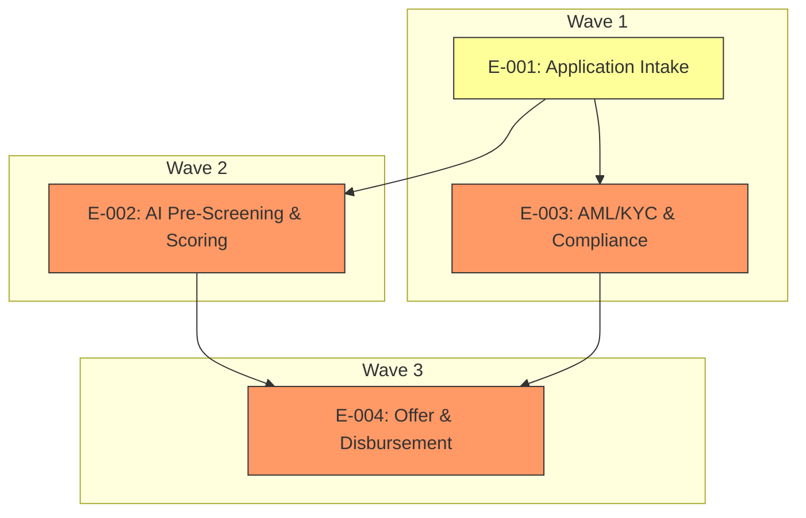

# Elaboration Plan

## Metadata

| Field | Value |
|---|---|
| Initiative ID | I011-N2 |
| Created at | 2026-06-21 |
| Created by | delivery-lead |
| Status | Draft |

---

## Elaboration Strategy Summary

Wave 1: E-001 (Application Intake) and E-003 (AML/KYC) — foundation and risk-first; Wave 2: E-002 (AI Pre-Screening & Scoring); Wave 3: E-004 (Offer & Disbursement). Key driver: reduce cross-epic risk by validating intake, compliance flows and integrations before scaling scoring and disbursement.

| Driver | Why |
|---|---|
| Foundation-first | Establish data model and submission APIs to avoid rework in downstream epics |
| Risk-first | Address high-impact integration and compliance risks early to fail fast and reduce cost of change |
| Business-priority | Ensure Must epics deliver core value early while balancing risk |

---

## Prioritisation Criteria

- Foundation-first (weight 40%): E-001 provides canonical data model and submission flows; nearly every downstream epic depends on it.
- Risk-first (weight 30%): E-002 and E-003 carry high architectural and compliance risk per `architecture/architecture-review.md` (scoring latency, external integrations, AML compliance). Fail-fast on risk.
- Business-priority (weight 20%): Must epics take precedence where risk parity exists.
- Parallelism (weight 10%): Identify independent epics that can be elaborated concurrently.

Rationale references: `architecture/architecture-review.md` (Performance NFR-002, Security NFR-004) and `requirements/atomic-requirements.md` (REQ-006 Experian, REQ-007 AML/KYC).

---

## Elaboration Order

| Wave | Epics | Rationale |
|---|---|---|
| Wave 1 | E-001 — Application Intake; E-003 — AML/KYC & Compliance | E-001 establishes data model and intake mechanics; E-003 addresses regulatory and integration risk early (HMRC/HM Treasury). Both are prerequisites to safe scoring and offer flows. |
| Wave 2 | E-002 — AI Pre-Screening & Scoring | Scoring depends on reliable intake and credit data; run after Wave 1 to validate model inputs and integration resilience. |
| Wave 3 | E-004 — Offer Generation & Disbursement | Final business value (offers/disbursement) depends on upstream clearance and scoring; schedule last to reduce rework risk. |

---

## Parallel Elaboration Opportunities

- E-001 and E-003 can be elaborated in parallel within Wave 1 by separate teams (frontend + compliance/integration), provided clear API contracts and data-model ownership are agreed at the start.
- No parallelism between E-002 and E-004 (E-002 feeds E-004) — E-002 must precede E-004.

---

## Elaboration Dependency Diagram

---

## Epic Dependency Analysis

| Epic | Depends On | Depended On By | Risk | Notes |
|---|---|---|---|---|
| E-001 | None | E-002, E-003, E-004 | Medium | Foundation: data model and submission APIs (REQ-001..REQ-005). |
| E-002 | E-001, Experian (REQ-006) | E-004 | High | Scoring latency, model explainability, external credit API risk. |
| E-003 | E-001, HMRC/HM Treasury integrations | E-004 | High | Compliance gating and KYC dependencies (REQ-007). |
| E-004 | E-001, E-002, E-003 | None | High | Disbursement relies on upstream clearances and core banking integration (REQ-010). |

---

## Risks and Mitigations

| Risk | Impact | Mitigation |
|---|---|---|
| Experian unavailability or contract changes | Wave 2 may be blocked or produce low-quality scores | Implement robust fallbacks (REFER_TO_UNDERWRITER), contract acceptance tests in Wave 1, and sandbox integration early (REQ-006). |
| AML/KYC provider latency or schema changes | Compliance checks delay downstream acceptance | Prototype HMRC integration in Wave 1; add circuit breakers and async retry policies (REQ-007, NFR-007). |
| AI model vendor decision (OQ-001) | Scoring approach may change requirements for data and infra | Defer model selection until after initial data contracts; run a short Spike within Wave 2 to validate assumptions (timeboxed). |

---

## Recommendations (2-3 sentences)

Start with Wave 1 focusing on `E-001` and `E-003` to establish a hardened intake, data model, and compliance integration surface; this reduces risk and clarifies inputs for scoring. After successful Wave 1 validation, execute Wave 2 for scoring (including a short model spike) and finish with Wave 3 for offers and disbursement.

---

## Done Checklist

- [x] Every epic from `delivery-skeleton.md` appears in the plan
- [x] Every epic assigned to one wave
- [x] Mermaid diagram includes all epics with dependency edges
- [x] At least one parallel group identified
- [x] Risks and mitigations documented
