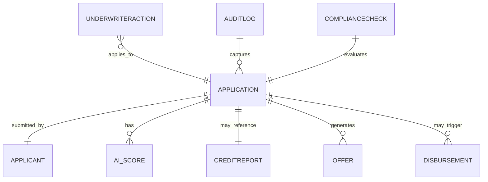

# Entity Model

## Metadata

| Field | Value |
|---|---|
| Initiative ID | I012-NEXT12 |
| Created at | 2026-06-16 |
| Created by | product-owner |
| Status | Draft |

## Entity Catalog

| ENT-NNN | Name | Description | Owner | PII | BRS Source |
|---|---|---|---|---|---|
| ENT-001 | Application | Customer loan application record and metadata (ARN) | ACT-001 / SYS-001 | Partial (applicant name, dob, contact) | FR-001..FR-005, FR-003 |
| ENT-002 | Applicant | Customer identity and profile used across applications | ACT-001 | Yes (name, dob, contact, ID) | FR-013, FR-002 |
| ENT-003 | AI_Score | AI scoring result and recommendation | SYS-001 | No | FR-006, FR-007, FR-008 |
| ENT-004 | CreditReport | Credit bureau report and summary (Experian) | SYS-002 | Yes (credit identifiers) | FR-009 |
| ENT-005 | Offer | Generated loan offer document and terms | SYS-003 | No | FR-010, FR-020..FR-023 |
| ENT-006 | Disbursement | Disbursement instruction and confirmation | SYS-004 | No | FR-024..FR-026 |
| ENT-007 | UnderwriterAction | Manual underwriter decisions and metadata | ACT-002 | No | FR-015..FR-019 |
| ENT-008 | ComplianceCheck | AML/KYC screening result and hold status | SYS-005 | Yes/No | FR-012..FR-014 |
| ENT-009 | AuditLog | Immutable audit entries for state transitions | SYS-006 | May include PII snapshot | FR-018, FR-028 |
| ENT-010 | AdminReport | Aggregated metrics and dashboards for admins | ACT-003 | No | FR-029, FR-030 |

---

### ENT-001: Application

**Description:** Represents a single loan application submission and its lifecycle (ARN, status, timestamps).
**Owner:** ACT-001 / SYS-001
**PII:** Applicant name, DOB, contact details, partial identifiers

**Key attributes:**

| Attribute | Description | Data Type | Length/Precision | Validation Rules |
|---|---|---:|---|---|
| arn | Application Reference Number | string | 32 | Not Null; unique; format ARN-YYYYNNN |
| status | Current state (SUBMITTED, AUTO_APPROVE, REFER, COMPLIANCE_HOLD, ACCEPTED, DISBURSED) | string | 32 | Not Null |
| submitted_at | Submission timestamp | datetime | n/a | Not Null |
| amount | Requested loan amount | decimal | 10,2 | Not Null; >0 |

**Status / lifecycle:** SUBMITTED → AI_SCORING → (AUTO_APPROVE / REFER / AUTO_DECLINE) → OFFER → ACCEPTED → DISBURSED

**Relationships:**

| Relationship | With | Cardinality | Optional | BR-NNN Rule |
|---|---|---:|---|---|
| has applicant | ENT-002 | 1:1 | No | FR-001 |
| has score | ENT-003 | 1:1 | Yes | FR-006 |
| may reference | ENT-004 | 1:1 | Yes | FR-009 |

---

### ENT-002: Applicant

**Description:** Canonical applicant identity record used for KYC and lookup operations.
**Owner:** ACT-001
**PII:** Yes — name, DOB, identifiers

**Key attributes:** name, dob, primary_contact, national_id

---

### ENT-003: AI_Score

**Description:** Risk score and recommendation produced by the AI pre-screening pipeline.
**Owner:** SYS-001
**PII:** No

**Key attributes:** score_value, score_bucket, recommendation, model_version, generated_at

---

### ENT-004: CreditReport

**Description:** Experian credit report payload and summary fields used by scoring and underwriters.
**Owner:** SYS-002
**PII:** Yes (credit identifiers, summary)

---

### ENT-005: Offer

**Description:** Loan offer document and acceptance metadata.
**Owner:** SYS-003

---

### ENT-006: Disbursement

**Description:** Payment instruction and confirmation status for settlement to customer account.
**Owner:** SYS-004

---

### ENT-007: UnderwriterAction

**Description:** Human review actions with reasons, timestamps, and actor metadata.
**Owner:** ACT-002

---

### ENT-008: ComplianceCheck

**Description:** AML/KYC screening results, hold flags, and routing instructions.
**Owner:** SYS-005

---

### ENT-009: AuditLog

**Description:** Immutable audit log entries capturing state transitions and snapshots for forensics.
**Owner:** SYS-006

---

### ENT-010: AdminReport

**Description:** Aggregated metrics and dashboards for operations and compliance.
**Owner:** ACT-003

---

## ER Diagram

## Feature Coverage

| ENT-NNN | FR-NNN Source(s) | Notes |
|---|---|---|
| ENT-001 | FR-001..FR-005, FR-003 | Application core fields, ARN, status lifecycle |
| ENT-002 | FR-013, FR-002 | KYC identity data and lookups |
| ENT-003 | FR-006..FR-008 | AI scoring inputs and outputs |
| ENT-004 | FR-009 | Experian integration payload |
| ENT-005 | FR-010, FR-020..FR-023 | Offer generation and acceptance tracking |
| ENT-006 | FR-024..FR-027 | Disbursement instruction and confirmation |
| ENT-007 | FR-015..FR-019 | Underwriter actions and queues |
| ENT-008 | FR-012..FR-014 | AML/KYC hold and routing |
| ENT-009 | FR-018, FR-028 | Immutable audit trail requirements |
| ENT-010 | FR-029, FR-030 | Admin dashboards and observability |

---

*Set Status: Accepted only by workflow or human approval when applicable.*
