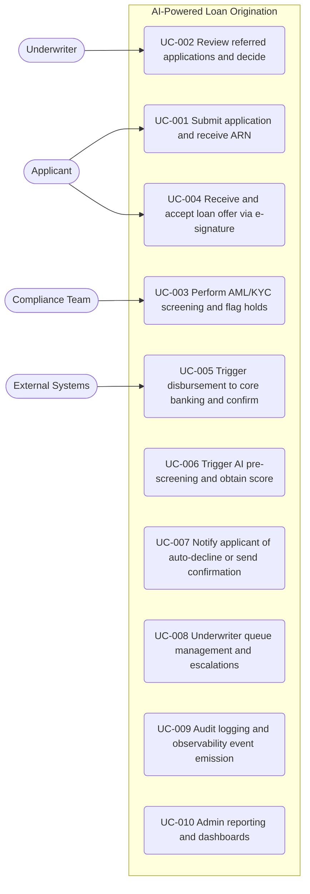

# Use Case Catalog

> Produced by: product-owner
> Status: Draft

## UC Catalog

| UC ID | Title | Actors | FR coverage |
|---|---|---|---|
| UC-001 | Submit application and receive ARN | Applicant, External Systems | FR-001..FR-005 |
| UC-002 | Review referred applications and decide | Underwriter | FR-015..FR-019 |
| UC-003 | Perform AML/KYC screening and flag holds | Compliance Team, External Systems | FR-012..FR-014 |
| UC-004 | Receive and accept loan offer via e-signature | Applicant, External Systems | FR-020..FR-023 |
| UC-005 | Trigger disbursement to core banking and confirm | System (Temenos T24) | FR-024..FR-027 |
| UC-006 | Trigger AI pre-screening and obtain score | System, Applicant | FR-006..FR-009 |
| UC-007 | Notify applicant of auto-decline or send confirmation | Applicant | FR-004, FR-011 |
| UC-008 | Underwriter queue management and escalations | Underwriter, Platform | FR-015, FR-019 |
| UC-009 | Audit logging and observability event emission | Platform, Admin | FR-028, FR-030 |
| UC-010 | Admin reporting and dashboards | Admin | FR-029 |

## Notes

- `UC-NNN` IDs are aligned between `use-cases.puml` and this markdown file.
- Each UC maps to one or more functional requirements from the requirements catalog.
