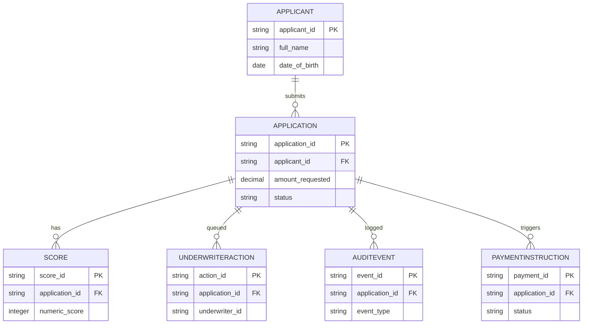

# Entity Model

## Metadata

| Field | Value |
|---|---|
| Initiative ID | I013-NEXT13 |
| Created at | 2026-06-16 |
| Created by | product-owner |
| Status | Draft |

---

## Entities

### ENT-001 — Applicant

- applicant_id (ARN) : string
- full_name : string
- date_of_birth : date
- national_insurance_number : string
- contact_email : string
- contact_phone : string

### ENT-002 — Application

- application_id : string
- applicant_id : FK -> Applicant
- amount_requested : decimal
- term_months : integer
- purpose : string
- submission_timestamp : datetime
- status : enum (SUBMITTED, SCORING, REFER_TO_UNDERWRITER, APPROVED, DECLINED, COMPLIANCE_HOLD, DISBURSED)

### ENT-003 — Score

- score_id : string
- application_id : FK -> Application
- numeric_score : integer
- recommendation : enum (AUTO_APPROVE, REFER_TO_UNDERWRITER, AUTO_DECLINE)
- inputs_snapshot : json
- computed_at : datetime

### ENT-004 — UnderwriterAction

- action_id : string
- application_id : FK -> Application
- underwriter_id : string
- action : enum (APPROVE, DECLINE, REQUEST_INFO)
- rationale : text
- timestamp : datetime

### ENT-005 — AuditEvent

- event_id : string
- application_id : FK -> Application
- event_type : string
- actor : string
- payload_snapshot : json
- timestamp : datetime

### ENT-006 — PaymentInstruction

- payment_id : string
- application_id : FK -> Application
- account_number : string
- sort_code : string
- amount : decimal
- value_date : date
- status : enum (PENDING, SENT, CONFIRMED, FAILED)

## Entity Catalog

| ENT-NNN | Entity | Primary Key | Notes |
|---|---|---|---|
| ENT-001 | Applicant | applicant_id (ARN) | Applicant personal identity and contact details |
| ENT-002 | Application | application_id | Application core data and status |
| ENT-003 | Score | score_id | AI scoring result and inputs snapshot |
| ENT-004 | UnderwriterAction | action_id | Human decision actions and rationale |
| ENT-005 | AuditEvent | event_id | Immutable audit trail events |
| ENT-006 | PaymentInstruction | payment_id | Disbursement instruction payload and status |

## ER Diagram

## Notes

- The `AuditEvent` store must be write-once and tamper-evident (see constraints).
- Sensitive PII fields must be encrypted at rest and masked in logs.
- The `Score.inputs_snapshot` should not persist full credit bureau raw responses; store only required attributes and ephemeral references.

---

*Set Status: Draft — update and accept after architecture review.*
