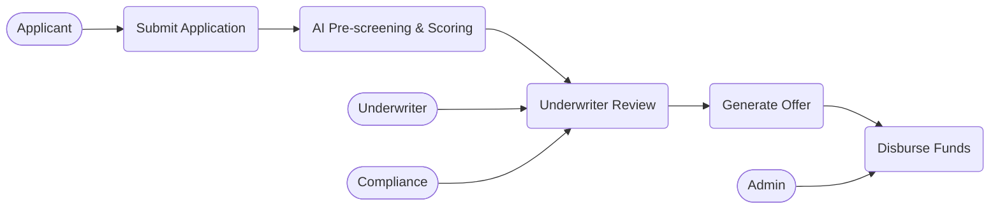

# Use Case Diagram

## Metadata

| Field | Value |
|---|---|
| Initiative ID | I013-NEXT13 |
| Created at | 2026-06-16 |
| Created by | product-owner |
| Status | Draft |

## Use Case Diagram

## UC Catalog

| UC-NNN | Title | Primary Actor(s) | FR Sources |
|---|---|---|---|
| UC-001 | Submit Application | Applicant | FR-001, FR-002 |
| UC-002 | Validate & Assign ARN | System | FR-003 |
| UC-003 | Confirmation Email | System | FR-004 |
| UC-004 | AI Pre-screening & Scoring | System / AI | FR-006, FR-007, FR-008 |
| UC-005 | Credit Bureau Lookup (Experian) | External / System | FR-009 |
| UC-006 | AML/KYC Screening | Compliance / System | FR-012, FR-013, FR-014 |
| UC-007 | Underwriter Review | Underwriter | FR-015, FR-016, FR-017 |
| UC-008 | Generate Offer | System | FR-020, FR-021 |
| UC-009 | Disburse Funds | System / Admin | FR-024, FR-025, FR-026 |

## Coverage Notes

The use cases cover the primary application lifecycle from submission through scoring, third-party lookups, human review when required, offer generation and disbursement. Observability, audit and compliance flows are represented across UC-002, UC-004, UC-006 and UC-009.

---

*Set Status: Accepted only by workflow or human approval when applicable. Never self-accept.*
