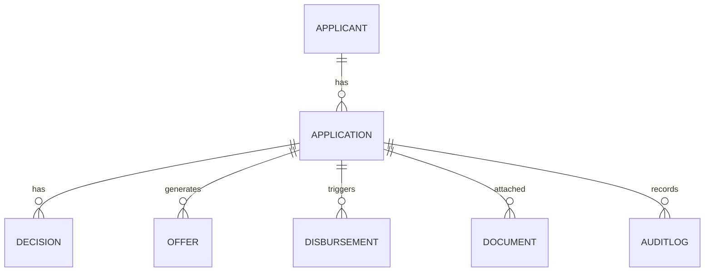

# Entity Model

## Metadata

| Field | Value |
|---|---|
| Initiative ID | I021-NEXT21 |
| Created at | 2026-06-17T17:45:00+00:00 |
| Created by | product-owner |
| Status | Draft |

## Entities

### Applicant

| Field | Type | Description |
|---|---|---|
| applicant_id | UUID | Primary key |
| first_name | string | |
| last_name | string | |
| dob | date | |
| email | string | |
| phone | string | |

### Application

| Field | Type | Description |
|---|---|---|
| application_id | UUID | Primary key (ARN) |
| applicant_id | UUID | FK -> Applicant |
| amount | decimal | Requested amount |
| term_months | integer | |
| status | enum | Draft/Submitted/Underwriting/Approved/Declined/Disbursed |
| created_at | datetime | |

### Decision

| Field | Type | Description |
|---|---|---|
| decision_id | UUID | Primary key |
| application_id | UUID | FK -> Application |
| score | integer | 0-1000 |
| recommendation | enum | AUTO_APPROVE/REFER_TO_UNDERWRITER/AUTO_DECLINE |
| created_at | datetime | |

## Relationships

- `Applicant` 1..* `Application`
- `Application` 1..1 `Decision`

## Entity Catalog

| ID | Entity | Summary |
|---|---|---|
| ENT-001 | Applicant | Person applying for a loan |
| ENT-002 | Application | Loan application record (ARN) |
| ENT-003 | Decision | AI/Underwriter decision record |
| ENT-004 | Offer | Generated loan offer document and metadata |
| ENT-005 | Disbursement | Disbursement instruction / status |
| ENT-006 | Document | Uploaded applicant documents (IDs, types) |
| ENT-007 | AuditLog | Append-only audit entries for state changes |

## ER Diagram

## Entity Details

### ENT-001 — Applicant

Fields: `applicant_id (UUID)`, `first_name`, `last_name`, `dob`, `email`, `phone`.

### ENT-002 — Application

Fields: `application_id (UUID)`, `applicant_id (UUID)`, `amount`, `term_months`, `status`, `created_at`.

### ENT-003 — Decision

Fields: `decision_id (UUID)`, `application_id (UUID)`, `score`, `recommendation`, `created_at`.

### ENT-004 — Offer

Fields: `offer_id (UUID)`, `application_id (UUID)`, `terms`, `valid_until`, `created_at`.

### ENT-005 — Disbursement

Fields: `disbursement_id (UUID)`, `application_id (UUID)`, `amount`, `status`, `value_date`, `created_at`.

### ENT-006 — Document

Fields: `document_id (UUID)`, `application_id (UUID)`, `type`, `storage_ref`, `uploaded_at`.

### ENT-007 — AuditLog

Fields: `audit_id (UUID)`, `entity_id`, `entity_type`, `action`, `performed_by`, `timestamp`.

---

*Set Status: Accepted only by human approval when required by the workflow. Never self-accept.*
